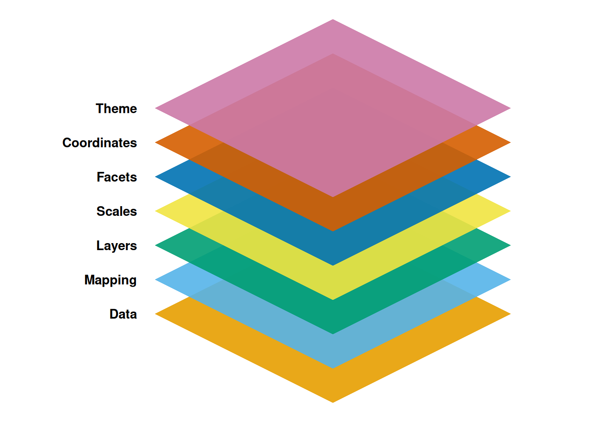
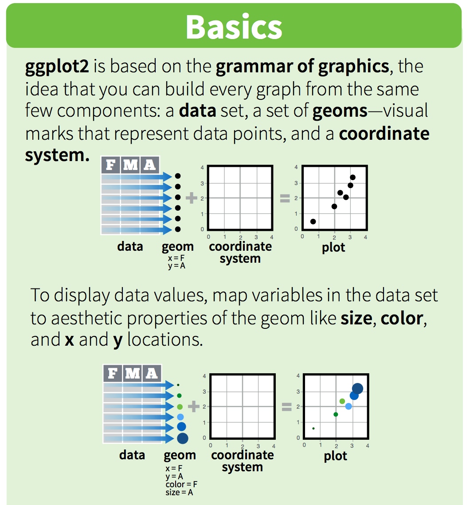
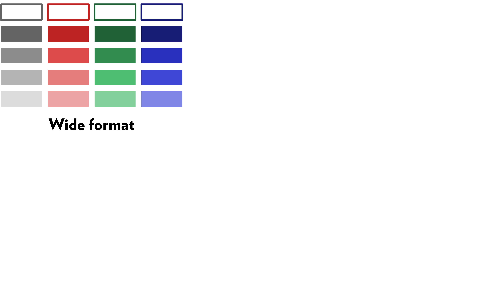
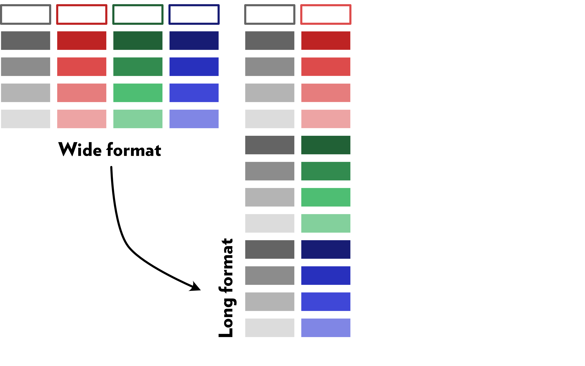
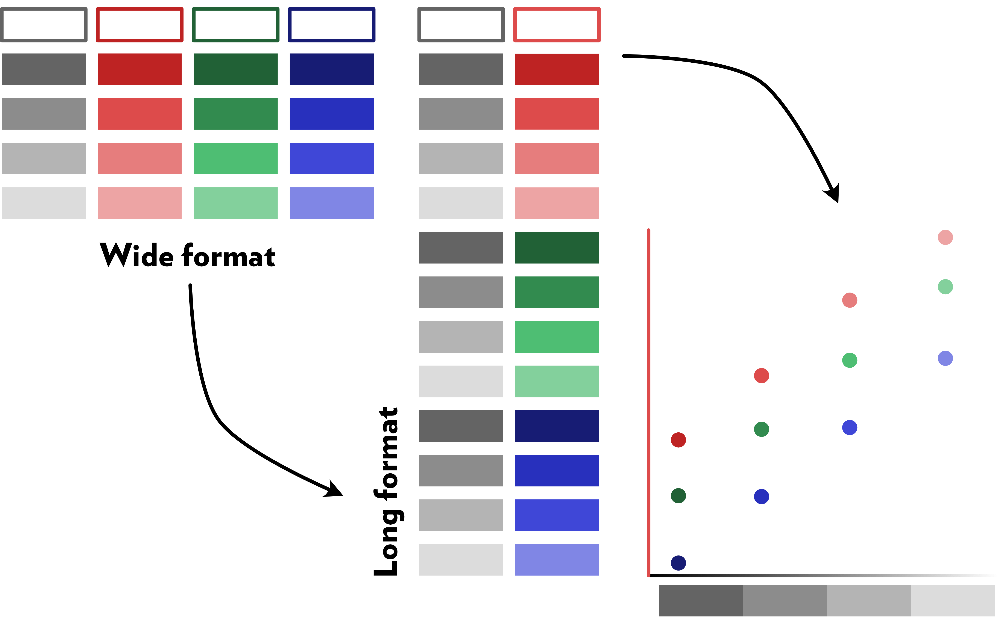
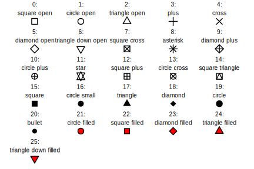
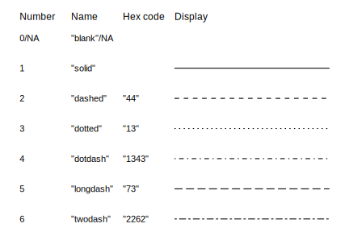
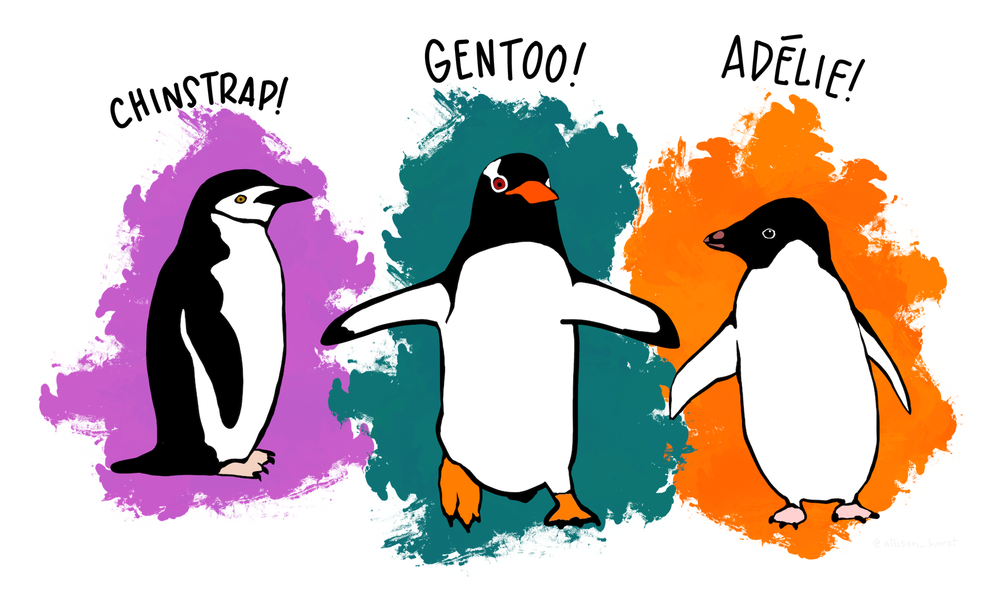

## Goals of this course

Use R to create figures from raw data that:

-   **convey a clear message**
-   are produced at high throughput in a reproducible way
-   can be easily tuned to
-   be adapted to different media (journals, posters, presentations)

## What we will cover

-   R basics
-   Building figures with `ggplot2`
-   Going further with "add-on" packages (`patchwork`, `ggtext`, `gganimate`)
-   10 principles of visual communication
-   Application to concrete examples (could be yours!)

## Tools and sources

-   All figures made in R with ggplot with additional packages:
    -   `tidyverse`, `patchwork`, `data.table`, `ggtext`, `scales`, `gt`, `fakir`, `charlatan`, `ggsci`, `colorblindr`, `gapminder`, `gganimate`, `palmerpenguins`, `png`, `plotly`, `ggalt`
-   Presentation made with revealJS
-   Biblio
    -   Patterns (N Y). **2020.** *1*, 100141
    -   Nature Communications. **2020**. *11*, 5444

# This presentation is available on [R.largy.fr](https://r.largy.fr) {background-color="#184669"}

## This presentation is available on [R.largy.fr](https://r.largy.fr) {.code6}

:::: columns
::: {.column width="50%"}
- Jump to slide:
  - Press G, enter a number, press Enter
- Search
    - Ctrl+Shift+F, enter word, press Enter
- Copy code cells 
  - "Copy code" button top right of code cells
- Code under the microscope: 🔬
- Test it by yourself: 🧪
:::

:::{.column width="50%"}

```{r}
#| label: example_code
#| echo: true

# This is an example of a code cell 
# that can be copied with the 
# "Copy code" button.

hello <- "👋 Welcome!
  Today we'll turn raw data into figures 
  so clear even Reviewer #2 might smile."

cat(rep(unlist(strsplit(hello, " "))[[1]], 12), sep = "")

```

:::
::::

# The Grammar of Graphics {background-color="#184669"}

```{r}
#| label: libs
librarian::shelf(
  tidyverse, patchwork, data.table, ggtext, scales, gt, fakir, paletteer, ggsci, clauswilke/colorblindr, gapminder, gganimate, palmerpenguins, png, plotly, charlatan, hrbrmstr/ggalt
)
```

## A framework for data visualization {auto-animate="TRUE"}

Introduced by Leland Wilkinson ([The Grammar of Graphics](https://link.springer.com/book/10.1007/0-387-28695-0 "Access provided by U. Bordeaux"), 2005).

Graphics can be built up from a set of components adapted to the `ggplot2` package in R by Hadley Wickham ([ggplot2: Elegant Graphics for Data Analysis](https://ggplot2-book.org/), 2016).



## A framework for data visualization {auto-animate="TRUE"}


## Aesthetics are layered as geometries</br>on a coordinate system {auto-animate="TRUE"}



## The [data]{.fg style="--col: #cb962a"} to be visualized has one column per variable</br>and one row per observation {auto-animate="TRUE"}

```{r}
#| label: data
#| echo: true
#| eval: true
#| output-location: column
#| classes: columns3070
library(dplyr)
library(data.table)
library(DT)
library(ggplot2)

DT::datatable(mpg)
```

## [Data]{.fg style="--col: #cb962a"}: the dataset to be visualized initializes the graph {auto-animate="TRUE"}

```{r}
#| label: ggplot_data 
#| echo: true
#| eval: true
#| output-location: column
#| classes: columns4060
#| fig-width: 7
#| fig-asp: 1
library(ggplot2)

ggplot(mpg)
```

## [Mapping]{.fg style="--col: #4596d3"} of objects to values {auto-animate="TRUE"}

```{r}
#| label: ggplot_mapping 
#| echo: true
#| eval: true
#| output-location: column
#| classes: columns4060
#| fig-width: 7
#| fig-asp: 1
library(ggplot2)

ggplot(
  mpg,
  mapping = aes(x = displ, y = hwy)
)
```

## Creation of geometric graphs from variables by [layers]{.fg style="--col: #17998e"} {auto-animate="TRUE"}

```{r}
#| label: ggplot_layers 
#| echo: true
#| eval: true
#| output-location: column
#| classes: columns4060
#| fig-width: 7
#| fig-asp: 1
library(ggplot2)

ggplot(
  mpg,
  mapping = aes(
    x = cty,
    y = hwy
  )
) +
  geom_point()
```

## [Scales]{.fg style="--col: #a5ca0f"} to represent variables on measured dimensions {auto-animate="TRUE"}

```{r}
#| label: ggplot_scales
#| echo: true
#| eval: true
#| output-location: column
#| classes: columns4060
#| fig-width: 7
#| fig-asp: 1
library(ggplot2)

ggplot(
  mpg,
  mapping = aes(
    x = displ,
    y = hwy,
    colour = class
  )
) +
  geom_point() +
  scale_colour_viridis_d()
```

## [Facets]{.fg style="--col: #2934b1"} allows generating many subplots {auto-animate="TRUE"}

```{r}
#| label: ggplot_facets
#| echo: true
#| eval: true
#| output-location: column
#| classes: columns4060
#| fig-width: 7
#| fig-asp: 1
library(ggplot2)

ggplot(
  mpg,
  mapping = aes(
    x = displ,
    y = hwy,
    colour = class
  )
) +
  geom_point() +
  scale_colour_viridis_d() +
  facet_grid(year ~ class) 
```

## [Coordinates]{.fg style="--col: #c83c19"} allows re-scaling {auto-animate="TRUE"}

```{r}
#| label: ggplot_coordinates
#| echo: true
#| eval: true
#| output-location: column
#| classes: columns4060
#| fig-width: 7
#| fig-asp: 1
library(ggplot2)

ggplot(
  mpg,
  mapping = aes(
    x = displ,
    y = hwy,
    colour = class
  )
) +
  geom_point() +
  scale_colour_viridis_d() +
  facet_grid(year ~ class) +
  coord_cartesian(
    xlim = c(0, 8),
    ylim = c(10, 50)
  )
```

## Make it pretty/corporate/legible with a [theme]{.fg style="--col: #ff69b4"} {.code5 auto-animate="TRUE"}

```{r}
#| label: ggplot_theme
#| echo: true
#| eval: true
#| output-location: column
#| classes: columns4060
#| fig-width: 7
#| fig-asp: 1
library(ggplot2)

ggplot(
  mpg,
  mapping = aes(
    x = displ,
    y = hwy,
    colour = class
  )
) +
  geom_point() +
  scale_colour_viridis_d() +
  facet_grid(year ~ class) +
  coord_cartesian(
    xlim = c(0, 8),
    ylim = c(10, 50),
    clip = "off"
  ) +
  theme_minimal() +
  theme(
    panel.grid.major = element_blank(),
    panel.grid.minor = element_blank(),
    legend.position = "bottom",
    axis.title = element_text(size = 14, face = "bold"),
    axis.line = element_line(color = "black", size = 0.75),
    axis.ticks = element_line(color = "black", size = 0.75),
    legend.title = element_text(face = "bold", size = 10),
    legend.text = element_text(size = 10),
    strip.text = element_text(face = "bold", size = 10)
  ) +
  scale_x_continuous(
    name = "Engine Displacement (L)",
    breaks = seq(0, 8, 4),
    limits = c(0, 8),
    expand = c(0, 0)
  ) +
  scale_y_continuous(name = "Highway Miles per Gallon") +
  labs(colour = "Vehicle Class")
```

# Basics of R,</br>tidyverse and/or data.table {background-color="#184669"}

# Variables, data types and modes {background-color="#186937"}

## Assigning and printing numeric variables {auto-animate="TRUE"}

```{r}
#| label: base_r_var_1_1
#| echo: true
#| eval: true
#| warning: true
#| message: true
#| output-location: column
#| classes: columns5050
a <- 42L
b <- 42
c <- pi
```

::: fragment
```{r}
#| label: base_r_var_1_2
#| echo: true
#| eval: true
#| warning: true
#| message: true
#| output-location: column
#| classes: columns5050
print(a) # prints the value of a
```
:::

::: fragment
```{r}
#| label: base_r_var_1_3
#| echo: true
#| eval: true
#| warning: true
#| message: true
#| output-location: column
#| classes: columns5050
a # also prints the value of a
```
:::

::: fragment
```{r}
#| label: base_r_var_1_4
#| echo: true
#| eval: true
#| warning: true
#| message: true
#| output-location: column
#| classes: columns5050
class(a) # integer is a class
```

```{r}
#| label: base_r_var_1_5
#| echo: true
#| eval: true
#| warning: true
#| message: true
#| output-location: column
#| classes: columns5050

# integer is a type
# (32-bit integer storage)
typeof(a) 
```
:::

::: fragment
```{r}
#| label: base_r_var_1_6
#| echo: true
#| eval: true
#| warning: true
#| message: true
#| output-location: column
#| classes: columns5050
class(b) # numeric is a class
```

```{r}
#| label: base_r_var_1_7
#| echo: true
#| eval: true
#| warning: true
#| message: true
#| output-location: column
#| classes: columns5050

# numeric type stored as double
# (64-bit floating point)
typeof(b)
```
:::

::: fragment
```{r}
#| label: base_r_var_1_8
#| echo: true
#| eval: true
#| warning: true
#| message: true
#| output-location: column
#| classes: columns5050
class(c)
```

```{r}
#| label: base_r_var_1_9
#| echo: true
#| eval: true
#| warning: true
#| message: true
#| output-location: column
#| classes: columns5050
typeof(c)
```
:::

## Assigning and printing character variables {auto-animate="TRUE"}

```{r}
#| label: base_r_var_2
#| echo: true
#| eval: true
#| warning: true
#| message: true
#| output-location: column
#| classes: columns5050
a_string <- "fourty-two"

a_string
```

## Assigning and printing boolean variables {auto-animate="TRUE"}

```{r}
#| label: base_r_var_2prime
#| echo: true
#| eval: true
#| warning: true
#| message: true
#| output-location: column
#| classes: columns5050
a_boolean <- TRUE
b_boolean <- FALSE

c(a_boolean, b_boolean)
```

## Null, missing values and infinities {auto-animate="TRUE"}

```{r}
#| label: base_r_var_2second
#| echo: true
#| eval: true
#| warning: true
#| message: true
#| output-location: column
#| classes: columns5050
a_null <- NULL
a_missing <- NA
a_nan <- NaN
a_inf <- Inf
a_minus_inf <- -Inf
char_missing <- NA_character_
real_missing <- NA_real_
int_missing <- NA_integer_

str(
  list(
    a_null = a_null,
    a_missing = a_missing,
    a_nan = a_nan,
    a_inf = a_inf,
    a_minus_inf = a_minus_inf,
    char_missing = char_missing,
    real_missing = real_missing,
    int_missing = int_missing
  )
)
```

## A NULL value is not missing {auto-animate="TRUE"}

```{r}
#| label: base_r_var_2second2
#| echo: true
#| eval: true
#| warning: true
#| message: true
#| output-location: column
#| classes: columns5050
a_null <- NULL
a_missing <- NA
a_nan <- NaN
a_inf <- Inf
a_minus_inf <- -Inf
char_missing <- NA_character_
real_missing <- NA_real_
int_missing <- NA_integer_

cat(
  "NULL represents the absence of a value or object,",
  "\nwhile NA represents a missing value in a vector.",
  "\n\nThe length of a NULL value is",
  length(a_null),
  ",\nwhile the length of a missing value is",
  length(a_missing),
  "."
)
```

## Factors are important for ordering elements in visualizations {auto-animate="TRUE"}

```{r}
#| label: base_r_var_2third
#| echo: true
#| eval: true
#| warning: true
#| message: true
#| output-location: column
#| classes: columns5050
a_factor <- factor(
  c("low", "medium", "high", "medium", "low")
)

a_factor
```

::: fragment
```{r}
#| label: base_r_var_2third2
#| echo: true
#| eval: true
#| warning: true
#| message: true
#| output-location: column
#| classes: columns5050
# Removing the "medium" level from the factor
droplevels(a_factor, "medium")
```
:::

::: fragment
```{r}
#| label: base_r_var_2third3
#| echo: true
#| eval: true
#| warning: true
#| message: true
#| output-location: column
#| classes: columns5050
# Adding data with a new level "very high"
new_data <- c("very high", "low")
factor_vec <- c(
  a_factor,
  factor(new_data, levels = c(levels(a_factor), "very high"))
)
factor_vec
```
:::

## Creating vectors {.out7 auto-animate="TRUE"}

```{r}
#| label: base_r_var_3
#| echo: true
#| eval: true
#| warning: true
#| message: true
#| output-location: column
#| classes: columns5050
# Explicit creation
a_vector <- c(1:10, "coucou")

a_vector
```

::: fragment
```{r}
#| label: base_r_var_3_2
#| echo: true
#| eval: true
#| warning: true
#| message: true
#| output-location: column
#| classes: columns5050
# Implicit integer creation
int_vector <- 1:10

int_vector
```
:::

## R coerces all elements to the most flexible type {auto-animate="TRUE"}

```{r}
#| label: base_r_var_3p
#| echo: true
#| eval: true
#| warning: true
#| message: true
#| output-location: column
#| classes: columns5050
a_vector <- c(1:10, "coucou")

class(a_vector)
```

## Subsetting vectors by position, logical and negative indexing {auto-animate="TRUE"}

```{r}
#| label: base_r_var_3second
#| echo: true
#| eval: true
#| warning: true
#| message: true
#| output-location: column
#| classes: columns5050
a_vector <- c(1:10, "coucou")
# R is 1-indexed
# so the first element is at position 1
a_vector[c(1:3, 11)]
```

::: fragment
```{r}
#| label: base_r_var_3third2
#| echo: true
#| eval: true
#| warning: true
#| message: true
#| output-location: column
#| classes: columns5050
# Logical indexing
a_vector[
  c(TRUE, TRUE, TRUE, rep(FALSE, 7), TRUE)
]
```
:::

::: fragment
```{r}
#| label: base_r_var_3third3
#| echo: true
#| eval: true
#| warning: true
#| message: true
#| output-location: column
#| classes: columns5050
# Negative indexing
a_vector[-c(4:10)]
```
:::

## Naming vector elements {auto-animate="TRUE"}

```{r}
#| label: base_r_var_3fourth
#| echo: true
#| eval: true
#| warning: true
#| message: true
#| output-location: column
#| classes: columns5050
b_vector <- c(1:5)

names(b_vector) <- c(
  "one",
  "two",
  "three",
  "four",
  "five"
)

b_vector
```

## Accessing named vector elements with `[]` and `[[]]` {auto-animate="TRUE"}

```{r}
#| label: base_r_var_3fifth
#| echo: true
#| eval: true
#| warning: true
#| message: true
#| output-location: column
#| classes: columns5050
b_vector["three"] #named element
```

```{r}
#| label: base_r_var_3sixth
#| echo: true
#| eval: true
#| warning: true
#| message: true
#| output-location: column
#| classes: columns5050
b_vector[["three"]] #scalar element
```

## Modifying elements and types of a vector {auto-animate="TRUE"}

```{r}
#| label: base_r_var_3seventh
#| echo: true
#| eval: true
#| warning: true
#| message: true
#| output-location: column
#| classes: columns5050
b_vector <- c(1:5)

a <- 42

b_vector[3] <- a

b_vector[1] <- "one"

b_vector
```

::: fragment
```{r}
#| label: base_r_var_3eighth
#| echo: true
#| eval: true
#| warning: true
#| message: true
#| output-location: column
#| classes: columns5050
b_vector[1] <- 1

b_vector
```
:::

::: fragment
```{r}
#| label: base_r_var_3ninth
#| echo: true
#| eval: true
#| warning: true
#| message: true
#| output-location: column
#| classes: columns5050
# Coercion to integer
# Only for printing here!
# The original vector is still character!
as.integer(b_vector)
```
:::

## Creating and inspecting lists {auto-animate="TRUE"}

```{r}
#| label: base_r_var_4
#| echo: true
#| eval: true
#| warning: true
#| message: true
#| output-location: column
#| classes: columns5050
# lists cannot contain
# different types of data
# but can contain different types of objects,
# including vectors

a_list <- list(
  numeric_vector = c(1, 2, 3, 4),
  character_vector = c("a", "b", "c"),
  mixed_vector = c(1, "b", TRUE),
  nested_list = list(
    numeric_vector = c(5, 6, 7, 8),
    character_vector = c("d", "e", "f"),
    mixed_vector = c(9, "g", FALSE)
  )
)

a_list
```

## Accessing list elements by name with `$` 🔬 {auto-animate="TRUE"}

```{r}
#| label: base_r_var_5
#| echo: true
#| eval: true
#| warning: true
#| message: true
#| output-location: column
#| classes: columns5050
#| code-line-numbers: "4|4,1,10"
a_list <- list(
  numeric_vector = c(1, 2, 3, 4),
  character_vector = c("a", "b", "c"),
  mixed_vector = c(1, "b", TRUE),
  nested_list = list(
    numeric_vector = c(5, 6, 7, 8),
    character_vector = c("d", "e", "f"),
    mixed_vector = c(9, "g", FALSE)
  )
)
```

::: fragment
```{r}
#| label: base_r_var_5p
#| echo: true
#| eval: true
#| warning: true
#| message: true
#| output-location: column
#| classes: columns5050
a_list$mixed_vector
```
:::

## Accessing nested list elements by name with `$` 🔬 {auto-animate="TRUE"}

```{r}
#| label: base_r_var_6
#| echo: true
#| eval: true
#| warning: true
#| message: true
#| output-location: column
#| classes: columns5050
#| code-line-numbers: "7|7,5,9|7,5,9,1,10"
a_list <- list(
  numeric_vector = c(1, 2, 3, 4),
  character_vector = c("a", "b", "c"),
  mixed_vector = c(1, "b", TRUE),
  nested_list = list(
    numeric_vector = c(5, 6, 7, 8),
    character_vector = c("d", "e", "f"),
    mixed_vector = c(9, "g", FALSE)
  )
)
```

::: fragment
```{r}
#| label: base_r_var_6p
#| echo: true
#| eval: true
#| warning: true
#| message: true
#| output-location: column
#| classes: columns5050
a_list$nested_list$character_vector
```
:::

## Comparing list elements for equality {auto-animate="TRUE"}

```{r}
#| label: base_r_var_6second
#| echo: true
#| eval: true
#| warning: true
#| message: true
#| output-location: column
#| classes: columns5050
a_list <- list(
  numeric_vector = c(1, 2, 3, 4),
  character_vector = c("a", "b", "c"),
  mixed_vector = c(1, "b", TRUE),
  nested_list = list(
    numeric_vector = c(5, 6, 7, 8),
    character_vector = c("d", "e", "f"),
    mixed_vector = c(9, "g", FALSE)
  )
)
```

::: fragment
```{r}
#| label: base_r_var_6second2
#| echo: true
#| eval: true
#| warning: true
#| message: true
#| output-location: column
#| classes: columns8020
all(a_list$nested_list$character_vector == a_list$character_vector)
```
:::

::: fragment
```{r}
#| label: base_r_var_6third
#| echo: true
#| eval: true
#| warning: true
#| message: true
#| output-location: column
#| classes: columns8020
all(a_list$nested_list$character_vector == a_list$character_vector)
```
:::

::: fragment
```{r}
#| label: base_r_var_6fourth
#| echo: true
#| eval: true
#| warning: true
#| message: true
#| output-location: column
#| classes: columns8020
(a_list$numeric_vector[1] + 4) == a_list$nested_list$numeric_vector[1]
```
:::

## Subsetting lists: `[ ]` vs. `[[ ]]` {auto-animate="TRUE"}

```{r}
#| label: base_r_var_7
#| echo: true
#| eval: true
#| warning: true
#| message: true
#| output-location: column
#| classes: columns5050
a_list <- list(
  numeric_vector = c(1, 2, 3, 4),
  character_vector = c("a", "b", "c"),
  mixed_vector = c(1, "b", TRUE),
  nested_list = list(
    numeric_vector = c(5, 6, 7, 8),
    character_vector = c("d", "e", "f"),
    mixed_vector = c(9, "g", FALSE)
  )
)

str(
  list(
    'dollar_name' = a_list$character_vector,
    'bracket_name' = a_list[["character_vector"]],
    'bracket_index' = a_list[[2]],
    'bracket_twice' = a_list[2][[1]]
  )
)
```

What happens if we access `a_list[2]` vs. `a_list[[2]]`?

::: fragment
```{r}
#| label: base_r_var_7p
#| echo: true
#| eval: true
#| warning: true
#| message: true
#| output-location: column
#| classes: columns5050
a_list[2]
```
:::

::: fragment
```{r}
#| label: base_r_var_7t
#| echo: true
#| eval: true
#| warning: true
#| message: true
#| output-location: column
#| classes: columns5050
a_list[[2]]
```
:::

# Basic operations, operands, functions {background-color="#184669"}

## Basic operations {auto-animate="TRUE"}

```{r}
#| label: base_r_op_1
#| echo: true
#| eval: true
#| warning: true
#| message: true
#| output-location: column
#| classes: columns5050
(1 + 2) * 3 / 4 - 5 * pi
```

## Basic operations {auto-animate="TRUE"}

```{r}
#| label: base_r_op_2
#| echo: true
#| eval: true
#| warning: true
#| message: true
#| output-location: column
#| classes: columns5050
a <- 1
b <- pi

a + b
```

## Basic operations {auto-animate="TRUE"}

```{r}
#| label: base_r_op_3
#| echo: true
#| eval: true
#| warning: true
#| message: true
#| output-location: column
#| classes: columns5050
a <- 1

c <- a + pi
c
```

## Equality and inequality {auto-animate="TRUE"}

```{r}
#| label: base_r_op_4_1
#| echo: true
#| eval: true
#| warning: true
#| message: true
#| output-location: column
#| classes: columns5050

a <- 1
b <- 2
c <- b

a < b
```

::: fragment
```{r}
#| label: base_r_op_4_2
#| echo: true
#| eval: true
#| warning: true
#| message: true
#| output-location: column
#| classes: columns5050

a == b 
```
:::

::: fragment
```{r}
#| label: base_r_op_4_3
#| echo: true
#| eval: true
#| warning: true
#| message: true
#| output-location: column
#| classes: columns5050

a != b 
```
:::

::: fragment
```{r}
#| label: base_r_op_4_4
#| echo: true
#| eval: true
#| warning: true
#| message: true
#| output-location: column
#| classes: columns5050

c >= b
```
:::

## Logical operators {auto-animate="TRUE"}

```{r}
#| label: base_r_op_5_1
#| echo: true
#| eval: true
#| warning: true
#| message: true
#| output-location: column
#| classes: columns5050

a <- TRUE
b <- FALSE
c <- TRUE

a & b
```

::: fragment
```{r}
#| label: base_r_op_5_2
#| echo: true
#| eval: true
#| warning: true
#| message: true
#| output-location: column
#| classes: columns5050

a | b
```
:::

::: fragment
```{r}
#| label: base_r_op_5_3
#| echo: true
#| eval: true
#| warning: true
#| message: true
#| output-location: column
#| classes: columns5050

!a
```
:::

::: fragment
```{r}
#| label: base_r_op_5_4
#| echo: true
#| eval: true
#| warning: true
#| message: true
#| output-location: column
#| classes: columns5050

# n& has higher precedence than |
# parentheses are needed here 
# to ensure the correct order of operations
(a | b) & c 

```
:::

## `if` statements {auto-animate="TRUE"}

```{r}
#| label: base_r_if_1
#| echo: true
#| eval: true
#| warning: true
#| message: true
#| output-location: column
#| classes: columns6040

x <- 5
if (x > 0) {
  cat("x is positive")
} else if (x < 0) {
  cat("x is negative")
} else {
  cat("x is zero")
} 
```

::: fragment
```{r}
#| label: base_r_if_2
#| echo: true
#| eval: true
#| warning: true
#| message: true
#| output-location: column
#| classes: columns5050


# not efficient 
# but demonstrates the use of multiple conditions
if (x > 0 & x %% 2 == 0) {
  cat("x is positive and even")
} else if (x > 0 & x %% 2 == 1) {
  cat("x is positive and odd")
} else if (x < 0 & x %% 2 == 0) {
  cat("x is negative and even")
} else if (x < 0 & x %% 2 == 1) {
  cat("x is negative and odd")
} else {
  cat("x is zero")
}

```
:::

# Basic functions {background-color="#184669"}

## Printing with `cat` {auto-animate="TRUE"}

```{r}
#| label: base_r_f_1
#| echo: true
#| eval: true
#| warning: true
#| message: true
#| output-location: column
#| classes: columns5050
a <- 1
b <- pi
c <- a + b

cat(
    "The result of a + b is:",
    c
)
```

## Summing numeric values with `sum` {auto-animate="TRUE"}

```{r}
#| label: base_f_2
#| echo: true
#| eval: true
#| warning: true
#| message: true
#| output-location: column
#| classes: columns5050
a <- 1
b <- pi
c <- sum(a, b)

cat(
    "The result of a + b is:",
    c
)
```

## `round`, `floor`, `ceiling` and `trunc` {auto-animate="TRUE"}

```{r}
#| label: base_f_3_1
#| echo: true
#| eval: true
#| warning: true
#| message: true
#| output-location: column
#| classes: columns5050
a <- 1
b <- pi
c <- sum(a, b)

cat(
    "The result of a + b is:",
    round(c, 2)
)
```

::: fragment
```{r}
#| label: base_f_3_2
#| echo: true
#| eval: true
#| warning: true
#| message: true
#| output-location: column
#| classes: columns5050

floor(c) # rounds down to the nearest integer
```
:::

::: fragment
```{r}
#| label: base_f_3_3
#| echo: true
#| eval: true
#| warning: true
#| message: true
#| output-location: column
#| classes: columns5050

ceiling(c) # rounds up to the nearest integer
```
:::

::: fragment
```{r}
#| label: base_f_3_4
#| echo: true
#| eval: true
#| warning: true
#| message: true
#| output-location: column
#| classes: columns5050

trunc(c) # truncates
```
:::

## `mean`, `median`, `min` and `max` {auto-animate="TRUE"}

```{r}
#| label: base_r_5_1
#| echo: true
#| eval: true
#| warning: true
#| message: true
#| output-location: column
#| classes: columns5050
a <- 1
b <- c(pi, 2, 3)
c <- mean(c(a, b))
d <- median(c(a, b))

cat(
    "The mean of a and b is:",
    c,
    "\nThe median of a and b is:",
    d
)
```

::: fragment
```{r}
#| label: base_r_5_2
#| echo: true
#| eval: true
#| warning: true
#| message: true
#| output-location: column
#| classes: columns5050
e <- NA

mean(c(a, b, e))
```
:::

::: fragment
```{r}
#| label: base_r_5_3
#| echo: true
#| eval: true
#| warning: true
#| message: true
#| output-location: column
#| classes: columns5050
mean(c(a, b, e), na.rm = TRUE)
```
:::

::: fragment
```{r}
#| label: base_r_5_4
#| echo: true
#| eval: true
#| warning: true
#| message: true
#| output-location: column
#| classes: columns5050
min(c(a, b, e), na.rm = TRUE)
```
:::

::: fragment
```{r}
#| label: base_r_5_5
#| echo: true
#| eval: true
#| warning: true
#| message: true
#| output-location: column
#| classes: columns5050

max(c(a, b, e), na.rm = TRUE)
```
:::

## Extract data by position with `dplyr::nth()` {auto-animate="TRUE"}

```{r}
#| label: base_r_5_6
#| echo: true
#| eval: true
#| warning: true
#| message: true
#| output-location: column
#| classes: columns5050
vec <- c(
  "first", "second", "third", 
  "fourth", "fifth"
  )

cat(
    "The 1st element is:", 
    first(vec), "\n",
    "The 3rd element is:", 
    nth(vec, 3), "\n",
    "The last element is:", 
    last(vec)
)
```

## Other mathematical transformations 🔬{auto-animate="TRUE"}

```{r}
#| label: base_r_6_1
#| echo: true
#| eval: true
#| warning: true
#| message: true
#| output-location: column
#| classes: columns5050
a <- 1
b <- exp(1)
c <- 81L
d <- -pi

cat(
    "The natural logarithm of a is:", 
    log(a, base = exp(1)), "\n",
    "The common logarithm of b is:", 
    round(log10(b), 2), "\n",
    "The exponential of a is:", 
    round(exp(a), 2)
)
```

```{r}
#| label: base_r_6_2
#| echo: true
#| eval: true
#| warning: true
#| message: true
#| output-location: column
#| classes: columns5050
#| code-line-numbers: "3"

sqrt(c)
```

```{r}
#| label: base_r_6_3
#| echo: true
#| eval: true
#| warning: true
#| message: true
#| output-location: column
#| classes: columns5050
#| code-line-numbers: "3"

abs(d)
```

## Data type conversion with `as.*` functions {auto-animate="TRUE"}

```{r}
#| label: base_r_7_1
#| echo: true
#| eval: true
#| warning: true
#| message: true
#| output-location: column
#| classes: columns5050

num_vec <- c(-1, 0, 1, 2)
char_vec <- as.character(num_vec)
char_vec
```

::: fragment
```{r}
#| label: base_r_7_2
#| echo: true
#| eval: true
#| warning: true
#| message: true
#| output-location: column
#| classes: columns5050
as.numeric(char_vec)
```
:::

::: fragment
```{r}
#| label: base_r_7_3
#| echo: true
#| eval: true
#| warning: true
#| message: true
#| output-location: column
#| classes: columns5050
as.logical(as.numeric(char_vec))
```
:::

::: fragment
```{r}
#| label: base_r_7_4
#| echo: true
#| eval: true
#| warning: true
#| message: true
#| output-location: column
#| classes: columns5050

as.factor(num_vec)

```
:::

::: fragment
```{r}
#| label: base_r_7_5
#| echo: true
#| eval: true
#| warning: true
#| message: true
#| output-location: column
#| classes: columns5050

date <- "27/02/2000"

# indicate the format of the input string
# to map it to a Date object
as.Date(date, format = "%d/%m/%Y")
```
:::

::: fragment
```{r}
#| label: base_r_7_6
#| echo: true
#| eval: true
#| warning: true
#| message: true
#| output-location: column
#| classes: columns5050

date_2 <- "270220"

as.Date(date_2, format = "%d%m%y")
```
:::

## String pasting basics {auto-animate="TRUE"}

```{r}
#| label: base_r_8_1
#| echo: true
#| eval: true
#| warning: true
#| message: true
#| output-location: column
#| classes: columns5050

num_vec <- c(1, 2, 3)

str_vec <- c("Case")

# num_vec is coerced to character 
paste(str_vec, num_vec)
```

::: fragment
```{r}
#| label: base_r_8_2
#| echo: true
#| eval: true
#| warning: true
#| message: true
#| output-location: column
#| classes: columns5050

paste0(str_vec, num_vec) # no space
```
:::

::: fragment
```{r}
#| label: base_r_8_3
#| echo: true
#| eval: true
#| warning: true
#| message: true
#| output-location: column
#| classes: columns5050

paste(str_vec, num_vec, sep = ": ") 
```
:::

## String modification and detection with `gsub` and `grepl` {auto-animate="TRUE"}

```{r}
#| label: base_r_9_1
#| echo: true
#| eval: true
#| warning: true
#| message: true
#| output-location: column
#| classes: columns5050

text_vec <- c(
  "The cat is on the roof", 
  "The dog is in the yard"
  )

gsub("cat", "mouse", text_vec)

```

::: fragment
```{r}
#| label: base_r_9_2
#| echo: true
#| eval: true
#| warning: true
#| message: true
#| output-location: column
#| classes: columns6040

grepl("cat", text_vec)
```
:::

# Tabular data structures {background-color="#186937"}

## Creating matrices {auto-animate="TRUE"}

```{r}
#| label: base_r_var_8
#| echo: true
#| eval: true
#| warning: true
#| message: true
#| output-location: column
#| classes: columns5050
mat <- matrix(1:9, nrow = 3)

mat
```

::: fragment
```{r}
#| label: base_r_var_9
#| echo: true
#| eval: true
#| warning: true
#| message: true
#| output-location: column
#| classes: columns5050
matrix(1:9, nrow = 3)
```
:::

::: fragment
```{r}
#| label: base_r_var_9p
#| echo: true
#| eval: true
#| warning: true
#| message: true
#| output-location: column
#| classes: columns5050
matrix(1:8, nrow = 3)
```
:::

## Indexing matrices by row and column {auto-animate="TRUE"}

```{r}
#| label: base_r_var_9t
#| echo: true
#| eval: true
#| warning: true
#| message: true
#| output-location: column
#| classes: columns5050
mat <- matrix(1:9, nrow = 3)

mat
```

```{r}
#| label: base_r_var_9t2
#| echo: true
#| eval: true
#| warning: true
#| message: true
#| output-location: column
#| classes: columns5050
mat[1, ] # First row
```

::: fragment
```{r}
#| label: base_r_var_9f
#| echo: true
#| eval: true
#| warning: true
#| message: true
#| output-location: column
#| classes: columns5050
mat[, 2] # Second column
```
:::

::: fragment
```{r}
#| label: base_r_var_9fi
#| echo: true
#| eval: true
#| warning: true
#| message: true
#| output-location: column
#| classes: columns5050
mat[1, 2] # Element at row 1, column 2
```
:::

## Creating dataframes as named list of vectors {auto-animate="TRUE"}

```{r}
#| label: base_r_var_10
#| echo: true
#| eval: true
#| warning: true
#| message: true
#| output-location: column
#| classes: columns5050
a_df <- data.frame(
  id = 1:5,
  group = c("A", "A", "B", "B", "C"),
  value = c(10.2, 12.5, 9.8, 11.1, 13.0)
)

a_df
```

## Accessing column names with `names()` {auto-animate="TRUE"}

```{r}
#| label: base_r_var_11
#| echo: true
#| eval: true
#| warning: true
#| message: true
#| output-location: column
#| classes: columns5050
a_df <- data.frame(
  id = 1:5,
  group = c("A", "A", "B", "B", "C"),
  value = c(10.2, 12.5, 9.8, 11.1, 13.0)
)

names(a_df)
```

## Accessing dataframe columns with `$` {auto-animate="TRUE"}

```{r}
#| label: base_r_var_11p
#| echo: true
#| eval: true
#| warning: true
#| message: true
#| output-location: column
#| classes: columns5050
a_df <- data.frame(
  id = 1:5,
  group = c("A", "A", "B", "B", "C"),
  value = c(10.2, 12.5, 9.8, 11.1, 13.0)
)

a_df$group
```

::: fragment
```{r}
#| label: base_r_var_11p2
#| echo: true
#| eval: true
#| warning: true
#| message: true
#| output-location: column
#| classes: columns5050
cat(
  "It is",
  is.vector(a_df$group),
  "that a_df$group is a vector, containing",
  class(a_df$group),
  "data."
)
```
:::

## Accessing dataframe columns with `$` {auto-animate="TRUE"}

```{r}
#| label: base_r_var_11t
#| echo: true
#| eval: true
#| warning: true
#| message: true
#| output-location: column
#| classes: columns5050
a_df <- data.frame(
  id = 1:5,
  group = c("A", "A", "B", "B", "C"),
  value = c(10.2, 12.5, 9.8, 11.1, 13.0)
)

unique(a_df$group)
```

::: fragment
```{r}
#| label: base_r_var_11f
#| echo: true
#| eval: true
#| warning: true
#| message: true
#| output-location: column
#| classes: columns5050
sort(a_df$value)
```
:::

::: fragment
```{r}
#| label: base_r_var_11fi
#| echo: true
#| eval: true
#| warning: true
#| message: true
#| output-location: column
#| classes: columns5050
sort(a_df$value, decreasing = TRUE)
```
:::

## Subsetting dataframes by row/column indices {auto-animate="TRUE"}

```{r}
#| label: base_r_var_11s1
#| echo: true
#| eval: true
#| warning: true
#| message: true
#| output-location: column
#| classes: columns5050
a_df <- data.frame(
  id = 1:5,
  group = c("A", "A", "B", "B", "C"),
  value = c(10.2, 12.5, 9.8, 11.1, 13.0)
)

# Select rows 1 and 3, all columns
a_df[c(1, 3), ]
```

::: fragment
```{r}
#| label: base_r_var_11s2
#| echo: true
#| eval: true
#| warning: true
#| message: true
#| output-location: column
#| classes: columns5050
# Select all rows, columns 1 and 3
a_df[, c(1, 3)]
```
:::

::: fragment
```{r}
#| label: base_r_var_11s3
#| echo: true
#| eval: true
#| warning: true
#| message: true
#| output-location: column
#| classes: columns5050
# Select rows 1 to 3, columns "id" and "value"
a_df[1:3, c("id", "value")]
```
:::

::: fragment
```{r}
#| label: base_r_var_11s4
#| echo: true
#| eval: true
#| warning: true
#| message: true
#| output-location: column
#| classes: columns5050
# Select rows where group is "A" or "B",
# and columns 1 to 3
a_df[
  a_df$group %in% c("A", "B"),
  1:3
]
```
:::

## Subsetting dataframes by column names {auto-animate="TRUE"}

```{r}
#| label: base_r_var_11s5
#| echo: true
#| eval: true
#| warning: true
#| message: true
#| output-location: column
#| classes: columns5050
a_df <- data.frame(
  id = 1:5,
  group = c("A", "A", "B", "B", "C"),
  value = c(10.2, 12.5, 9.8, 11.1, 13.0)
)

a_df[c("id", "value")]
```

::: fragment
```{r}
#| label: base_r_var_11s6
#| echo: true
#| eval: true
#| warning: true
#| message: true
#| output-location: column
#| classes: columns5050
a_df[["group"]] # access to scalar vector
```
:::

## Subsetting dataframes by logical conditions {auto-animate="TRUE"}

```{r}
#| label: base_r_var_11s7
#| echo: true
#| eval: true
#| warning: true
#| message: true
#| output-location: column
#| classes: columns5050
a_df <- data.frame(
  id = 1:5,
  group = c("A", "A", "B", "B", "C"),
  value = c(10.2, 12.5, 9.8, 11.1, 13.0)
)

# Rows where value > 10
a_df[a_df$value > 10, ]
```

::: fragment
```{r}
#| label: base_r_var_11s8
#| echo: true
#| eval: true
#| warning: true
#| message: true
#| output-location: column
#| classes: columns5050
# Rows where group is "A" AND value > 10
a_df[a_df$group == "A" & a_df$value > 10, ]
```
:::

## Subsetting dataframes can be subsetted with `subset()` {auto-animate="TRUE"}

```{r}
#| label: base_r_var_11s9
#| echo: true
#| eval: true
#| warning: true
#| message: true
#| output-location: column
#| classes: columns6040
a_df <- data.frame(
  id = 1:5,
  group = c("A", "A", "B", "B", "C"),
  value = c(10.2, 12.5, 9.8, 11.1, 13.0)
)

subset(a_df, group %in% c("A", "B") & value > 10)
```

## Finding row indices with `which()` {auto-animate="TRUE"}

```{r}
#| label: base_r_var_14_2
#| echo: true
#| eval: true
#| warning: true
#| message: true
#| output-location: column
#| classes: columns5050
a_df <- data.frame(
  id = 1:5,
  group = c("A", "A", "B", "B", "C"),
  value = c(10.2, 12.5, 9.8, 11.1, 13.0)
)

which(a_df$group == "A")
```

::: fragment
```{r}
#| label: base_r_var_14_2p
#| echo: true
#| eval: true
#| warning: true
#| message: true
#| output-location: column
#| classes: columns5050
# Extract values for rows where group is "A"
a_df[which(a_df$group == "A"), ]$value
```
:::

## Evaluating expressions in datafames with `with()` {auto-animate="TRUE"}

```{r}
#| label: base_r_var_14_3
#| echo: true
#| eval: true
#| warning: true
#| message: true
#| output-location: column
#| classes: columns5050
a_df <- data.frame(
  id = 1:5,
  group = c("A", "A", "B", "B", "C"),
  value = c(10.2, 12.5, 9.8, 11.1, 13.0)
)

# Extract values for rows where group is "A"
with(a_df, a_df[group == "A", ])
```

## `tibble::tibble()` is a modern dataframe {auto-animate="TRUE"}

```{r}
#| label: base_r_var_12
#| echo: true
#| eval: true
#| warning: true
#| message: true
#| output-location: column
#| classes: columns5050
a_tb <- tibble(
  id = 1:5,
  group = c("A", "A", "B", "B", "C"),
  value = c(10.2, 12.5, 9.8, 11.1, 13.0)
)

a_tb
```

## Tibbles have improved defaults

```{r}
#| label: base_r_var_12p1
#| echo: true
#| eval: true
#| warning: true
#| message: true
#| output-location: column
#| classes: columns5050
# Base R data frame

# "Modern R (>= 4.0.0) no longer converts strings to factors by default. Use stringsAsFactors = TRUE to replicate old behavior."
str(a_df)
```

```{r}
#| label: base_r_var_12p2
#| echo: true
#| eval: true
#| warning: true
#| message: true
#| output-location: column
#| classes: columns5050
# Tibble
# category remains a character vector
str(a_tb)
```

```{r}
#| label: base_r_var_12p3
#| echo: true
#| eval: true
#| warning: true
#| message: true
#| output-location: column
#| classes: columns5050
# Prints with row numbers
# and truncates columns
a_df
```

```{r}
#| label: base_r_var_12p4
#| echo: true
#| eval: true
#| warning: true
#| message: true
#| output-location: column
#| classes: columns5050
# Prints without row numbers,
# shows data types,
# and truncates more cleanly
a_tb
```

## Subsetting with `dplyr::filter()` and `dplyr::select()` {auto-animate="TRUE"}

```{r}
#| label: base_r_var_13
#| echo: true
#| eval: true
#| warning: true
#| message: true
#| output-location: column
#| classes: columns5050
a_tb <- tibble(
  id = 1:5,
  group = c("A", "A", "B", "B", "C"),
  value = c(10.2, 12.5, 9.8, 11.1, 13.0)
)

filter(
  a_tb,
  group %in% c("A", "B"),
  value > 10
)
```

## The pipe operators `|>` and `%>%` for chaining operations {auto-animate="TRUE"}

```{r}
#| label: base_r_var_13_2
#| echo: true
#| eval: true
#| warning: true
#| message: true
#| output-location: column
#| classes: columns5050
a_tb <- tibble(
  id = 1:5,
  group = c("A", "A", "B", "B", "C"),
  value = c(10.2, 12.5, 9.8, 11.1, 13.0)
)

filter(
  a_tb,
  group %in% c("A", "B"),
  value > 10
)
```

```{r}
#| label: base_r_var_13p
#| echo: true
#| eval: true
#| warning: true
#| message: true
#| output-location: column
#| classes: columns5050
a_tb |>
  filter(group %in% c("A", "B"), value > 10)
```

::: fragment
```{r}
#| label: base_r_var_13t
#| echo: true
#| eval: true
#| warning: true
#| message: true
#| output-location: column
#| classes: columns5050
a_tb |>
  filter(group %in% c("A", "B")) |>
  filter(value > 10)
```
:::

## `%>%` lets you use a placeholder `.`

```{r}
#| label: base_r_var_13p2
#| echo: true
#| eval: true
#| warning: true
#| message: true
#| output-location: column
#| classes: columns5050

linear_tb <- tibble(
  x = 1:5,
  y = 2 * (1:5) + 1 * rnorm(1)
)

linear_tb %>%
  lm(y ~ x, data = .)

```

```{r}
#| label: base_r_var_13p3
#| echo: true
#| eval: true
#| warning: true
#| message: true
#| output-location: column
#| classes: columns5050

tryCatch(
  linear_tb |> 
    lm(y ~ x, data = .),
  error = function(e) {
    cat("An error occurred:", e$message)
  }
)

```

```{r}
#| label: base_r_var_13p4
#| echo: true
#| eval: true
#| warning: true
#| message: true
#| output-location: column
#| classes: columns5050
#use of an anonymous function 
#to replace the placeholder
linear_tb |>
  (\(z) lm(y ~ x, data = z))() 

```

## Dataframes can be subsetted with `dplyr::select()` {auto-animate="TRUE"}

```{r}
#| label: base_r_var_14
#| echo: true
#| eval: true
#| warning: true
#| message: true
#| output-location: column
#| classes: columns5050
a_tb <- tibble(
  id = 1:5,
  group = c("A", "A", "B", "B", "C"),
  value = c(10.2, 12.5, 9.8, 11.1, 13.0)
)

select(a_df, id, value)
```

::: fragment
```{r}
#| label: base_r_var_14p
#| echo: true
#| eval: true
#| warning: true
#| message: true
#| output-location: column
#| classes: columns5050
# Exclude the group column
select(a_tb, -group)
```
:::

::: fragment
```{r}
#| label: base_r_var_14t
#| echo: true
#| eval: true
#| warning: true
#| message: true
#| output-location: column
#| classes: columns5050
a_tb |>
  filter(group == "A") |>
  select(id, value)
```
:::

## Modifying a column with `dplyr::mutate()` {auto-animate="TRUE" .code6 .out7}

```{r}
#| label: base_r_var_14mm
#| echo: true
#| eval: true
#| warning: true
#| message: true
#| output-location: column
#| classes: columns6040

c_tb <- tibble(
  id = 1:5,
  category = c("X", "Y", "X", "Y", "Z"),
  value_1 = c(10.2, 12.5, 9.8, 11.1, 13.0),
  value_2 = c(5.1, 6.2, 4.9, 5.5, 6.5),
  value_3 = c(2.5, 3.0, 2.8, 3.2, 3.5),
  value_4 = c(1.2, 1.5, 1.0, 1.3, 1.8)
)

c_tb |>
  mutate(
    name = paste(category, id, sep = "_"),
    sum_value = sum(value_1, value_2, value_3, value_4),
    mean_value = mean(c(value_1, value_2, value_3, value_4)),
    sd_value = sd(c(value_1, value_2, value_3, value_4))
  ) |> 
    glimpse()
```

## Calculating summary statistics by groups with `dplyr::group_by()` and `dplyr::summarise()` {auto-animate="TRUE" .code7}

```{r}
#| label: base_r_var_14mn
#| echo: true
#| eval: true
#| warning: true
#| message: true
#| output-location: column
#| classes: columns6040

c_tb <- tibble(
  id = 1:5,
  category = c("X", "Y", "X", "Y", "Z"),
  value_1 = c(10.2, 12.5, 9.8, 11.1, 13.0),
  value_2 = c(5.1, 6.2, 4.9, 5.5, 6.5),
  value_3 = c(2.5, 3.0, 2.8, 3.2, 3.5),
  value_4 = c(1.2, 1.5, 1.0, 1.3, 1.8)
)

c_tb |>
  group_by(category) |>
  summarise(
    mean_value = mean(c(value_1, value_2, value_3, value_4)),
    sd_value = sd(c(value_1, value_2, value_3, value_4))
  )
```

## Pivoting dataframes from wide to long format {auto-animate="TRUE"}

::: r-stack


{.fragment fragment-index="1"}

{.fragment fragment-index="2"}
:::

## Pivoting dataframes to long format with `dplyr::pivot_longer()` {auto-animate="TRUE"}

```{r}
#| label: base_r_var_14n_1
#| echo: true
#| eval: true
#| warning: true
#| message: true
#| output-location: column
#| classes: columns5050
wide_tb <- tibble(
  temp = 20:90,
  case_1 = temp * 2 + rnorm(1),
  case_2 = temp * 3 + rnorm(1),
  case_3 = temp * 4 + rnorm(1),
  case_4 = temp * 5 + rnorm(1)
)
wide_tb
```

::: fragment
```{r}
#| label: base_r_var_14n_2
#| echo: true
#| eval: true
#| warning: true
#| message: true
#| output-location: column
#| classes: columns5050
wide_tb |> 
  pivot_longer(
    cols = 2:ncol(wide_tb),
    names_to = "case",
    values_to = "value"
  )
```
:::

## Chaining operations {auto-animate="TRUE"}

```{r}
#| label: base_r_var_14n_3
#| echo: true
#| eval: true
#| warning: true
#| message: true
#| output-location: column
#| classes: columns5050
wide_tb |>
  pivot_longer(
    cols = starts_with("case_"),
    names_to = "case",
    values_to = "value"
  ) |>
  mutate(
    case = str_remove(case, "case_") |>
      as.integer()
  ) |> 
    arrange(temp, case) |> 
    head(20)
```

## Chaining operations {auto-animate="TRUE"}

```{r}
#| label: base_r_var_14n_4
#| echo: true
#| eval: true
#| warning: true
#| message: true
#| output-location: column
#| classes: columns5050
wide_tb |>
  pivot_longer(
    cols = starts_with("case_"),
    names_to = "case",
    values_to = "value"
  ) |>
  mutate(
    case = str_remove(case, "case_") |>
      as.integer()
  ) |> 
  group_by(temp) |>
  summarise(
    mean_value = mean(value),
    sd_value = sd(value)
  )  |> 
    head(20)
```

## Chaining operations {auto-animate="TRUE"}

```{r}
#| label: base_r_var_14n_5
#| echo: true
#| eval: true
#| warning: true
#| message: true
#| output-location: column
#| classes: columns5050
wide_tb |>
  pivot_longer(
    cols = starts_with("case_"),
    names_to = "case",
    values_to = "value"
  ) |>
  mutate(
    case = str_remove(case, "case_") |>
      as.integer()
  ) |> 
  filter(temp %in% 40:60) |>
  group_by(temp) |>
  summarise(
    mean_value = mean(value),
    sd_value = sd(value)
  )  |> 
    head(20)
```

## Chaining operations {auto-animate="TRUE"}

```{r}
#| label: base_r_var_14n_6
#| echo: true
#| eval: true
#| warning: false
#| message: false
#| output-location: column
#| classes: columns5050
#| fig-height: 8

wide_tb |>
  pivot_longer(
    cols = starts_with("case_"),
    names_to = "case",
    values_to = "value"
  ) |>
  mutate(
    case = str_remove(case, "case_") |>
      as.factor()
  ) |>
  ggplot(aes(
    x = temp,
    y = value,
    color = case
  )) +
  geom_point(size = 2) +
  geom_smooth(method = "lm", se = FALSE)
```

## The `data.table` alternative for large dataset</br>and concise syntax {auto-animate="TRUE"}

Think in terms of basic units: [**rows**]{.fg style="--col: #184669"}, [**columns**]{.fg style="--col: #0c9b1f"}, and [**groups**]{.fg style="--col: #cc7504"}.

**DT\[[i]{.fg style="--col: #184669"}, [j]{.fg style="--col: #0c9b1f"}, [by]{.fg style="--col: #cc7504"}\]**

-   [**i**]{.fg style="--col: #184669"}: row selection (filtering)
-   [**j**]{.fg style="--col: #0c9b1f"}: column selection (projection)
-   [**by**]{.fg style="--col: #cc7504"}: grouping operations

`data.table` is optimized for speed and memory, ideal for large datasets

## The `data.table` alternative for large dataset</br>and concise syntax {auto-animate="TRUE" .code6}

```{r}
#| label: base_r_var_15
#| echo: true
#| eval: true
#| warning: true
#| message: true
#| output-location: column
#| classes: columns6040
a_dt <- data.table(
  id = 1:5,
  group = c("A", "A", "B", "B", "C"),
  value = c(10.2, 12.5, 9.8, 11.1, 13.0)
)

a_dt
```

::: fragment
```{r}
#| label: base_r_var_15p
#| echo: true
#| eval: true
#| warning: true
#| message: true
#| output-location: column
#| classes: columns6040
# FROM[WHERE, SELECT, GROUP BY]
# DT  [i,     j,      by]

# Select rows where group is "A"
a_dt[group == "A"]
```
:::

::: fragment
```{r}
#| label: base_r_var_15t
#| echo: true
#| eval: true
#| warning: true
#| message: true
#| output-location: column
#| classes: columns6040
# Select columns by name
a_dt[, .(id, value)]
```
:::

::: fragment
```{r}
#| label: base_r_var_15d
#| echo: true
#| eval: true
#| warning: true
#| message: true
#| output-location: column
#| classes: columns6040
# Select rows where group is "A" or "B", and value > 10
# Yield the corresponding id values
a_dt[
  group %in% c("A", "B") & value > 10,
  .(id)
]
```
:::

## data.tables can be piped with `[]` or `|>` {auto-animate="TRUE" .code6 .out8}

```{r}
#| label: base_r_var_13p5
#| echo: true
#| eval: true
#| warning: true
#| message: true
#| output-location: column
#| classes: columns6040

a_dt[group %in% c("A", "B") & value > 10,][]
```
::: fragment

```{r}
#| label: base_r_var_13p6
#| echo: true
#| eval: true
#| warning: true
#| message: true
#| output-location: column
#| classes: columns6040

a_dt[
  group %in% c("A", "B")
  ][
  value > 10
]
```
:::
::: fragment
```{r}
#| label: base_r_var_13p7
#| echo: true
#| eval: true
#| warning: true
#| message: true
#| output-location: column
#| classes: columns6040

a_dt  |> 
  _[group %in% c("A", "B")] |> 
  _[value > 10]
```
:::

## Modifying a column with `:=` {auto-animate="TRUE" .code6 .out7}

```{r}
#| label: base_r_var_14m3
#| echo: true
#| eval: true
#| warning: true
#| message: true
#| output-location: column
#| classes: columns5050
as.data.table(c_tb)[,
  name := paste(category, id, sep = "_")
] |>
  _[,
    sum_value := sum(value_1, value_2, value_3, value_4)
  ] |>
  _[,
    mean_value := mean(c(value_1, value_2, value_3, value_4))
  ] |>
  _[,
    sd_value := sd(c(value_1, value_2, value_3, value_4))
  ] |>
  str()
```
::: fragment

```{r}
#| label: base_r_var_14m2
#| echo: true
#| eval: true
#| warning: true
#| message: true
#| output-location: column
#| classes: columns5050

as.data.table(c_tb)[
  , `:=`(
    name = paste(category, id, sep = "_"),
    sum_value = sum(value_1, value_2, value_3, value_4),
    mean_value = mean(c(value_1, value_2, value_3, value_4)),
    sd_value = sd(c(value_1, value_2, value_3, value_4))
  )
] |> 
  str()
```
:::

## Summarizing by groups in a single step {auto-animate="TRUE" .code7}

```{r}
#| label: base_r_var_16
#| echo: true
#| eval: true
#| warning: true
#| message: true
#| output-location: column
#| classes: columns6040
as.data.table(c_tb)[,
  .(
    mean_value = mean(c(value_1, value_2, value_3, value_4)),
    sd_value = sd(c(value_1, value_2, value_3, value_4))
  ),
  by = category
]
```

## Summarizing by groups in a single step 🔬 {auto-animate="TRUE" .code7}
```{r}
#| label: base_r_var_16_0
#| echo: true
#| eval: true
#| warning: true
#| message: true
#| output-location: column
#| classes: columns6040
#| code-line-numbers: "1-8|2|3-6|7|1-8"
as.data.table(c_tb)[
  category != "X", # Filter
  .(               # Calculate summary statistics
    mean_value = mean(c(value_1, value_2, value_3, value_4)),
    sd_value = sd(c(value_1, value_2, value_3, value_4))
  ),
  by = category    # Group
]
```


## Pivoting data from wide to long format with `data.table::melt()` {auto-animate="TRUE" .out7 .code6}

```{r}
#| label: base_r_var_16_1
#| echo: true
#| eval: true
#| warning: true
#| message: true
#| output-location: column
#| classes: columns6040

wide_dt <- as.data.table(wide_tb)
head(wide_dt, 3)
```
::: fragment
```{r}
#| label: base_r_var_16_2
#| echo: true
#| eval: true
#| warning: true
#| message: true
#| output-location: column
#| classes: columns6040

# All columns except id are melted
wide_dt |> 
  melt(
    id.vars = "temp",
    variable.name = "case",
    value.name = "value"
  )
```
:::

::: fragment
```{r}
#| label: base_r_var_16_3
#| echo: true
#| eval: true
#| warning: true
#| message: true
#| output-location: column
#| classes: columns6040

# Explicit selection by index
wide_dt |> 
  melt(
    id.vars = "temp",
    measure.vars = 2:ncol(wide_dt),
    variable.name = "case",
    value.name = "value"
  )
```
:::

::: fragment
```{r}
#| label: base_r_var_16_4
#| echo: true
#| eval: true
#| warning: true
#| message: true
#| output-location: column
#| classes: columns6040

# Explicit selection by pattern
wide_dt |> 
  melt(
    id.vars = "temp",
    measure.vars = patterns("^case_"),
    variable.name = "case",
    value.name = "value"
  )
```
:::

## Chaining operations with `data.table` {auto-animate="TRUE" .code7 .out8}

```{r}
#| label: base_r_var_16_5
#| echo: true
#| eval: true
#| warning: true
#| message: true
#| output-location: column
#| classes: columns6040
wide_dt |>
  melt(
    id.vars = "temp",
    measure.vars = patterns("^case_"),
    variable.name = "case",
    value.name = "value"
  ) |>
  _[,
    case := (\(x) as.integer(gsub("case_", "", x)))(case)
  ] |>
  _[order(temp, case)] |>
  head(20)
```

## Chaining operations with `data.table` {auto-animate="TRUE" .code7 .out8}

```{r}
#| label: base_r_var_16_6
#| echo: true
#| eval: true
#| warning: true
#| message: true
#| output-location: column
#| classes: columns6040
wide_dt |>
  melt(
    id.vars = "temp",
    measure.vars = patterns("^case_"),
    variable.name = "case",
    value.name = "value"
  ) |>
  _[,
    case := (\(x) as.integer(gsub("case_", "", x)))(case)
  ] |>
  _[,
    .(mean_value = mean(value), sd_value = sd(value)),
    by = temp
  ] |>
  head(20)
```

## Chaining operations with `data.table` {auto-animate="TRUE" .code7 .out8}

```{r}
#| label: base_r_var_16_7
#| echo: true
#| eval: true
#| warning: true
#| message: true
#| output-location: column
#| classes: columns6040
wide_dt |>
  melt(
    id.vars = "temp",
    measure.vars = patterns("^case_"),
    variable.name = "case",
    value.name = "value"
  ) |>
  _[,
    case := (\(x) as.integer(gsub("case_", "", x)))(case)
  ] |>
  _[temp %in% 40:60,
    .(mean_value = mean(value), sd_value = sd(value)),
    by = temp
  ] |>
  head(20)
```

## Chaining operations with `data.table` {auto-animate="TRUE" .code7 .out8}

```{r}
#| label: base_r_var_14n_8
#| echo: true
#| eval: true
#| warning: false
#| message: false
#| output-location: column
#| classes: columns6040
#| fig-height: 8

wide_dt |>
  melt(
    id.vars = "temp",
    measure.vars = patterns("^case_"),
    variable.name = "case",
    value.name = "value"
  ) |>
  _[,
    case := (\(x) as.factor(gsub("case_", "", x)))(case)
  ] |>
  ggplot(aes(
    x = temp,
    y = value,
    color = case
  )) +
  geom_point(size = 2) +
  geom_smooth(method = "lm", se = FALSE)
```

# 10 common pitfalls {background-color="#184669"}

And how to avoid them

## R is 1-indexed {auto-animate="TRUE"}

```{r}
#| label: pit_1
#| echo: true
#| eval: true
#| warning: true
#| message: true
#| output-location: column
#| classes: columns5050
# R is 1-indexed
# The first element is at position 1
R_vector <- c("a", "b", "c")

R_vector[1]
```

::: fragment
```{python}
#| label: pit_1_py
#| echo: true
#| eval: true
#| warning: true
#| message: true
#| output-location: column
#| classes: columns5050

# Python is 0-indexed
# The first element is at position 0
python_list = ["a", "b", "c"]

python_list[0]
```
:::

## \[ \] returns a listis not \[\[ \]\]

```{r}
#| label: pit_2
#| echo: true
#| eval: true
#| warning: true
#| message: true
#| output-location: column
#| classes: columns5050
# list of uneven numbers <= 100
b_list <- as.list(
  which(1:100 %% 2 == 1, 1:100)
)
```

::: fragment
```{r}
#| label: pit_2_2
#| echo: true
#| eval: true
#| warning: true
#| message: true
#| output-location: column
#| classes: columns5050
# Returns a list
b_list[1:3]
```
:::

::: fragment
```{r}
#| label: pit_2_3
#| echo: true
#| eval: true
#| warning: true
#| message: true
#| output-location: column
#| classes: columns5050
# Returns an element
b_list[[3]]
```
:::

## Check for missing values with `is.na()` {auto-animate="TRUE"}

```{r}
#| label: pit_3_1
#| echo: true
#| eval: true
#| warning: true
#| message: true
#| output-location: column
#| classes: columns5050
vec_1 <- c(1, 2, NA, 4, 5)

vec_1 == NA
```

::: fragment
```{r}
#| label: pit_3_2
#| echo: true
#| eval: true
#| warning: true
#| message: true
#| output-location: column
#| classes: columns5050

# NA == NA returns NA 
# because NA is a missing value, 
# not a comparable one
NA == NA
```
:::

::: fragment
```{r}
#| label: pit_3_3
#| echo: true
#| eval: true
#| warning: true
#| message: true
#| output-location: column
#| classes: columns5050
is.na(vec_1)
```
:::

::: fragment
```{r}
#| label: pit_3_4
#| echo: true
#| eval: true
#| warning: true
#| message: true
#| output-location: column
#| classes: columns5050
any(is.na(vec_1))
```
:::

## R coerces all elements to the most flexible type {auto-animate="TRUE"}

```{r}
#| label: pit_4_1
#| echo: true
#| eval: true
#| warning: true
#| message: true
#| output-location: column
#| classes: columns5050
mixed_vector <- c(1, "b", TRUE)

mixed_vector
```

```{r}
#| label: pit_4_2
#| echo: true
#| eval: true
#| warning: true
#| message: true
#| output-location: column
#| classes: columns5050
mixed_vector <- c(1, "b", TRUE)

class(mixed_vector)
```

## Modifying a subset does not modify the original {auto-animate="TRUE"}

```{r}
#| label: pit_5_1
#| echo: true
#| eval: true
#| warning: true
#| message: true
#| output-location: column
#| classes: columns5050
mixed_vector <- c(1, "b", TRUE)

mixed_subset <- mixed_vector[1:2]

mixed_subset[1] <- "a"

mixed_subset
```

::: fragment
```{r}
#| label: pit_5_2
#| echo: true
#| eval: true
#| warning: true
#| message: true
#| output-location: column
#| classes: columns5050
mixed_vector # Unchanged
```
:::

## R recycles shorter vectors to match the length of longer vectors {auto-animate="TRUE"}

```{r}
#| label: pit_6_1
#| echo: true
#| eval: true
#| warning: true
#| message: true
#| output-location: column
#| classes: columns5050
1:10 + c(10, 20)
```

```{r}
#| label: pit_6_2
#| echo: true
#| eval: true
#| warning: true
#| message: true
#| output-location: column
#| classes: columns5050
# A warning is issued
# only if the lengths are not multiples
# of each other
1:5 + c(10, 20)
```

## `NULL` is different from `NA` {auto-animate="TRUE"}

```{r}
#| label: pit_7_1
#| echo: true
#| eval: true
#| warning: true
#| message: true
#| output-location: column
#| classes: columns7030
#| 
list_NA_NULL <- list(
  "missing" = NA,
  "null_value" = NULL
)

list_NA_NULL["length_missing"] <- length(list_NA_NULL[[1]])
list_NA_NULL["length_null"] <- length(list_NA_NULL[[2]])
list_NA_NULL[5] <- length(list_NA_NULL[2])
list_NA_NULL["na_check"] <- is.na(list_NA_NULL["missing"])
list_NA_NULL["null_check"] <- is.null(list_NA_NULL[["null_value"]])
list_NA_NULL["null_check_2"] <- is.null(list_NA_NULL["null_value"])

# length_null = 0 because NULL has no length
# [5] = 1 because list_NA_NULL[2] is a list of length 1, not NULL itself 

# null_check = TRUE because the element inside is NULL
# null_check_2 = FALSE because it is a list of length 1 != NULL 

str(list_NA_NULL)
```

## Adding a factor level does not add data {auto-animate="TRUE"}

```{r}
#| label: pit_8_1
#| echo: true
#| eval: true
#| warning: true
#| message: true
#| output-location: column
#| classes: columns7030
factor_vec <- factor(c("A", "B", "C"))

levels(factor_vec) <- c("A", "B", "C", "D")

factor_vec
```

::: fragment
```{r}
#| label: pit_8_2
#| echo: true
#| eval: true
#| warning: true
#| message: true
#| output-location: column
#| classes: columns7030
# Data to add
data_to_add <- c("D", "E")

# Add new levels to factor_vec and generate new levels for the new data
factor_vec <- c(
  factor_vec,
  factor(
    data_to_add,
    levels = unique(c(levels(factor_vec), data_to_add))
  )
)

factor_vec
```
:::

## `[[]]` allow dynamic df access, `$` does not {auto-animate="TRUE"}

```{r}
#| label: pit_9_1
#| echo: true
#| eval: true
#| warning: true
#| message: true
#| output-location: column
#| classes: columns7030
un_even_tb <- tibble(
  id = c(1, 2, 3, 4, 5),
  even = c(2, 4, 6, 8, 10),
  uneven = c(1, 3, 5, 7, 9)
)

# $ indexing
a_tb$id
```

::: fragment
```{r}
#| label: pit_9_2
#| echo: true
#| eval: true
#| warning: true
#| message: true
#| output-location: column
#| classes: columns7030
# [[]] indexing
a_tb[["id"]]
```
:::

::: fragment
```{r}
#| label: pit_9_3
#| echo: true
#| eval: true
#| warning: true
#| message: true
#| output-location: column
#| classes: columns7030
#| cache: false
# Extract seconds from current date
# Check if even or uneven and Subset corresponding column
seconds <- ifelse(
  as.numeric(format(Sys.time(), "%S")) %% 2 == 0,
  "even",
  "uneven"
)

cat('The current time is:', format(Sys.time(), "%H:%M:%S"))
```
:::

::: fragment
```{r}
#| label: pit_9_4_0
#| echo: true
#| eval: true
#| warning: true
#| message: true
#| output-location: column
#| classes: columns7030
#| cache: false

try({a_tb$seconds}, silent = FALSE) 
```
:::

::: fragment
```{r}
#| label: pit_9_4
#| echo: true
#| eval: true
#| warning: true
#| message: true
#| output-location: column
#| classes: columns7030
#| cache: false

un_even_tb[[seconds]]
```
:::

## Use `drop = FALSE` to retain df structure when subsetting a single column {auto-animate="TRUE"}

```{r}
#| label: pit_10_1
#| echo: true
#| eval: true
#| warning: true
#| message: true
#| output-location: column
#| classes: columns5050
un_even_tb <- tibble(
  id = c(1, 2, 3, 4, 5),
  even = c(2, 4, 6, 8, 10),
  uneven = c(1, 3, 5, 7, 9)
)

un_even_tb[, c("id", seconds)]
```

```{r}
#| label: pit_10_2
#| echo: true
#| eval: true
#| warning: true
#| message: true
#| output-location: column
#| classes: columns5050

un_even_tb[[seconds]]
```

::: fragment
```{r}
#| label: pit_10_3
#| echo: true
#| eval: true
#| warning: true
#| message: true
#| output-location: column
#| classes: columns5050
un_even_tb[, seconds, drop = FALSE]
```
:::


# Functions {background-color="#184669"}


## Defining custom functions {auto-animate="TRUE"}

```{r}
#| label: base_r_fun_1
#| echo: true
#| eval: true
#| warning: true
#| message: true
#| output-location: column
#| classes: columns5050

add_and_square <- function(a, b) {
  sum <- a + b
  result <- sum^2
  return(result)
}

add_and_square(a = 2, b = 3)
```

## Defining custom functions {auto-animate="TRUE"}

```{r}
#| label: base_r_fun_2
#| echo: true
#| eval: true
#| warning: true
#| message: true
#| output-location: column
#| classes: columns5050

add_and_square <- function(a, b) {
  sum <- a + b
  result <- sum^2
  result
}

add_and_square(2, 3)
```

## Defining custom functions {auto-animate="TRUE"}

```{r}
#| label: base_r_fun_3
#| echo: true
#| eval: true
#| warning: true
#| message: true
#| output-location: column
#| classes: columns5050

add_and_square <- function(a, b) {
  sum <- a + b
  sum^2

}

add_and_square(2, 3)
```

## Anonymous function are practical</br>but not reusable {auto-animate="TRUE"}

```{r}
#| label: base_r_fun_4_0
#| echo: true
#| eval: true
#| warning: true
#| message: true
#| output-location: column
#| classes: columns5050

square <- function(a) {
  a^2
}

square(3)
```
::: fragment
```{r}
#| label: base_r_fun_4_1
#| echo: true
#| eval: true
#| warning: true
#| message: true
#| output-location: column
#| classes: columns5050

# shorter syntax for anonymous function
(\(a) a^2)(3)
```
:::

## Functionalization of code to repeat analysis steps {auto-animate="TRUE"}

```{r}
#| label: base_r_fun_4_2
#| echo: true
#| eval: true
#| warning: true
#| message: true
#| output-location: column
#| classes: columns6040

# Ensure x is an integer by rounding
# then check if it is divisible by 4
integer_divisible_by_4 <- function(x) {
  x <- as.integer(round(x, 0))
  x %% 4 == 0
}

# Test on a vector of numbers
integer_divisible_by_4(c(1.1, 2.5, 3.9, 4.0, 5.2, 8.3))
```

```{r}
#| label: base_r_fun_5_2
#| echo: true
#| eval: true
#| warning: true
#| message: true
#| output-location: column
#| classes: columns6040

# make a table of the mpg dataset,
# add a new column that checks if cty is divisible by 4,
# then subset the model and cty columns 
# for rows where cty is divisible by 4
mpg |>
  mutate(cty_div_by_4 = integer_divisible_by_4(cty)) |>
  filter(cty_div_by_4) |>
  select(manufacturer, model, cty) |>
  head(10)

```

## Functionalization of code to repeat analysis steps {auto-animate="TRUE"}

```{r}
#| label: base_r_fun_4
#| echo: true
#| eval: true
#| warning: true
#| message: true
#| output-location: column
#| classes: columns6040

# Ensure x is an integer by rounding
# then check if it is divisible by 4
integer_divisible_by_4 <- function(x) {
  x <- as.integer(round(x, 0))
  x %% 4 == 0
}

# Test on a vector of numbers
integer_divisible_by_4(c(1.1, 2.5, 3.9, 4.0, 5.2, 8.3))


```

```{r}
#| label: base_r_fun_5
#| echo: true
#| eval: true
#| warning: true
#| message: true
#| output-location: column
#| classes: columns6040

# make a table of the mpg dataset,
# add a new column that checks if cty is divisible by 4,
# then subset the model and cty columns 
# for rows where cty is divisible by 4
data.table(mpg) |> 
  _[, cty_div_by_4 := integer_divisible_by_4(cty)] |> 
  _[cty_div_by_4 == TRUE, .(manufacturer, model, cty)] |>
  head(10)
```

## Functionalization of code to repeat analysis steps {auto-animate="TRUE"}

```{r}
#| label: base_r_fun_4_3
#| echo: true
#| eval: true
#| warning: true
#| message: true
#| output-location: column
#| classes: columns6040

# Ensure x is an integer by rounding
# then check if it is divisible by 4
integer_divisible_by_4 <- function(x) {
  x <- as.integer(round(x, 0))
  x %% 4 == 0
}

# Test on a vector of numbers
integer_divisible_by_4(c(1.1, 2.5, 3.9, 4.0, 5.2, 8.3))
```

```{r}
#| label: base_r_fun_5_3
#| echo: true
#| eval: true
#| warning: true
#| message: true
#| output-location: column
#| classes: columns6040

# Here the function was not necessary
# For reference, a more concise approach
data.table(mpg)[
  round(cty)%%4 == 0, .(manufacturer, model, cty)
  ] |> 
  head(10)

```

## Example for ggplots {auto-animate="TRUE"}

```{r}
#| label: base_r_fun_6
#| echo: true
#| eval: true
#| warning: true
#| message: true
#| output-location: column
#| classes: columns8020
plot_iris <- function(var1, var2) {

  labeller <- function(variable) {
    gsub("\\.", " ", variable)
  }

  ggplot(data = iris, 
  aes(x = .data[[var1]], y = .data[[var2]], color = .data[[var2]])) +
    geom_point(size = 3, show.legend = FALSE) +
    labs(title = paste(
        "Scatter plot of", var1,
        "vs", var2),
      x = labeller(var1),
      y = labeller(var2)
    ) +
      scale_color_viridis_c() +
      theme_minimal() +
      theme(
        plot.title = element_text(size = 28, face = "bold"),
        axis.title = element_text(size = 24, face = "bold")
      )
}
```

## Example for ggplots {auto-animate="TRUE"}

```{r}
#| label: base_r_fun_7
#| echo: true
#| eval: true
#| warning: true
#| message: true
#| output-location: column
#| classes: columns4060
#| fig-height: 10


patchwork::wrap_plots(
  plot_iris(
    "Sepal.Length",
     "Petal.Length"
     ),
  plot_iris(
    "Sepal.Length", 
    "Petal.Width"
    )
) +
  patchwork::plot_layout(ncol = 1)
```

# Plotting with ggplot2 {background-color="#184669"}

# 1. Data {background-color="#cb962a"}

## Data must be in long format {auto-animate="TRUE"}

```{r}
#| label: ggplot_aes_0
#| echo: true
#| eval: true
#| warning: true
#| message: true
#| output-location: column
#| classes: columns5050

head(iris)
```

## Specify the dataset {auto-animate="TRUE"}
```{r}
#| label: ggplot_aes_1
#| echo: true
#| eval: true
#| warning: true
#| message: true
#| output-location: column
#| classes: columns5050
#| fig-height: 6
#| fig-width: 6
ggplot(
  data = iris
)
```

# 2. Aesthetics {background-color="#17998e"}

## Map variables to aesthetics 🔬{auto-animate="TRUE"}
```{r}
#| label: ggplot_aes_2_1
#| echo: true
#| eval: true
#| warning: true
#| message: true
#| output-location: column
#| classes: columns5050
#| fig-height: 6
#| fig-width: 6
#| code-line-numbers: "1-8|3-7|4-5|6|1-8"
ggplot(
  data = iris,
  aes(
    x = Sepal.Length,
    y = Petal.Length,
    color = Species
  )
)
```

## Map variables to aesthetics 🔬{auto-animate="TRUE"}
```{r}
#| label: ggplot_aes_2_2
#| echo: true
#| eval: true
#| warning: true
#| message: true
#| output-location: column
#| classes: columns5050
#| fig-height: 6
#| fig-width: 6
#| code-line-numbers: "6"
ggplot(
  data = iris,
  aes(
    x = Sepal.Length,
    y = Petal.Length,
    shape = Species
  )
)
```

# 3. Geometries {background-color="#17998e"}

## Add geometries {auto-animate="TRUE"}

```{r}
#| label: ggplot_aes_3_1
#| echo: true
#| eval: true
#| warning: true
#| message: true
#| output-location: column
#| classes: columns5050
#| fig-height: 6
#| fig-width: 6
ggplot(
  data = iris,
  aes(
    x = Sepal.Length,
    y = Petal.Length,
    color = Species
  )
) +
  geom_point(
    size = 3
  )
```

## Geometries are layered on top of each others {auto-animate="TRUE"}

```{r}
#| label: ggplot_aes_3_2
#| echo: true
#| eval: true
#| warning: true
#| message: true
#| output-location: column
#| classes: columns5050
#| fig-height: 6
#| fig-width: 6
ggplot(
  data = iris,
  aes(
    x = Sepal.Length,
    y = Petal.Length,
    color = Species
  )
) +
  geom_point(
    size = 3
  ) +
  geom_line(
    linewidth = 0.75
  )
```

## Aesthetics can be mapped to different geometries 🔬{auto-animate="TRUE"}

```{r}
#| label: ggplot_aes_3_3
#| echo: true
#| eval: true
#| warning: true
#| message: true
#| output-location: column
#| classes: columns5050
#| fig-height: 6
#| fig-width: 6
#| code-line-numbers: "1-17|11|15-16"
ggplot(
  data = iris,
  aes(
    x = Sepal.Length,
    y = Petal.Length,
    color = Species
  )
) +
  geom_point(
    size = 2,
    aes(shape = Species)
  ) +
  geom_line(
    linewidth = 0.75,
    inherit.aes = FALSE,
    aes(x = Sepal.Length, y = Petal.Length)
  )
```
## Aesthetics can be mapped to different geometries 🔬{auto-animate="TRUE"}

```{r}
#| label: ggplot_aes_3_4
#| echo: true
#| eval: true
#| warning: true
#| message: true
#| output-location: column
#| classes: columns5050
#| fig-height: 6
#| fig-width: 6
#| code-line-numbers: "1-18|17"
ggplot(
  data = iris,
  aes(
    x = Sepal.Length,
    y = Petal.Length,
    color = Species
  )
) +
  geom_point(
    size = 2,
    aes(shape = Species)
  ) +
  geom_line(
    linewidth = 0.75,
    inherit.aes = FALSE,
    aes(x = Sepal.Length, y = Petal.Length,
    group = Species)
  )
```

## It may be cleaner to specify aesthetics in geometries 🔬{auto-animate="TRUE"}

```{r}
#| label: ggplot_aes_3_5
#| echo: true
#| eval: true
#| warning: true
#| message: true
#| output-location: column
#| classes: columns5050
#| fig-height: 6
#| fig-width: 6
#| code-line-numbers: "1-18|17"
ggplot(
  data = iris,
  aes(
    x = Sepal.Length,
    y = Petal.Length,
    group = Species
  )
) +
  geom_point(
    size = 2,
    aes(shape = Species, color = Species)
  ) +
  geom_line(
    linewidth = 0.75
  )
```
## A geometry can be a model, *e.g*., linear with `lm` 🔬{auto-animate="TRUE"}

```{r}
#| label: ggplot_aes_3_6
#| echo: true
#| eval: true
#| warning: false
#| message: false
#| output-location: column
#| classes: columns5050
#| fig-height: 6
#| fig-width: 6
#| code-line-numbers: "1-19|13-18"
ggplot(
  data = iris,
  aes(
    x = Sepal.Length,
    y = Petal.Length,
    group = Species
  )
) +
  geom_point(
    size = 2,
    aes(shape = Species, color = Species)
  ) +
  geom_smooth(
    method = "lm",
    formula = y ~ x,
    se = FALSE,
    linewidth = 0.75
  )
```

## A geometry can be a model, *e.g*., nonlinear with `nls` 🔬{auto-animate="TRUE" .code5}

```{r}
#| label: ggplot_aes_3_6b
#| echo: true
#| eval: true
#| warning: false
#| message: false
#| output-location: column
#| classes: columns5050
#| fig-height: 6
#| fig-width: 6
#| code-line-numbers: "1-28|20-25|12"
tibble(
  x = rep(1:100, 3),
  var = c(rep(0.025, 100), rep(0.05, 100), rep(0.01, 100)),
  y = exp(-var * x) + var * rnorm(300),
  Species = rep(c("setosa", "versicolor", "virginica"), 
  each = 100)
) |>
  ggplot(
    aes(
      x = x,
      y = y,
      group = Species
    )
  ) +
  geom_point(
    size = 2,
    aes(shape = Species, color = Species)
  ) +
  geom_smooth(
    method = "nls",
    formula = y ~ exp(-a * x) + b,
    method.args = list(
      start = c(a = 0.01, b = 0.01),
      control = nls.control(warnOnly = TRUE)
    ),
    se = FALSE,
    linewidth = 0.75
  )
```

## A geometry can be a model, *e.g*., nonlinear with `nls` 🔬{auto-animate="TRUE" .code5}

```{r}
#| label: ggplot_aes_3_6c
#| echo: true
#| eval: true
#| warning: false
#| message: false
#| output-location: column
#| classes: columns5050
#| fig-height: 6
#| fig-width: 6
#| code-line-numbers: "20"
tibble(
  x = rep(1:100, 3),
  var = c(rep(0.025, 100), rep(0.05, 100), rep(0.01, 100)),
  y = exp(-var * x) + var * rnorm(300),
  Species = rep(c("setosa", "versicolor", "virginica"), 
  each = 100)
) |>
  ggplot(
    aes(
      x = x,
      y = y,
      group = Species
    )
  ) +
  geom_point(
    size = 2,
    aes(shape = Species, color = Species)
  ) +
  geom_smooth(
    aes(color = Species),
    method = "nls",
    formula = y ~ exp(-a * x) + b,
    method.args = list(
      start = c(a = 0.01, b = 0.01),
      control = nls.control(warnOnly = TRUE)
    ),
    se = FALSE,
    linewidth = 0.75
  )
```

## Colors, shapes, sizes can be defined locally {auto-animate="TRUE"}

```{r}
#| label: ggplot_aes_3_7z
#| echo: true
#| eval: true
#| warning: false
#| message: false
#| output-location: column
#| classes: columns5050
#| fig-height: 6
#| fig-width: 6
ggplot(
  data = iris,
  aes(
    x = Sepal.Length,
    y = Petal.Length,
    group = Species
  )
) +
  geom_point(
    size = 2,
    aes(shape = Species, color = Species)
  ) +
  geom_smooth(
    method = "lm",
    formula = y ~ x,
    se = FALSE,
    linewidth = 0.75
  )
```

## Colors, shapes, sizes can be defined locally 🔬{auto-animate="TRUE"}

```{r}
#| label: ggplot_aes_3_7
#| echo: true
#| eval: true
#| warning: false
#| message: false
#| output-location: column
#| classes: columns5050
#| fig-height: 6
#| fig-width: 6
#| code-line-numbers: "17-19"

ggplot(
  data = iris,
  aes(
    x = Sepal.Length,
    y = Petal.Length,
    group = Species
  )
) +
  geom_point(
    size = 2,
    aes(shape = Species, color = Species)
  ) +
  geom_smooth(
    method = "lm",
    formula = y ~ x,
    se = FALSE,
    linewidth = 0.75,
    color = "coral",
    linetype = "dashed"
  )
```

## Including uncertainty is simple 🔬{auto-animate="TRUE"}

```{r}
#| label: ggplot_aes_3_8
#| echo: true
#| eval: true
#| warning: false
#| message: false
#| output-location: column
#| classes: columns5050
#| fig-height: 6
#| fig-width: 6
#| code-line-numbers: "16"
ggplot(
  data = iris,
  aes(
    x = Sepal.Length,
    y = Petal.Length,
    group = Species
  )
) +
  geom_point(
    size = 2,
    aes(shape = Species, color = Species)
  ) +
  geom_smooth(
    method = "lm",
    formula = y ~ x,
    se = TRUE,
    linewidth = 0.75,
    color = "coral",
    linetype = "dashed"
  )
```

## Data can be tuned for each `geom` 🔬{auto-animate="TRUE"}

```{r}
#| label: ggplot_aes_3_9
#| echo: true
#| eval: true
#| warning: false
#| message: false
#| output-location: column
#| classes: columns5050
#| fig-height: 6
#| fig-width: 6
#| code-line-numbers: "14-15"
ggplot(
  data = iris,
  aes(
    x = Sepal.Length,
    y = Petal.Length,
    group = Species
  )
) +
  geom_point(
    size = 2,
    aes(shape = Species, color = Species)
  ) +
  geom_smooth(
    data = iris |>
      filter(Species != "setosa"),
    method = "lm",
    formula = y ~ x,
    se = TRUE,
    linewidth = 0.75,
    color = "coral",
    linetype = "dashed"
  )
```

## There are many `geoms_*` to choose from 🔬{auto-animate="TRUE"}

```{r}
#| label: ggplot_aes_3_9b
#| echo: true
#| eval: true
#| warning: false
#| message: false
#| output-location: column
#| classes: columns5050
#| fig-height: 6
#| fig-width: 6
#| code-line-numbers: "8"
ggplot(
  data = iris,
  aes(
    x = Sepal.Length,
    group = Species
  )
) +
  geom_bar()
```

## There are many `geoms_*` to choose from 🔬{auto-animate="TRUE"}

```{r}
#| label: ggplot_aes_3_9c
#| echo: true
#| eval: true
#| warning: false
#| message: false
#| output-location: column
#| classes: columns5050
#| fig-height: 6
#| fig-width: 6
#| code-line-numbers: "9"
ggplot(
  data = iris,
  aes(
    x = Species,
    y = Sepal.Length,
    color = Species
  )
) +
  geom_boxplot()
```

## There are many `geoms_*` to choose from 🔬{auto-animate="TRUE"}

```{r}
#| label: ggplot_aes_3_9d
#| echo: true
#| eval: true
#| warning: false
#| message: false
#| output-location: column
#| classes: columns5050
#| fig-height: 6
#| fig-width: 6
#| code-line-numbers: "9"
ggplot(
  data = iris,
  aes(
    x = Species,
    y = Sepal.Length,
    color = Species
  )
) +
  geom_violin()
```

## There are many `geoms_*` to choose from 🔬{auto-animate="TRUE"}

```{r}
#| label: ggplot_aes_3_9e
#| echo: true
#| eval: true
#| warning: false
#| message: false
#| output-location: column
#| classes: columns5050
#| fig-height: 6
#| fig-width: 6
#| code-line-numbers: "10"
ggplot(
  data = iris,
  aes(
    x = Species,
    y = Sepal.Length,
    color = Species
  )
) +
  geom_violin() +
  geom_jitter() 

```

## There are many `geoms_*` to choose from 🔬{auto-animate="TRUE"}

```{r}
#| label: ggplot_aes_3_9f
#| echo: true
#| eval: true
#| warning: false
#| message: false
#| output-location: column
#| classes: columns5050
#| fig-height: 6
#| fig-width: 6
#| code-line-numbers: "15-19,2-7"
ggplot(
  data = iris |> 
    group_by(Species) |>
    summarise(
      mean = mean(Sepal.Length),
      sd = sd(Sepal.Length)
    ),
  aes(
    x = Species,
    y = mean,
    color = Species
  )
) +
  geom_point(size = 3) +
  geom_errorbar(
    aes(ymin = mean - sd, ymax = mean + sd),
    width = 0.2,
    linewidth = 1
  )
```

## There are many `geoms_*` to choose from 🔬{auto-animate="TRUE" .code6}

```{r}
#| label: ggplot_aes_3_9g
#| echo: true
#| eval: true
#| warning: false
#| message: false
#| output-location: column
#| classes: columns5050
#| fig-height: 6
#| fig-width: 6
#| code-line-numbers: "14-18|19-23"
ggplot(
  data = iris |>
    group_by(Species) |>
    summarise(
      mean = mean(Sepal.Length),
      sd = sd(Sepal.Length)
    ),
  aes(
    x = Species,
    y = mean,
    color = Species
  )
) +
  geom_vline(
    xintercept = 1:3,
    linetype = "dashed",
    linewidth = 1,
    color = "grey50"
  ) +
  geom_hline(
    yintercept = mean(iris$Sepal.Length),
    linetype = "dotted",
    linewidth = 1,
    color = "goldenrod"
  ) +
  geom_point(size = 3)
```

## Labels can be added with `geom_text` 🔬{auto-animate="TRUE" .code6}

```{r}
#| label: ggplot_aes_3_9h
#| echo: true
#| eval: true
#| warning: false
#| message: false
#| output-location: column
#| classes: columns5050
#| fig-height: 6
#| fig-width: 6
#| code-line-numbers: "11-22|12-16|17-20|21"
ggplot(
  data = iris,
  aes(
    x = Species,
    y = Sepal.Length,
    color = Species
  )
) +
  geom_violin() +
  geom_jitter() +
  geom_text(
    data = iris |> 
      group_by(Species) |>
      summarise(
        mean = mean(Sepal.Length)
      ),
    aes(
      x = Species, y = mean, 
      label = paste0("Mean: ", round(mean, 2))
      ),
    size = 5, color = "black", fontface = "bold"
  )
```

## Labels can be added with `geom_label` 🔬{auto-animate="TRUE" .code6}

```{r}
#| label: ggplot_aes_3_9i
#| echo: true
#| eval: true
#| warning: false
#| message: false
#| output-location: column
#| classes: columns5050
#| fig-height: 6
#| fig-width: 6
#| code-line-numbers: "11|20,22"
ggplot(
  data = iris,
  aes(
    x = Species,
    y = Sepal.Length,
    color = Species
  )
) +
  geom_violin() +
  geom_jitter() +
  geom_label(
    data = iris |> 
      group_by(Species) |>
      summarise(
        mean = mean(Sepal.Length)
      ),
    aes(
      x = Species, y = mean, 
      label = paste0("Mean: ", round(mean, 2)),
      fill = Species
      ),
    size = 5, color = "white", fontface = "bold"
  )
```

## Going further with text and labelling

Strongly advised libraries to explore:

- `ggtext`
  - Rich text formatting in ggplot labels, including markdown and HTML
- `ggrepel`
  - Labels that repel each other to avoid overlap, improving readability

## Going further with text and labelling {.code5}

```{r}
#| label: ggplot_aes_3_9j
#| echo: true
#| eval: true
#| warning: false
#| message: false
#| output-location: column
#| classes: columns5050
#| fig-height: 6
#| fig-width: 6
ggplot(
  data = mpg,
  aes(
    x = displ,
    y = hwy,
    color = class
  )
) +
  geom_point() +
  ggrepel::geom_label_repel(
    aes(label = model)
  ) +
  labs(
    x = '<span style="color:forestgreen;"><b>
  Displacement (&delta;)
  </b></span>',
    y = '<span style="color:tomato;"><b>
        Highway (m&nbsp;g<sup>-1</sup>)
        </b></span>'
  ) +
  theme(axis.title = ggtext::element_markdown())
```

# 4.1 Scales {background-color="#a5ca0f"}

Except colours

## Axes can be scaled with `scale_*_continuous` {auto-animate="TRUE"}

```{r}
#| label: ggplot_aes_3_10a
#| echo: true
#| eval: true
#| warning: false
#| message: false
#| output-location: column
#| classes: columns5050
#| fig-height: 6
#| fig-width: 6
ggplot(
  data = iris,
  aes(
    x = Sepal.Length,
    y = Petal.Length,
    group = Species
  )
) +
  geom_point(
    size = 2,
    aes(shape = Species, color = Species)
  ) 
```

## Axes can be scaled with `scale_*_continuous` {auto-animate="TRUE"}

```{r}
#| label: ggplot_aes_3_10b
#| echo: true
#| eval: true
#| warning: false
#| message: false
#| output-location: column
#| classes: columns5050
#| fig-height: 6
#| fig-width: 6
ggplot(
  data = iris,
  aes(
    x = Sepal.Length,
    y = Petal.Length,
    group = Species
  )
) +
  geom_point(
    size = 2,
    aes(shape = Species, color = Species)
  ) +
  scale_x_continuous(
    limits = c(4, 6)
  ) +
  scale_y_continuous(
    limits = c(0, 2)
  )
```

## Scaling margin can be tuned with `expand` 🔬{auto-animate="TRUE"}

```{r}
#| label: ggplot_aes_3_10c
#| echo: true
#| eval: true
#| warning: false
#| message: false
#| output-location: column
#| classes: columns5050
#| fig-height: 6
#| fig-width: 6
#| code-line-numbers: "15"
ggplot(
  data = iris,
  aes(
    x = Sepal.Length,
    y = Petal.Length,
    group = Species
  )
) +
  geom_point(
    size = 2,
    aes(shape = Species, color = Species)
  ) +
  scale_x_continuous(
    limits = c(4, 6),
    expand = c(0, 0)
  ) +
  scale_y_continuous(
    limits = c(0, 2)
  )
```

## Open-ended limits using `NA` 🔬{auto-animate="TRUE"}

```{r}
#| label: ggplot_aes_3_10d
#| echo: true
#| eval: true
#| warning: false
#| message: false
#| output-location: column
#| classes: columns5050
#| fig-height: 6
#| fig-width: 6
#| code-line-numbers: "14,17"
ggplot(
  data = iris,
  aes(
    x = Sepal.Length,
    y = Petal.Length,
    group = Species
  )
) +
  geom_point(
    size = 2,
    aes(shape = Species, color = Species)
  ) +
  scale_x_continuous(
    limits = c(4, NA),
  ) +
  scale_y_continuous(
    limits = c(NA, 2)
  )
```

## Axis titles can be set up with `scale_*_continuous` 🔬{auto-animate="TRUE" .code7}

```{r}
#| label: ggplot_aes_3_10e
#| echo: true
#| eval: true
#| warning: false
#| message: false
#| output-location: column
#| classes: columns5050
#| fig-height: 6
#| fig-width: 6
#| code-line-numbers: "14,17"
ggplot(
  data = iris,
  aes(
    x = Sepal.Length,
    y = Petal.Length,
    group = Species
  )
) +
  geom_point(
    size = 2,
    aes(shape = Species, color = Species)
  ) +
  scale_x_continuous(
    name = "Sepal Length",
  ) +
  scale_y_continuous(
    name = "Petal Length"
  )
```

## All titles can be set up with `labs` 🔬{auto-animate="TRUE" .code5}

```{r}
#| label: ggplot_aes_3_10f
#| echo: true
#| eval: true
#| warning: false
#| message: false
#| output-location: column
#| classes: columns5050
#| fig-height: 6
#| fig-width: 6
#| code-line-numbers: "14,15|16|17-19"
ggplot(
  data = iris,
  aes(
    x = Sepal.Length,
    y = Petal.Length,
    group = Species
  )
) +
  geom_point(
    size = 2,
    aes(shape = Species, color = Species)
  ) +
  labs(
    x = "Sepal Length",
    y = "Petal Length",
    legend = "Legend",
    title = "Scatter plot of Sepal Length vs Petal Length",
    subtitle = "Data from the iris dataset",
    caption = "Source: R's built-in iris dataset"
  )
```

## Aesthetics can be scaled with `scale_*` 🔬{auto-animate="TRUE" .code7}

```{r}
#| label: ggplot_aes_3_11a
#| echo: true
#| eval: true
#| warning: false
#| message: false
#| output-location: column
#| classes: columns5050
#| fig-height: 6
#| fig-width: 6
#| code-line-numbers: "6,11,12,16"
ggplot(
  data = iris,
  aes(
    x = Sepal.Length,
    y = Petal.Length,
    color = Species
  )
) +
  geom_point(
    aes(
      shape = Species,
      size = Petal.Width
    )
  ) +
  geom_smooth(
    aes(linetype = Species),
    method = "lm",
    formula = y ~ x,
    se = FALSE,
    linewidth = 0.75
  ) 
```

## Size can be scaled with `scale_size_*` 🔬{auto-animate="TRUE" .code6}

```{r}
#| label: ggplot_aes_3_11b
#| echo: true
#| eval: true
#| warning: false
#| message: false
#| output-location: column
#| classes: columns5050
#| fig-height: 6
#| fig-width: 6
#| code-line-numbers: "22-25,12"
ggplot(
  data = iris,
  aes(
    x = Sepal.Length,
    y = Petal.Length,
    color = Species
  )
) +
  geom_point(
    aes(
      shape = Species,
      size = Petal.Width
    )
  ) +
  geom_smooth(
    aes(linetype = Species),
    method = "lm",
    formula = y ~ x,
    se = FALSE,
    linewidth = 0.75
  ) +
  scale_size_continuous(
    range = c(1, 5),
    breaks = seq(0.5, 2.5, by = 0.25)
  ) 
```

## Shape can be scaled with `scale_shape_*` 🔬{auto-animate="TRUE" .code6}

```{r}
#| label: ggplot_aes_3_11c
#| echo: true
#| eval: true
#| warning: false
#| message: false
#| output-location: column
#| classes: columns5050
#| fig-height: 6
#| fig-width: 6
#| code-line-numbers: "11,22-24"
ggplot(
  data = iris,
  aes(
    x = Sepal.Length,
    y = Petal.Length,
    color = Species
  )
) +
  geom_point(
    aes(
      shape = Species,
      size = Petal.Width
    )
  ) +
  geom_smooth(
    aes(linetype = Species),
    method = "lm",
    formula = y ~ x,
    se = FALSE,
    linewidth = 0.75
  ) +
  scale_shape_manual(
    values = c(15, 16, 17)
  ) +
  scale_size_continuous(
    range = c(1, 5),
    breaks = seq(0.5, 2.5, by = 1)
  ) 
```

## Shape can be scaled with `scale_shape_*` {auto-animate="TRUE" .code6}



## Linetype can be scaled with `scale_linetype_*` 🔬{auto-animate="TRUE" .code6}

```{r}
#| label: ggplot_aes_3_11d
#| echo: true
#| eval: true
#| warning: false
#| message: false
#| output-location: column
#| classes: columns5050
#| fig-height: 6
#| fig-width: 6
#| code-line-numbers: "16,22-24"
ggplot(
  data = iris,
  aes(
    x = Sepal.Length,
    y = Petal.Length,
    color = Species
  )
) +
  geom_point(
    aes(
      shape = Species,
      size = Petal.Width
    )
  ) +
  geom_smooth(
    aes(linetype = Species),
    method = "lm",
    formula = y ~ x,
    se = FALSE,
    linewidth = 0.75
  ) +
  scale_linetype_manual(
    values = c("dashed", "dotted", "solid")
  ) +
  scale_size_continuous(
    range = c(1, 5),
    breaks = seq(0.5, 2.5, by = 1)
  )  +
  scale_shape_manual(
    values = c(15, 16, 17)
  ) 
```

## Linetype can be scaled with `scale_linetype_*` {auto-animate="TRUE"}



## Naming scales impacts the legend 🔬{auto-animate="TRUE" .code6}

```{r}
#| label: ggplot_aes_3_11e
#| echo: true
#| eval: true
#| warning: false
#| message: false
#| output-location: column
#| classes: columns5050
#| fig-height: 6
#| fig-width: 6
#| code-line-numbers: "23"
ggplot(
  data = iris,
  aes(
    x = Sepal.Length,
    y = Petal.Length,
    color = Species
  )
) +
  geom_point(
    aes(
      shape = Species,
      size = Petal.Width
    )
  ) +
  geom_smooth(
    aes(linetype = Species),
    method = "lm",
    formula = y ~ x,
    se = FALSE,
    linewidth = 0.75
  ) +
  scale_linetype_manual(
    name = "species",
    values = c("dashed", "dotted", "solid")
  ) +
  scale_size_continuous(
    range = c(1, 5),
    breaks = seq(0.5, 2.5, by = 1)
  )  +
  scale_shape_manual(
    values = c(15, 16, 17)
  ) 
```

## Naming scales also possible with `guides` 🔬{auto-animate="TRUE" .code6}

```{r}
#| label: ggplot_aes_3_11f
#| echo: true
#| eval: true
#| warning: false
#| message: false
#| output-location: column
#| classes: columns5050
#| fig-height: 6
#| fig-width: 6
#| code-line-numbers: "22-27"
ggplot(
  data = iris,
  aes(
    x = Sepal.Length,
    y = Petal.Length,
    color = Species
  )
) +
  geom_point(
    aes(
      shape = Species,
      size = Petal.Width
    )
  ) +
  geom_smooth(
    aes(linetype = Species),
    method = "lm",
    formula = y ~ x,
    se = FALSE,
    linewidth = 0.75
  ) +
  guides(
    linetype = guide_legend(title = "species"),
    colour = guide_legend(title = "species"),
    shape = guide_legend(title = "species"),
    size = guide_legend(title = "petal width")
  ) +
  scale_linetype_manual(
    values = c("dashed", "dotted", "solid")
  ) +
  scale_size_continuous(
    range = c(1, 5),
    breaks = seq(0.5, 2.5, by = 1)
  )  +
  scale_shape_manual(
    values = c(15, 16, 17)
  ) 
```

## Reordering legend `guides` with `order` 🔬{auto-animate="TRUE" .code6}

```{r}
#| label: ggplot_aes_3_11f2
#| echo: true
#| eval: true
#| warning: false
#| message: false
#| output-location: column
#| classes: columns5050
#| fig-height: 6
#| fig-width: 6
#| code-line-numbers: "22-27"
ggplot(
  data = iris,
  aes(
    x = Sepal.Length,
    y = Petal.Length,
    color = Species
  )
) +
  geom_point(
    aes(
      shape = Species,
      size = Petal.Width
    )
  ) +
  geom_smooth(
    aes(linetype = Species),
    method = "lm",
    formula = y ~ x,
    se = FALSE,
    linewidth = 0.75
  ) +
  guides(
    linetype = guide_legend(order = 4),
    colour = guide_legend(order = 1),
    shape = guide_legend(order = 3),
    size = guide_legend(order = 2)
  ) +
  scale_linetype_manual(
    values = c("dashed", "dotted", "solid")
  ) +
  scale_size_continuous(
    range = c(1, 5),
    breaks = seq(0.5, 2.5, by = 1)
  )  +
  scale_shape_manual(
    values = c(15, 16, 17)
  ) 
```

## Hiding a legend with `guides` or `show.legend` 🔬{auto-animate="TRUE" .code6}

```{r}
#| label: ggplot_aes_3_11g
#| echo: true
#| eval: true
#| warning: false
#| message: false
#| output-location: column
#| classes: columns5050
#| fig-height: 6
#| fig-width: 6
#| code-line-numbers: "23-25|15,21"
ggplot(
  data = iris,
  aes(
    x = Sepal.Length,
    y = Petal.Length,
    color = Species
  )
) +
  geom_point(
    aes(
      shape = Species,
      size = Petal.Width
    )
  ) +
  geom_smooth(
    aes(linetype = Species),
    method = "lm",
    formula = y ~ x,
    se = FALSE,
    linewidth = 0.75,
    show.legend = FALSE
  ) +
  guides(
    size = "none"
  ) +
  scale_linetype_manual(
    values = c("dashed", "dotted", "solid")
  ) +
  scale_size_continuous(
    range = c(1, 5),
    breaks = seq(0.5, 2.5, by = 1)
  )  +
  scale_shape_manual(
    values = c(15, 16, 17)
  ) 

```

# 4.2 scales {background-color="#a5ca0f"}

## Discrete coloring by default for categorical variables {auto-animate="TRUE" .code7}

```{r}
#| label: ggplot_aes_3_12a
#| echo: true
#| eval: true
#| warning: false
#| message: false
#| output-location: column
#| classes: columns5050
#| fig-height: 6
#| fig-width: 6
ggplot(
  data = iris,
  aes(
    x = Sepal.Length,
    y = Petal.Length,
    color = Species
  )
) +
  geom_point(size = 3) +
  geom_smooth(
    aes(linetype = Species),
    method = "lm",
    formula = y ~ x,
    se = FALSE,
    linewidth = 0.75
  ) +
  labs(
    title = paste(
      "The class of Species is",
      class(iris$Species)
    )
  )
```

## Discrete coloring with `scale_color_manual` using names 🔬{auto-animate="TRUE" .code7}

```{r}
#| label: ggplot_aes_3_12b
#| echo: true
#| eval: true
#| warning: false
#| message: false
#| output-location: column
#| classes: columns5050
#| fig-height: 6
#| fig-width: 6
#| code-line-numbers: "17-23"
ggplot(
  data = iris,
  aes(
    x = Sepal.Length,
    y = Petal.Length,
    color = Species
  )
) +
  geom_point(size = 3) +
  geom_smooth(
    aes(linetype = Species),
    method = "lm",
    formula = y ~ x,
    se = FALSE,
    linewidth = 0.75
  ) +
  scale_color_manual(
    values = c(
      "coral", 
      "steelblue", 
      "seagreen"
      )
  ) 
```

## Discrete coloring with using hex codes 🔬{auto-animate="TRUE" .code7}

```{r}
#| label: ggplot_aes_3_12c
#| echo: true
#| eval: true
#| warning: false
#| message: false
#| output-location: column
#| classes: columns5050
#| fig-height: 6
#| fig-width: 6
#| code-line-numbers: "17-23"
ggplot(
  data = iris,
  aes(
    x = Sepal.Length,
    y = Petal.Length,
    color = Species
  )
) +
  geom_point(size = 3) +
  geom_smooth(
    aes(linetype = Species),
    method = "lm",
    formula = y ~ x,
    se = FALSE,
    linewidth = 0.75
  ) +
  scale_color_manual(
    values = c(
      "#ff7f0e", 
      "#1f77b4",
      "#2ca02c"
      )
  ) 
```

## Explicit mapping to values 🔬{auto-animate="TRUE" .code7}

```{r}
#| label: ggplot_aes_3_12c2
#| echo: true
#| eval: true
#| warning: false
#| message: false
#| output-location: column
#| classes: columns5050
#| fig-height: 6
#| fig-width: 6
#| code-line-numbers: "17-23"
ggplot(
  data = iris,
  aes(
    x = Sepal.Length,
    y = Petal.Length,
    color = Species
  )
) +
  geom_point(size = 3) +
  geom_smooth(
    aes(linetype = Species),
    method = "lm",
    formula = y ~ x,
    se = FALSE,
    linewidth = 0.75
  ) +
  scale_color_manual(
    values = c(
      "versicolor" = "#ff7f0e",
      "setosa" = "#1f77b4",
      "virginica" = "#2ca02c"
    )
  ) 
```

## Explicit mapping to values for consistency across plots 🔬{auto-animate="TRUE" .code7}

```{r}
#| label: ggplot_aes_3_12c3
#| echo: true
#| eval: true
#| warning: false
#| message: false
#| output-location: column
#| classes: columns5050
#| fig-height: 6
#| fig-width: 6
#| code-line-numbers: "1-5|23-25"
color_scale <- c(
  "versicolor" = "#ff7f0e",
  "setosa" = "#1f77b4",
  "virginica" = "#2ca02c"
)

ggplot(
  data = iris,
  aes(
    x = Sepal.Length,
    y = Petal.Length,
    color = Species
  )
) +
  geom_point(size = 3) +
  geom_smooth(
    aes(linetype = Species),
    method = "lm",
    formula = y ~ x,
    se = FALSE,
    linewidth = 0.75
  ) +
  scale_color_manual(
    values = color_scale
  ) 
```

## Discrete coloring with palettes 🔬{auto-animate="TRUE" .code7}

```{r}
#| label: ggplot_aes_3_12d
#| echo: true
#| eval: true
#| warning: false
#| message: false
#| output-location: column
#| classes: columns5050
#| fig-height: 6
#| fig-width: 6
#| code-line-numbers: "17-19"
ggplot(
  data = iris,
  aes(
    x = Sepal.Length,
    y = Petal.Length,
    color = Species
  )
) +
  geom_point(size = 3) +
  geom_smooth(
    aes(linetype = Species),
    method = "lm",
    formula = y ~ x,
    se = FALSE,
    linewidth = 0.75
  ) +
  scale_color_viridis_d(
    option = "D"
  )
```

## Discrete coloring with palettes 🔬{auto-animate="TRUE" .code7}

```{r}
#| label: ggplot_aes_3_12e
#| echo: true
#| eval: true
#| warning: false
#| message: false
#| output-location: column
#| classes: columns5050
#| fig-height: 6
#| fig-width: 6
#| code-line-numbers: "17-19"
ggplot(
  data = iris,
  aes(
    x = Sepal.Length,
    y = Petal.Length,
    color = Species
  )
) +
  geom_point(size = 3) +
  geom_smooth(
    aes(linetype = Species),
    method = "lm",
    formula = y ~ x,
    se = FALSE,
    linewidth = 0.75
  ) +
  scale_color_viridis_d(
    option = "E"
  )
```

## Default coloring for continuous variables 🔬{auto-animate="TRUE" .code7}

```{r}
#| label: ggplot_aes_3_12f
#| echo: true
#| eval: true
#| warning: false
#| message: false
#| output-location: column
#| classes: columns5050
#| fig-height: 6
#| fig-width: 6
#| code-line-numbers: "17-19"
ggplot(
  data = iris,
  aes(
    x = Sepal.Length,
    y = Petal.Length,
    color = Petal.Length
  )
) +
  geom_point(size = 3) 
```

## Continuous coloring with `scale_color_gradient` 🔬{auto-animate="TRUE" .code7}

```{r}
#| label: ggplot_aes_3_12f2
#| echo: true
#| eval: true
#| warning: false
#| message: false
#| output-location: column
#| classes: columns5050
#| fig-height: 6
#| fig-width: 6
#| code-line-numbers: "10-14"
ggplot(
  data = iris,
  aes(
    x = Sepal.Length,
    y = Petal.Length,
    color = Petal.Length
  )
) +
  geom_point(size = 3) +
  scale_color_gradient(
    name = 'Tequila sunrise',
    low = "coral",
    high = "palegoldenrod"
  )
```

## Continuous coloring with `scale_color_gradientn` 🔬{auto-animate="TRUE" .code7}

```{r}
#| label: ggplot_aes_3_12g
#| echo: true
#| eval: true
#| warning: false
#| message: false
#| output-location: column
#| classes: columns5050
#| fig-height: 6
#| fig-width: 6
#| code-line-numbers: "10-14"
ggplot(
  data = iris,
  aes(
    x = Sepal.Length,
    y = Petal.Length,
    color = Petal.Length
  )
) +
  geom_point(size = 3) +
  scale_color_gradientn(
    name = 'Irish flag',
    colors = c("forestgreen", "white", "orange")
  )
```

## Continuous coloring with palettes 🔬{auto-animate="TRUE" .code7}

```{r}
#| label: ggplot_aes_3_12h
#| echo: true
#| eval: true
#| warning: false
#| message: false
#| output-location: column
#| classes: columns5050
#| fig-height: 6
#| fig-width: 6
#| code-line-numbers: "10-12"
ggplot(
  data = iris,
  aes(
    x = Sepal.Length,
    y = Petal.Length,
    color = Petal.Length
  )
) +
  geom_point(size = 3) +
  scale_color_viridis_c(
    option = "C"
  )
```

## Continuous coloring with palettes 🔬{auto-animate="TRUE" .code7}

```{r}
#| label: ggplot_aes_3_12i
#| echo: true
#| eval: true
#| warning: false
#| message: false
#| output-location: column
#| classes: columns5050
#| fig-height: 6
#| fig-width: 6
#| code-line-numbers: "12"
ggplot(
  data = iris,
  aes(
    x = Sepal.Length,
    y = Petal.Length,
    color = Petal.Length
  )
) +
  geom_point(size = 3) +
  scale_color_viridis_c(
    option = "G",
    breaks = seq(0, 8, by = 2)
  )
```

## The same applies to `fill` aesthetics 🔬{auto-animate="TRUE" .code7}

```{r}
#| label: ggplot_aes_3_13a
#| echo: true
#| eval: true
#| warning: false
#| message: false
#| output-location: column
#| classes: columns5050
#| fig-height: 6
#| fig-width: 6
#| code-line-numbers: "11"
ggplot(
  data = iris,
  aes(
    x = Sepal.Length,
    y = Petal.Length,
    color = Petal.Length
  )
) +
  geom_point(
    size = 3,
    shape = 21
  )
```

## The same applies to `fill` aesthetics 🔬{auto-animate="TRUE" .code7}

```{r}
#| label: ggplot_aes_3_13b
#| echo: true
#| eval: true
#| warning: false
#| message: false
#| output-location: column
#| classes: columns5050
#| fig-height: 6
#| fig-width: 6
#| code-line-numbers: "6,12,13"
ggplot(
  data = iris,
  aes(
    x = Sepal.Length,
    y = Petal.Length,
    color = Petal.Length
  )
) +
  geom_point(
    size = 3,
    shape = 21,
    color = 'black',
    stroke = 1
  )
```

## The same applies to `fill` aesthetics 🔬{auto-animate="TRUE" .code7}

```{r}
#| label: ggplot_aes_3_13c
#| echo: true
#| eval: true
#| warning: false
#| message: false
#| output-location: column
#| classes: columns5050
#| fig-height: 6
#| fig-width: 6
#| code-line-numbers: "6,9-11"
ggplot(
  data = iris,
  aes(
    x = Sepal.Length,
    y = Petal.Length,
    fill = Petal.Length
  )
) +
  scale_fill_viridis_c(
    option = "A",
  ) +
  geom_point(
    size = 3,
    shape = 21,
    color = 'black',
    stroke = 1
  )
```

## Combining `color` and `fill` aesthetics 🔬{auto-animate="TRUE" .code5}

```{r}
#| label: ggplot_aes_3_13d
#| echo: true
#| eval: true
#| warning: false
#| message: false
#| output-location: column
#| classes: columns5050
#| fig-height: 6
#| fig-width: 6
#| code-line-numbers: "6,22|7,23-30"
ggplot(
  data = iris,
  aes(
    x = Sepal.Length,
    y = Petal.Length,
    fill = Petal.Width,
    color = Species
  )
) +
  geom_point(
    size = 3,
    shape = 21,
    color = 'black',
    stroke = 1
  ) +
  geom_smooth(
    method = "lm",
    formula = y ~ x,
    se = FALSE,
    linewidth = 0.75
  ) +
  scale_fill_viridis_c() +
  scale_color_manual(
    values = c(
      "versicolor" = "#ff7f0e",
      "setosa" = "#1f77b4",
      "virginica" = "#2ca02c"
    )
  ) +
  labs(
    x = "Sepal Length",
    y = "Petal Length"
  )
```

## Remember that `geom` elements are layered 🔬{auto-animate="TRUE" .code5}

```{r}
#| label: ggplot_aes_3_13e1
#| echo: true
#| eval: true
#| warning: false
#| message: false
#| output-location: column
#| classes: columns5050
#| fig-height: 6
#| fig-width: 6
#| code-line-numbers: "10-21"
ggplot(
  data = iris,
  aes(
    x = Sepal.Length,
    y = Petal.Length,
    fill = Petal.Width,
    color = Species
  )
) +
  geom_point(
    size = 3,
    shape = 21,
    color = 'black',
    stroke = 1
  ) +
  geom_smooth(
    method = "lm",
    formula = y ~ x,
    se = FALSE,
    linewidth = 0.75
  ) +
  scale_fill_viridis_c() +
  scale_color_manual(
    values = c(
      "versicolor" = "#ff7f0e",
      "setosa" = "#1f77b4",
      "virginica" = "#2ca02c"
    )
  ) +
  labs(
    x = "Sepal Length",
    y = "Petal Length"
  )
```

## Remember that `geom` elements are layered 🔬{auto-animate="TRUE" .code5}

```{r}
#| label: ggplot_aes_3_13e2
#| echo: true
#| eval: true
#| warning: false
#| message: false
#| output-location: column
#| classes: columns5050
#| fig-height: 6
#| fig-width: 6
#| code-line-numbers: "10-21"
ggplot(
  data = iris,
  aes(
    x = Sepal.Length,
    y = Petal.Length,
    fill = Petal.Width,
    color = Species
  )
) +
  geom_smooth(
    method = "lm",
    formula = y ~ x,
    se = FALSE,
    linewidth = 0.75
  ) +
  geom_point(
    size = 3,
    shape = 21,
    color = 'black',
    stroke = 1
  ) +
  scale_fill_viridis_c() +
  scale_color_manual(
    values = c(
      "versicolor" = "#ff7f0e",
      "setosa" = "#1f77b4",
      "virginica" = "#2ca02c"
    )
  ) +
  labs(
    x = "Sepal Length",
    y = "Petal Length"
  )
```

# 5. Facets {background-color="#2934b1"}

## Split figures into panels with `facet_wrap()` {auto-animate="TRUE" .out7}

```{r}
#| label: ggplot_aes_3_14a2
#| echo: true
#| eval: true
#| warning: false
#| message: false
#| output-location: column
#| classes: columns4060

str(mpg)
```

::: fragment
```{r}
#| label: ggplot_aes_3_14a
#| echo: true
#| eval: true
#| warning: false
#| message: false
#| output-location: column
#| classes: columns4060
#| fig-height: 4
#| fig-width: 6
ggplot(
  data = mpg,
  aes(
    x = displ,
    y = hwy,
    color = class
  )
) +
  geom_point()
```

:::

## Split figures into panels with `facet_wrap()` {auto-animate="TRUE"}

```{r}
#| label: ggplot_aes_3_14b
#| echo: true
#| eval: true
#| warning: false
#| message: false
#| output-location: column
#| classes: columns4060
#| fig-height: 6
#| fig-width: 7
ggplot(
  data = mpg,
  aes(
    x = displ,
    y = hwy,
    color = class
  )
) +
  geom_point() +
  facet_wrap(~class)
```

## Arrange panels by `ncol` 🔬{auto-animate="TRUE"}

```{r}
#| label: ggplot_aes_3_14c
#| echo: true
#| eval: true
#| warning: false
#| message: false
#| output-location: column
#| classes: columns4060
#| fig-height: 6
#| fig-width: 7
#| code-line-numbers: "12"
ggplot(
  data = mpg,
  aes(
    x = displ,
    y = hwy,
    color = class
  )
) +
  geom_point() +
  facet_wrap(
    ~class,
    ncol = 4
  )
```

## Arrange panels by `nrow` 🔬{auto-animate="TRUE"}

```{r}
#| label: ggplot_aes_3_14c2
#| echo: true
#| eval: true
#| warning: false
#| message: false
#| output-location: column
#| classes: columns4060
#| fig-height: 6
#| fig-width: 7
#| code-line-numbers: "12"
ggplot(
  data = mpg,
  aes(
    x = displ,
    y = hwy,
    color = class
  )
) +
  geom_point() +
  facet_wrap(
    ~class,
    nrow = 3
  )
```

## Free scales with `scales = "free_*"` (dangerous) 🔬{auto-animate="TRUE"}

```{r}
#| label: ggplot_aes_3_14d
#| echo: true
#| eval: true
#| warning: false
#| message: false
#| output-location: column
#| classes: columns4060
#| fig-height: 6
#| fig-width: 7
#| code-line-numbers: "13"
ggplot(
  data = mpg,
  aes(
    x = displ,
    y = hwy,
    color = class
  )
) +
  geom_point() +
  facet_wrap(
    ~class,
    nrow = 3,
    scales = "free"
  )
```

## Free scales with `scales = "free_*"` (dangerous) 🔬{auto-animate="TRUE"}

```{r}
#| label: ggplot_aes_3_14e
#| echo: true
#| eval: true
#| warning: false
#| message: false
#| output-location: column
#| classes: columns4060
#| fig-height: 6
#| fig-width: 7
#| code-line-numbers: "13"
ggplot(
  data = mpg,
  aes(
    x = displ,
    y = hwy,
    color = class
  )
) +
  geom_point() +
  facet_wrap(
    ~class,
    nrow = 3,
    scales = "free_x"
  )
```

## Make a grid of panels along 2 variableswith `facet_grid()` {auto-animate="TRUE"}

```{r}
#| label: ggplot_aes_3_14f
#| echo: true
#| eval: true
#| warning: false
#| message: false
#| output-location: column
#| classes: columns4060
#| fig-height: 6
#| fig-width: 7
#| code-line-numbers: "10-12"
ggplot(
  data = mpg,
  aes(
    x = displ,
    y = hwy,
    color = class
  )
) +
  geom_point() +
  facet_grid(
    class ~ cyl
  )
```

## Make a grid of panels along 2 variableswith `facet_grid()` {auto-animate="TRUE"}

```{r}
#| label: ggplot_aes_3_14g
#| echo: true
#| eval: true
#| warning: false
#| message: false
#| output-location: column
#| classes: columns4060
#| fig-height: 6
#| fig-width: 7
#| code-line-numbers: "10-12"
ggplot(
  data = mpg,
  aes(
    x = displ,
    y = hwy,
    color = class
  )
) +
  geom_point() +
  facet_grid(
    cyl ~ class
  )
```

## Leverage what we've seen so far 🔬{auto-animate="TRUE" .code6}

```{r}
#| label: ggplot_aes_3_14h
#| echo: true
#| eval: true
#| warning: false
#| message: false
#| output-location: column
#| classes: columns4060
#| fig-height: 6
#| fig-width: 7
#| code-line-numbers: "11|6,13|14-17|18-21"
ggplot(
  data = mpg,
  aes(
    x = displ,
    y = hwy,
    color = hwy
  )
) +
  geom_point() +
  facet_grid(
    paste(cyl, "cylinders") ~ class
  ) +
  scale_color_viridis_c("mpg") +
  scale_x_continuous(
    name = "Engine displacement (L)",
    breaks = seq(0, 7, by = 2),
  ) +
  scale_y_continuous(
    name = "Highway miles per gallon",
    breaks = seq(0, 50, by = 10),
  )
```

# 6. Coordinates {background-color="#c83c19"}

## Cartesian coordinates {auto-animate="TRUE"}

```{r}
#| label: ggplot_aes_3_15a
#| echo: true
#| eval: true
#| warning: false
#| message: false
#| output-location: column
#| classes: columns5050
#| fig-height: 6
#| fig-width: 6

set.seed(42)

data.frame(x = 1:10, y = sample(1:10)) |> 
  ggplot(aes(x, y)) +
  geom_bar(stat = "identity") +
  coord_cartesian(
    xlim = c(2, 8), 
    ylim = c(0, NA),
  expand = FALSE
  )

```

## Flipped cartesian coordinates {auto-animate="TRUE"}

```{r}
#| label: ggplot_aes_3_15b
#| echo: true
#| eval: true
#| warning: false
#| message: false
#| output-location: column
#| classes: columns5050
#| fig-height: 6
#| fig-width: 6

set.seed(42)

data.frame(x = 1:10, y = sample(1:10)) |> 
  ggplot(aes(x, y)) +
  geom_bar(stat = "identity") +
  coord_flip(
    xlim = c(2, 8), 
    ylim = c(0, NA),
  expand = FALSE
  )

```

## Log cartesian coordinates {auto-animate="TRUE"}

```{r}
#| label: ggplot_aes_3_15c
#| echo: true
#| eval: true
#| warning: false
#| message: false
#| output-location: column
#| classes: columns5050
#| fig-height: 6
#| fig-width: 6

set.seed(42)

```


## Polar coordinates, angle mapped to x {auto-animate="TRUE"}

```{r}
#| label: ggplot_aes_3_16a
#| echo: true
#| eval: true
#| warning: false
#| message: false
#| output-location: column
#| classes: columns5050
#| fig-height: 6
#| fig-width: 6

set.seed(42)

data.frame(x = 1:10, y = sample(1:10)) |> 
  ggplot(aes(x, y)) +
  geom_bar(stat = "identity") +
  coord_radial(expand = FALSE) #also coord_polar()
```

## Polar coordinates, angle mapped to y {auto-animate="TRUE"}

```{r}
#| label: ggplot_aes_3_16b
#| echo: true
#| eval: true
#| warning: false
#| message: false
#| output-location: column
#| classes: columns5050
#| fig-height: 6
#| fig-width: 6

set.seed(42)

data.frame(x = 1:10, y = sample(1:10)) |> 
  ggplot(aes(x, y)) +
  geom_bar(stat = "identity") +
  coord_radial(theta = "y") #also coord_polar()
```

## Map projections {auto-animate="TRUE"}

https://r-charts.com/ggplot2/coordinate-systems/

## Saving plots

ggsave png, pdf, dimensions, scaling, dpi

## Themes {auto-animate="TRUE"}

normal theme
functional theme

# Elements of visual communication {background-color="#184669"}

## Visuals are an increasingly important form of science communication

Many scientists not well trained in design *principles* for **effective** messaging

Visuals can be improved by taking some simple steps before, during, and after their creation

# 10 Principles {background-color="#ffdae0"}

# Principle 1:</br>Diagram first {background-color="#ffdae0"}

## Focus on information and message

Least technical but very important step

[**Prioritize the information you want to share**]{.fg style="--col: #ffdae0"} and design it.

-   What [**core information**]{.fg style="--col: #ffdae0"} needs to be conveyed?
-   What about that information is going to make your point?
-   Objective: comparison, ranking, trend?
-   Search the literature for inspiration

You can use the grammar of graphics approach to pick the different necessary elements

# Principle 2:</br>Use the right software {background-color="#ffdae0"}

## Excel might not be the best tool

-   A spreadsheet program may not be sufficient
    -   Data summary by groups
    -   Non-linear fitting, advanced statistics
-   Examples
    -   Origin
    -   GraphPad Prism
    -   Tableau
    -   MATLAB
    -   Python
    -   [**R**]{.fg style="--col: #ffdae0"}

# Principle 3:</br>Use an Effective Geometry and Show Data {background-color="#ffdae0"}

## Less is more

-   Geometries = representations of data in different forms
-   Often more than one possible geometry
-   High data-ink ratios[^1] are best: Remove as much non-data-ink as possible (Principle 8)
    -   Unnecessary plot elements (grids, colored background)
    -   Busy axis (too many breaks)
-   Do not include too much information
    -   Stick to your message (see principle 1)

[^1]: ratio of ink used on data compared with overall ink used in a figure

## Geometries

-   4 categories
    -   Amounts (or comparisons)
    -   Compositions (or proportions)
    -   Distributions
    -   Relationships
-   One geometry may work in more than one category
-   One dataset may be visualized with more than one geometry

## Amounts

-   Examples:
    -   Bar plots
    -   Scatter plots
    -   Heatmaps
-   Only for data without
    -   Distributional information
    -   Uncertainty

## Bar plots

-   Bar plots are popular but often a bad choice
    -   Low data density
    -   Always start at zero, they can be misleading
    -   Part of the range covered by the bar might have never been observed
-   Good use of a bar plot: show counts of something
-   Poor use of a bar plot: show group means

## Bar plots: showing counts

Example with a [Drug review dataset from WebMD](https://www.kaggle.com/datasets/rohanharode07/webmd-drug-reviews-dataset):

-   How many counts of each *Ease of use* score?

```{r}
#| label: bar plot data
#| warning: false

custom.theme <- function(scale = 1){
  theme_minimal() +
    theme(
      panel.grid = element_blank(),
      axis.line = element_line(linewidth = 0.5*scale),
      axis.ticks = element_line(linewidth = 0.5*scale),
      axis.text = element_text(size = 10*scale),
      axis.title.x = element_markdown(size = 16*scale),
      axis.title.y = element_markdown(size = 16*scale),
      legend.title = element_markdown(size = 14*scale, face = 'bold'),
      # legend.text = element_markdown(size = 12*scale),
      strip.text = element_markdown(size = 12, face = 'bold'),
      title = element_markdown(face = 'bold', size = 18 * scale),
      plot.tag = element_text(face = 'bold', size = 18 * scale),
      plot.background = element_rect(color = NA, linewidth = NULL),
      plot.title = element_markdown(face = 'bold', size = 18 * scale),
      plot.caption = element_markdown(face = 'plain', size = 16 * scale)
    )
}

df.webmd <- fread('data/webmd.csv') %>% 
  mutate(
    EaseofUse = as.numeric(EaseofUse),
    gender = if_else(Sex == '', "NA", Sex)
  ) %>% 
  filter(EaseofUse <= 5) 

df.webmd %>% 
  select(-Reviews, -Sides, -Sex) %>%
  rename("Gender" = 'gender') %>% 
  sample_n(6) %>% 
  gt() %>% 
  opt_stylize(style = 6, color = 'pink') %>% 
  tab_options(column_labels.background.color = "pink")

```

## Bar plots: showing counts

Bar plot shows data counts with very low information density

```{r}
#| label: bar plot ex
(
  df.webmd %>% 
  group_by(EaseofUse) %>% 
  summarise(n = n()) %>% 
  ggplot(aes(x = EaseofUse, y = n)) +
  geom_col() +
  labs(
    x = 'Ease of Use'
  ) +
  custom.theme(1.5)
  ) +
  (
      df.webmd %>% 
  group_by(EaseofUse) %>% 
  summarise(n = n()) %>% 
  ggplot(aes(x = EaseofUse, y = n)) +
  geom_point(size = 2) +
  labs(
    x = 'Ease of Use'
  ) +
  custom.theme(1.5)
  )

```

What differences do you notice?

Which is best? Would you change anything?

## Compositions

Goal: For each *Ease of use* score, what is the proportion of females/males?

```{r}
#| label: pies

pie.values <- df.webmd %>% 
  group_by(EaseofUse, gender) %>% 
  summarise(n = n()) %>% 
  ungroup()

pieR <- function(gp = 1, data = pie.values){
  data %>% 
    filter(EaseofUse == gp) %>% 
    ggplot(., aes(x = "", y = n, fill = gender)) +
    geom_bar(stat = "identity", width = 1) +
    coord_polar("y", start = 0) +
    custom.theme() +
    theme(axis.text = element_blank(),
          axis.line = element_blank(),
          axis.title.x = element_blank(),
          axis.title.y = element_blank(),
          legend.position = 'none'
    ) +
    scale_fill_manual(values = c('pink',"steelblue", 'grey')) +
    geom_text(aes(label = gender), position = position_stack(vjust = 0.5)) +
    labs(subtitle = paste0('Ease of use = ', gp)) +
    theme(plot.subtitle = element_text(size = 14))
}


patchwork::wrap_plots(lapply(1:5, pieR)) +
  plot_layout(nrow = 2)
```

-   Pie charts are a classic that **do not work** in most cases
    -   Inherent difficulties in making visual comparisons
-   Prefer e.g., stacked or clustered bar plots

## Stacked and clustered bars

For each *Ease of use* score, what is the proportion of females/males?

```{r}
#| label: clusterd and stacked
(
  df.webmd %>% 
    group_by(EaseofUse, gender) %>% 
    summarise(n = n()) %>% 
    ggplot(aes(x = EaseofUse, y = n, fill = gender)) +
    geom_col() +
    labs(title = 'Stacked')
) + (
  df.webmd %>% 
    group_by(EaseofUse, gender) %>% 
    summarise(n = n()) %>% 
    ggplot(aes(x = EaseofUse, y = n, fill = gender)) +
    geom_col(position = position_dodge()) +
    labs(title = 'Clustered')
) +
  plot_layout(guides = 'collect') &
  labs(x = 'Ease of Use',
       y = 'n') &
  custom.theme(1.3)
```

Is the message clear? What would you change?

## Normalized bars

-   *Normalized* bars better show the composition
-   Loss of information on counts
    -   But was it the intended message?

```{r}
#| label: normalized bars
(
  df.webmd %>% 
    group_by(EaseofUse, gender) %>% 
    summarise(n = n()) %>%
    group_by(EaseofUse) %>% 
    mutate(prop = n/sum(n)*100) %>% 
    ggplot(aes(x = EaseofUse, y = prop, fill = gender)) +
    geom_col() +
    labs(title = 'Stacked',
         y = '% Answer')
) + (
  df.webmd %>% 
    group_by(EaseofUse, gender) %>% 
    summarise(n = n()) %>% 
    group_by(EaseofUse) %>% 
    mutate(max.n = max(n)) %>% 
    mutate(prop = n/max.n) %>% 
    ggplot(aes(x = EaseofUse, y = prop, fill = gender)) +
    geom_col(position = position_dodge()) +
    labs(title = 'Clustered',
         y = 'Relative answer')
) +
  plot_layout(guides = 'collect') &
  custom.theme(1.3) &
  labs(x = 'Ease of Use')
```

## Different message = change of aesthetics

For each gender, what is the proportion of *Ease of use* ?

```{r}
#| label: propo
(
  df.webmd %>% 
    group_by(EaseofUse, gender) %>% 
    summarise(n = n()) %>%
    group_by(gender) %>% 
    mutate(prop = n/sum(n)*100) %>%  
    ggplot(aes(x = gender, y = prop, fill = factor(EaseofUse))) +
    geom_col() +
    labs(title = 'Stacked',
         y = '% Answer')
) + (
  df.webmd %>% 
    group_by(EaseofUse, gender) %>% 
    summarise(n = n()) %>%
    group_by(gender) %>% 
    mutate(max.n = max(n)) %>% 
    mutate(prop = n/max.n) %>% 
    ggplot(aes(x = gender, y = prop, fill = factor(EaseofUse))) +
    geom_col(position = position_dodge()) +
    labs(title = 'Clustered',
         y = 'Relative answer')
) +
  plot_layout(guides = 'collect') &
  custom.theme(1.3) &
  labs(x = 'Gender') &
  scale_fill_discrete('Ease of use')
```

## Distributions

-   Underused category
-   High data density
-   Examples
    -   Box plot
    -   Histogram
    -   Violin plot
    -   Density plot
-   Better to show the data

## Distributions

-   Example of a [water temperature in Antibes dataset](https://www.data.gouv.fr/fr/datasets/temperature-de-leau-de-mer-a-antibes-juan-les-pins/)
    -   Goal: compare temperatures across years
    -   6 first data points:

```{r}
#| label: antibe table
df.antibes <- fread('data/antibes-eau-temperature-est-cap.csv') %>% 
  pivot_longer(
    cols = 4:7,
    values_to = 'temp',
    names_to = 'year'
  ) %>% 
  mutate(year = as.factor(as.numeric(gsub('ANNEE ', '', year)))) %>% 
  filter(!is.na(temp)) %>% 
  mutate(
    day = gsub('-', '', substr(JOUR, 1, 2)),
    month = case_when(
      grepl('janv', JOUR) ~ 1,
      grepl('fev', JOUR) ~ 2,
      grepl('mars', JOUR) ~ 3,
      grepl('avr', JOUR) ~ 4,
      grepl('mai', JOUR) ~ 5,
      grepl('juin', JOUR) ~ 6,
      grepl('juil', JOUR) ~ 7,
      grepl('août', JOUR) ~ 8,
      grepl('sept', JOUR) ~ 9,
      grepl('oct', JOUR) ~ 10,
      grepl('nov', JOUR) ~ 11,
      grepl('dec', JOUR) ~ 12,
      TRUE~NA
    ),
    date = as.Date(paste0(year, '/', month, '/', day))
  )

df.antibes %>% 
  sample_n(6) %>% 
  select(date, temp) %>%
  magrittr::set_colnames(c('Date', 'Temperature (°C)')) %>% 
  gt() %>% 
  opt_stylize(style = 6, color = 'pink') %>% 
  tab_options(column_labels.background.color = "pink")
```

## Bar plots: showing mean :vomiting_face:

No distribution information (only mean) and suggests data starts at 0!

```{r}
#| label: geom_col
df.antibes %>% 
  group_by(year) %>% 
  summarise(
    sd = sd(temp),
    temp = mean(temp)
  ) %>% 
  ggplot(aes(x = year, y = temp, group = year)) +
  geom_col() +
  labs(
    x = 'Year',
    y = 'Water T (°C)'
  ) +
  custom.theme(1.5) +
  scale_y_continuous(limits = c(NA, 30))
```

## Introducing data spread info

Using error bars, but what do they represent here?

```{r}
#| label: errorbars
df.antibes %>% 
  group_by(year) %>% 
  summarise(
    sd = sd(temp),
    temp = mean(temp)
  ) %>% 
  ggplot(aes(x = year, y = temp, group = year)) +
  geom_col() +
  geom_errorbar(
    aes(ymin = (temp - sd), ymax = (temp + sd)),
    width = 0.2,
    linewidth = 1
  ) +
  labs(
    x = 'Year',
    y = 'Water T (°C)'
  ) +
  custom.theme(1.5) +
  scale_y_continuous(limits = c(NA, 30))
```

## Scatter is less misleading

But the distribution information is still lacking

```{r}
#| label: misled
df.antibes %>% 
  group_by(year) %>% 
  summarise(
    sd = sd(temp),
    temp = mean(temp)
  ) %>% 
  ggplot(aes(x = year, y = temp, group = year)) +
  geom_point(size = 3) +
  geom_errorbar(
    aes(ymin = (temp - sd), ymax = (temp + sd)),
    width = 0.2,
    linewidth = 1
  ) +
  labs(
    x = 'Year',
    y = 'Water T (°C)'
  ) +
  custom.theme(1.5) +
  scale_y_continuous(limits = c(0, 30))
```

## Is mean ± sd not enough?

Still insufficient to differentiate these (fake) distributions

```{r}
#| label: rnormy


rnormy <- function(n,mean,sd) { 
  mean + sd * scale(rnorm(n)) 
}

df.norm <- data.frame(
  a = rnormy(100,20,3),
  b = rnormy(1000,20,3),
  c = rnormy(10,20,3),
  d = rnormy(500,20,3),
  e = rnormy(250,20,3)
) %>% 
  pivot_longer(
    cols = 1:5,
    names_to = 'Year',
    values_to = 'Values'
  ) 

(
  df.norm %>% 
    ggplot(aes(x = Year, y = Values)) +
    geom_jitter(alpha = 0.05) +
    custom.theme(1) +
    labs(y = 'Water T (°C)')
) + (
  df.norm %>% 
    group_by(Year) %>% 
    summarise(
      Mean = mean(Values),
      sd = sd(Values)
    ) %>% 
    ggplot(aes(x = Year, y = Mean)) +
    geom_point() +
    geom_errorbar(aes(ymin = Mean - sd, ymax = Mean + sd),
                  width = 0.1) +
    custom.theme(1) +
    labs(y = 'Mean Water T (°C)')
) &
  scale_y_continuous(limits = c(0,30)) 
```

## Box plots are much better

Box plots show the *spread* of data through their quartiles.

```{r}
#| label: boxyboxes
df.antibes %>% 
  ggplot(aes(x = year, y = temp, group = year)) +
  geom_boxplot(linewidth = 1) +
  # geom_jitter(width = 0.25, alpha = 0.25) +
  labs(
    x = 'Year',
    y = 'Water T (°C)'
  ) +
  custom.theme(1.5) +
  scale_y_continuous(limits = c(NA, 30))
```

## Data points may be added

*Density* can be shown with individual data points with *transparency*

```{r}
#| label: box and points

df.antibes %>% 
  ggplot(aes(x = year, y = temp, group = year)) +
  geom_boxplot(linewidth = 1) +
  geom_point(alpha = 0.1, size = 3) +
  labs(
    x = 'Year',
    y = 'Water T (°C)'
  ) +
  custom.theme(1.5) +
  scale_y_continuous(limits = c(NA, 30))
```

## Data points may be added

Or with *jitter*

```{r}
#| label: jittery

df.antibes %>% 
  ggplot(aes(x = year, y = temp, group = year)) +
  geom_boxplot(linewidth = 1) +
  geom_jitter(width = 0.25, size = 3) +
  labs(
    x = 'Year',
    y = 'Water T (°C)'
  ) +
  custom.theme(1.5) +
  scale_y_continuous(limits = c(NA, 30))
```

## Data points may be added

Or *both*

```{r}
#| label: transparentjitter
df.antibes %>% 
  ggplot(aes(x = year, y = temp, group = year)) +
  geom_boxplot(linewidth = 1) +
  geom_jitter(width = 0.25, alpha = 0.1, size = 3) +
  labs(
    x = 'Year',
    y = 'Water T (°C)'
  ) +
  custom.theme(1.5) +
  scale_y_continuous(limits = c(NA, 30))
```

## Violin plots

Violin plots even more effective to compare (probability) distributions

```{r}
#| label: jitteredviolins

df.antibes %>% 
  ggplot(aes(x = year, y = temp, group = year)) +
  geom_violin(linewidth = 1) +
  geom_jitter(width = 0.1, alpha = 0.1, size = 3) +
  labs(
    x = 'Year',
    y = 'Water T (°C)'
  ) +
  custom.theme(1.5) +
  scale_y_continuous(limits = c(NA, 30))
```

## Violin + boxes

Quantiles can be shown directly of via superimposed boxes

```{r}
#| label: violin and box
df.antibes %>% 
  ggplot(aes(x = year, y = temp, group = year)) +
  geom_violin(linewidth = 1) +
  geom_boxplot(width = 0.1, fill = 'grey', outlier.size = 0, linewidth = 0.75) +
  geom_jitter(width = 0.1, alpha = 0.1, size = 3) +
  labs(
    x = 'Year',
    y = 'Water T (°C)'
  ) +
  custom.theme(1.5) +
  scale_y_continuous(limits = c(NA, 30))
```

## Relationship

-   Most presentations of x- and y-coordinate data
-   Scatter plots are simple and effective
-   Lines may be shown
-   Information can be layered
    -   symbols (e.g. circles, squares)
    -   size
    -   color
    -   line type (e.g. dashed vs. plain)

## Scatter plot

Temperature vs. time with *points*

```{r}
#| label: scatterplot
df.antibes %>% 
  ggplot(aes(date, temp)) +
  geom_point() +
  labs(y = 'Water T (°C)',
       x = 'Date') +
  scale_y_continuous(limits = c(9, 30)) +
  custom.theme(1.5)

```

## Scatter plot

Temperature vs. time with *points* and *line*

```{r}
#| label: plot and lines
df.antibes %>% 
  ggplot(aes(date, temp)) +
  geom_point(size = 1.5) +
  geom_line(linewidth = 1) +
  labs(y = 'Water T (°C)',
       x = 'Date') +
  scale_y_continuous(limits = c(9, 30)) +
  custom.theme(1.5)

```

## Scatter plot

Temperature vs. time with *points* and *smoothed line*

```{r}
#| label: smoothed
df.antibes %>% 
  ggplot(aes(date, temp)) +
  geom_point(size = 1.5) +
  geom_smooth(method = 'gam') +
  labs(y = 'Water T (°C)',
       x = 'Date') +
  scale_y_continuous(limits = c(9, 30)) +
  custom.theme(1.5)

```

## Penguin dataset

::::: columns
::: {.column width="60%"}
-   Source: [Palmer station penguins dimensions](https://github.com/allisonhorst/palmerpenguins)
    -   Repository and Artwork by @allison_horst

```{r}
#| label: penguin dataset
penguins %>% 
  sample_n(6) %>% 
  gt() %>% 
  opt_stylize(style = 6, color = 'pink') %>% 
  tab_options(column_labels.background.color = "pink")
```
:::

::: {.column width="40%"}
{width="75%"}

{width="75%"}
:::
:::::

## Distributions

Bad and good ways to plot distributions

```{r}
#| label: distripenguins

(
  penguins %>%
  remove_missing() %>%
  group_by(species, sex) %>%
  summarise(mean_bmg = mean(body_mass_g),
            sd_bmg = sd(body_mass_g)) %>% 
  ggplot(aes(x = species, y = mean_bmg,
             fill = sex)) +
  geom_bar(stat = "identity", position = "dodge") +
  geom_errorbar(aes(ymin = mean_bmg - sd_bmg, 
                    ymax = mean_bmg + sd_bmg), 
                width = 0.2,
                position = position_dodge(0.9)) +
  labs(x = "Species", 
       y = "Mean body mass (in g)",
       title = "Barchart") +
  scale_fill_manual(values = rev(c("#999999", "#CC79A7"))) +
  custom.theme(0.9)
) + (
  penguins %>%
  remove_missing() %>%
  ggplot(aes(x = species, y = body_mass_g,
             fill = sex, color = sex)) +
  geom_boxplot(alpha = 0.5, notch = TRUE,
               linewidth = 0.75) +
  geom_jitter(alpha = 0.5, position = position_jitter(0.3), size = 1) +
  labs(x = "Species", 
       y = "Body mass (in g)",
       title = "Boxplot with notch and points")  +
  scale_fill_manual(values = rev(c("#999999", "#CC79A7"))) +
  scale_color_manual(values = rev(c("#999999", "#CC79A7"))) +
  custom.theme(0.9)
) + (
  penguins %>%
  remove_missing() %>%
  ggplot(aes(x = species, y = body_mass_g,
             fill = sex)) +
  geom_violin(scale = "area", linewidth = 0.75) +
  labs(x = "Species", 
       y = "Body mass (in g)",
       title = "Violinplot") +
  scale_fill_manual(values = rev(c("#999999", "#CC79A7"))) +
  scale_color_manual(values = rev(c("#999999", "#CC79A7"))) +
  custom.theme(0.9)
) + (
  penguins %>%
  remove_missing() %>%
  ggplot(aes(x = species, y = body_mass_g,
             fill = sex, color = sex)) +
  geom_dotplot(method = "dotdensity", alpha = 0.7,
               binaxis = 'y', stackdir = 'center',
               position = position_dodge(1)) +
  labs(x = "Species", 
       y = "Body mass (in g)",
       title = "Violinplot with points (dotplot)") +
  scale_fill_manual(values = rev(c("#999999", "#CC79A7"))) +
  scale_color_manual(values = rev(c("#999999", "#CC79A7"))) +
  custom.theme(0.9)
) 
```

## Bubble plot

Adds a symbol scale aesthetics to map an additional variable

```{r}
#| label: bubble plot
penguins %>%
  remove_missing() %>%
  ggplot(
    aes(x = bill_length_mm, y = flipper_length_mm,
        color = species, shape = species, size = body_mass_g)
  ) +
  geom_point(alpha = 0.5) +
  labs(
    x = "Bill length (mm)", 
    y = "Flipper length (mm)",
    title = "Penguins bill v. flipper length by species;\nsize indicates body mass in grams", 
    size = "body mass (g)"
  ) +
  custom.theme(1.35) +
  scale_color_manual(values = c("#E69F00", "#CC79A7", "#009E73")) +
  theme(
    plot.title = element_markdown(size = 14),
    legend.text = element_text(size = 12)
    )
```

## Lollipop plot (Lolliplot)

Analogous to a barplot but less misleading

```{r}
#| label: lollipop

penguins %>%
  remove_missing() %>%
  group_by(year, species, sex) %>%
  summarise(mean_bmg = mean(body_mass_g)) %>%
  mutate(species_sex = paste(species, sex, sep = "_"),
         year = paste0("year_", year)) %>%
  spread(year, mean_bmg) %>%
  ggplot() +
  geom_segment(aes(x = reorder(species_sex, year_2009), xend = reorder(species_sex, -year_2009), 
                   y = 0, yend = year_2009),
               color = "#999999", size = 1) +
  geom_point(aes(x = reorder(species_sex, -year_2009), y = year_2009),
             size = 5, color = "#CC79A7") +
  coord_flip(clip = 'off') +
  labs(x = "Species & sex", 
       y = "Body mass (g)",
       subtitle = "Penguin's body mass in 2009") +
  custom.theme(1.4) +
  theme(plot.subtitle = element_markdown(size = 16)) +
  scale_y_continuous(expand = c(0,NA), limits = c(0,6000), breaks = c((1:5)*1000))
```

## Dumbbell plot

Multiple comparisons between two points.

```{r}
#| label: dumbbell
penguins %>%
  remove_missing() %>%
  group_by(year, species, sex) %>%
  summarise(mean_bmg = mean(body_mass_g)) %>%
  mutate(species_sex = paste(species, sex, sep = "_"),
         year = paste0("year_", year)) %>%
  spread(year, mean_bmg) %>%
  ggplot(aes(x = year_2007, xend = year_2009, 
             y = reorder(species_sex, year_2009))) +
  geom_dumbbell(
    color = "#999999", 
    size_x = 5, 
    size_xend = 5,
    size = 1.5,
    colour_x = "#999999",
    colour_xend = "#CC79A7",
    dot_guide = TRUE, dot_guide_size = 1, dot_guide_colour = "#999999"
  ) +
  labs(x = "Body mass (g)", 
       y = "Species & sex",
       subtitle = "Penguin's change in body mass from <span style='color:#999999;'>2007</span> 
       to <span style='color:#CC79A7;'>2009</span>") +
  custom.theme(1.4) + 
  theme(plot.subtitle = element_markdown(size = 16)) +
  scale_x_continuous(expand = c(0,NA), limits = c(0,6000), breaks = c((1:5)*1000))
```

# Principle 4:</br>Colors mean something {background-color="#ffdae0"}

## Color is often the first visual information</br>getting across to the reader

-   Colors represent information
    -   in a direct and obvious way,
    -   or in an indirect and subtle way
-   Must make the message easier to understand
    -   Not just to make the figure pretty

**Colors should be strategically used to amplify your visual message**

## Classes disinguish between</br>sequential and diverging schemes

](resources/color_classes.png){fig.cap="right aligned" fig-align="center"}

## Types distinguish between</br>continuous, discrete, and categorical data

](resources/color_types.png){fig.cap="right aligned" fig-align="center"}

## Sequential coloring can be light to dark</br>with one hue

```{r}
#| label: single hue
#| 
df.antibes %>% 
  ggplot(aes(date, temp)) +
  geom_point(aes(color = temp), size = 1.5) +
  geom_smooth(method = 'gam') +
  labs(y = 'Water T (°C)',
       x = 'Date') +
  scale_y_continuous(limits = c(9, 30)) +
  custom.theme(1.5) +
  scale_color_distiller(type = 'seq', palette = 'RdPu', name = 'T (°C)')

```

## Sequential coloring can be light to dark</br>with several hues

```{r}
#| label: multiple hues

df.antibes %>% 
  ggplot(aes(date, temp)) +
  geom_point(aes(color = temp), size = 1.5) +
  geom_smooth(method = 'gam') +
  labs(y = 'Water T (°C)',
       x = 'Date') +
  scale_y_continuous(limits = c(9, 30)) +
  custom.theme(1.5) +
  scale_color_viridis_c(name = 'T (°C)')

```

## Diverging coloring uses two sequential schemes</br>and one neutral color

```{r}
#| label: div colors

df.antibes %>% 
  ggplot(aes(date, temp)) +
  geom_point(aes(color = temp)) +
  geom_smooth(method = 'gam') +
  labs(y = 'Water T (°C)',
       x = 'Date') +
  scale_y_continuous(limits = c(9, 30)) +
  scale_color_distiller(type = 'div', palette = 7, name = 'T (°C)') +
  custom.theme(1.5)

```

## Using meaningful coloring may improve understanding

```{r}
#| label: obv
(
  df.antibes %>% 
    ggplot(aes(date, temp)) +
    geom_point(aes(color = temp)) +
    geom_smooth(
      aes(color = ..y..),
      se = FALSE,
      method = 'gam',
      size = 1
    ) +
    labs(y = 'Water T (°C)',
         x = 'Date') +
    scale_y_continuous(limits = c(9, 30)) +
    scale_color_distiller(type = 'div', palette = 7, name = 'T (°C)') +
    custom.theme(1)
) + (
  df.antibes %>% 
    ggplot(aes(date, temp)) +
    geom_point(aes(color = temp)) +
    geom_smooth(method = 'gam') +
    labs(y = 'Water T (°C)',
         x = 'Date') +
    scale_y_continuous(limits = c(9, 30)) +
    scale_color_distiller(type = 'div', palette = 3, name = 'T (°C)') +
    custom.theme(1.25)
)
```

## Categorical coloring involves unrelated colors</br>to convey qualitative group differences {auto-animate="TRUE"}

::: data-id="id_01"
```{r}
#| label: qual
#| 
df.webmd %>% 
  group_by(EaseofUse, gender) %>% 
  summarise(n = n()) %>%
  group_by(EaseofUse) %>% 
  mutate(prop = n/sum(n)*100) %>% 
  ggplot(aes(x = EaseofUse, y = prop, fill = gender)) +
  geom_col() +
  labs(x = 'Ease of use',
       y = '% Answer') +
  custom.theme(1.5)

```
:::

## Meaningful colors may not be culturally obvious</br>or appropriate for everyone {auto-animate="TRUE"}

::: data-id="id_01"
```{r}
#| label: qual2

df.webmd %>% 
  group_by(EaseofUse, gender) %>% 
  summarise(n = n()) %>%
  group_by(EaseofUse) %>% 
  mutate(prop = n/sum(n)*100) %>% 
  ggplot(aes(x = EaseofUse, y = prop, fill = gender)) +
  geom_col() +
  labs(x = 'Ease of use',
       y = '% Answer') +
  scale_fill_manual(values = c('pink', 'steelblue', 'grey')) +
  custom.theme(1.5)

```
:::

## Highlighting discrete values can be very effective</br>to convey a message

```{r}
#| label: high
df.antibes %>% 
  ggplot(aes(date, temp)) +
  geom_point(size = 1.5) +
  geom_smooth(method = 'gam') +
  labs(y = 'Water T (°C)',
       x = 'Date') +
  scale_y_continuous(limits = c(9, 30)) +
  custom.theme(1.5) +
  labs(subtitle = 'Water temperature variations in Antibes') +
  theme(plot.subtitle = element_markdown(size = 20))

```

## Highlighting discrete values can be very effective</br>to convey a message

```{r}
#| label: high2
df.antibes %>% 
  ggplot(aes(date, temp)) +
  geom_point(color = 'grey', alpha = 0.7, size = 1.5) +
  geom_smooth(method = 'gam', color = 'gray', se = FALSE, alpha = 0.25) +
  labs(y = 'Water T (°C)',
       x = 'Date') +
  scale_y_continuous(limits = c(9, 30)) +
  custom.theme(1.5) +
  geom_point(
    data = . %>% 
      filter(temp > 28),
    color = '#FF4081'
  ) +
  labs(subtitle = "The water temperature in Antibes rose <span style = 'color:#FF4081;'>above 28°C</span> in 2022") +
  theme(plot.subtitle = element_markdown(size = 20))

```

## Data highlighting can be reinfored by *few* other elements

```{r}
#| label: high3
df.antibes %>% 
  ggplot(aes(date, temp)) +
  geom_point(color = 'grey', alpha = 0.7, size = 1.5) +
  geom_smooth(method = 'gam', color = 'gray', se = FALSE, alpha = 0.25) +
  labs(y = 'Water T (°C)',
       x = 'Date') +
  scale_y_continuous(limits = c(9, 30)) +
  custom.theme(1.5) +
  geom_point(
    data = . %>% 
      filter(temp > 28),
    color = '#FF4081'
  ) +
  labs(subtitle = "The water temperature in Antibes rose <span style = 'color:#FF4081;'>above 28°C</span> in 2022") +
  theme(plot.subtitle = element_markdown(size = 20)) +
  geom_hline(color = '#FF4081', linetype = 'dashed', size = 0.75,
             aes(yintercept = 28))

```

## Design figures that work for everyone

-   Use colors that can be distinguished by colorblind people
    -   [Okabe Ito](https://mikemol.github.io/technique/colorblind/2018/02/11/color-safe-palette.html)
-   Use color schemes that are perceptually uniform to prevent data distortion
    -   [Viridis](https://waldyrious.net/viridis-palette-generator/), [Cividis](https://journals.plos.org/plosone/article?id=10.1371/journal.pone.0199239), [Brewer](https://colorbrewer2.org/#type=sequential&scheme=BuGn&n=3)
-   Combine colors with symbols, line type and other elements to convey same information
-   Use effective redundancy to increase understanding and accessibility
-   Use transparency instead of color for density, background info

## Use effective redundancy to increase understanding and accessibility

Note: use of symbols, direct labeling in title and inset figure (same color, same order)

```{r}
#| label: penguins

p_penguins <- penguins %>%
  remove_missing() %>%
  ggplot(aes(x = bill_length_mm, y = flipper_length_mm,
             color = species, shape = species)) +
  geom_point(alpha = 0.7, size = 2.5, show.legend = FALSE) +
  labs(x = "Bill length (mm)", 
       y = "Flipper length (mm)",
       title = "Penguins bill v. flipper length of
       <span style = 'color:#CC79A7;'>Chinstrap</span>,
       <span style = 'color:#009E73;'>Gentoo</span> and 
       <span style = 'color:#E69F00;'>Adelie</span>
        species",
  ) +
  custom.theme(1.4) +
  scale_color_manual(values = c("#E69F00", "#CC79A7", "#009E73")) +
  theme(plot.title = element_markdown(size = 12))

p_penguins +
  inset_element(
    readPNG("resources/penguins.png", native = TRUE),
    left = 0.01,
    bottom = 0.7, 
    right = 0.3, 
    top = 0.99
  ) 

```

## Default colors may cause issues for colorblind people

```{r}
#| label: bad choices

p1 <- df.webmd %>% 
  group_by(EaseofUse, gender) %>% 
  summarise(n = n()) %>%
  group_by(EaseofUse) %>% 
  mutate(prop = n/sum(n)*100) %>% 
  ggplot(aes(x = EaseofUse, y = prop, fill = gender)) +
  geom_col() +
  labs(x = 'Ease of use',
       y = '% Answer') +
  custom.theme(1)

p1 + cvd_grid(p1) +
  plot_layout(
    design = "
    ABBBB
    #BBBB
    "
  )
```

## Meaningful colors may also be problematic

```{r}
#| label: bad choices 2

p2 <- df.webmd %>% 
  group_by(EaseofUse, gender) %>% 
  summarise(n = n()) %>%
  group_by(EaseofUse) %>% 
  mutate(prop = n/sum(n)*100) %>% 
  ggplot(aes(x = EaseofUse, y = prop, fill = gender)) +
  geom_col() +
  labs(x = 'Ease of use',
       y = '% Answer') +
  scale_fill_manual(values = c('pink', 'steelblue', 'grey')) +
  custom.theme(1)

p2 + cvd_grid(p2) +
  plot_layout(
    design = "
    ABBBB
    #BBBB
    "
  )
```

## [Okabe Ito](https://mikemol.github.io/technique/colorblind/2018/02/11/color-safe-palette.html) is designed for colorblindness

```{r}
#| label: okabe gray

p3 <- df.webmd %>% 
  group_by(EaseofUse, gender) %>% 
  summarise(n = n()) %>%
  group_by(EaseofUse) %>% 
  mutate(prop = n/sum(n)*100) %>% 
  ggplot(aes(x = EaseofUse, y = prop, fill = gender)) +
  geom_col() +
  labs(x = 'Ease of use',
       y = '% Answer') +
  scale_fill_OkabeIto() +
  custom.theme(1)

p3 + cvd_grid(p3) +
  plot_layout(
    design = "
    ABBBB
    #BBBB
    "
  )
```

## [Viridis](https://waldyrious.net/viridis-palette-generator/) is always a good choice

```{r}
#| label: cividis gray

p4 <- df.webmd %>% 
  group_by(EaseofUse, gender) %>% 
  summarise(n = n()) %>%
  group_by(EaseofUse) %>% 
  mutate(prop = n/sum(n)*100) %>% 
  ggplot(aes(x = EaseofUse, y = prop, fill = gender)) +
  geom_col() +
  labs(x = 'Ease of use',
       y = '% Answer') +
  scale_fill_viridis_d(option = 'D') +
  custom.theme(1)

p4 + cvd_grid(p4) +
  plot_layout(
    design = "
    ABBBB
    #BBBB
    "
  )
```

## [Cividis](https://journals.plos.org/plosone/article?id=10.1371/journal.pone.0199239) as well

```{r}
#| label: viridis gray

p5 <- df.webmd %>% 
  group_by(EaseofUse, gender) %>% 
  summarise(n = n()) %>%
  group_by(EaseofUse) %>% 
  mutate(prop = n/sum(n)*100) %>% 
  ggplot(aes(x = EaseofUse, y = prop, fill = gender)) +
  geom_col() +
  labs(x = 'Ease of use',
       y = '% Answer') +
  scale_fill_viridis_d(option = 'E') +
  custom.theme(1)

p5 + cvd_grid(p5) +
  plot_layout(
    design = "
    ABBBB
    #BBBB
    "
  )
```

## Data variation is under- or overrepresented with rainbows

](resources/jet.png)

## So how do I pick a color palette?

::::: columns
::: {.column width="50%"}
Class and type {width="100%"}
:::

::: {.column width="50%"}
Colour combination {width="100%"}
:::
:::::

[Source](https://www.nature.com/articles/s41467-020-19160-7)

# Principle 5:</br>Include Uncertainty {background-color="#ffdae0"}

## Uncertainty is an inherent part of understanding most systems

Failure to include uncertainty can be **misleading**

Two primary issues with uncertainty:

-   Failure to include uncertainty = doubts over other parts of the statistical message
    -   e.g. inference on the mean
-   Misrepresentation (or misinterpretation) of uncertainty

## There are simple ways to include uncertainty in your figures

-   Classicly:
    -   Error bars
    -   Shaded intervals (ribbons)
-   Or implicitly, with:
    -   Box plots
    -   Violins
    -   Distributions

## Difficult to assess significance</br>when uncertainty is omitted

```{r}
#| label: omitted uncertainty

(
  df.antibes %>% 
  group_by(year) %>% 
  summarise(
    mean.t = mean(temp),
    sd.t = sd(temp)
  ) %>% 
  ggplot(aes(year, mean.t)) +
  geom_point(size = 3) +
  custom.theme(1.5) +
  labs(
    x = 'Year',
    y = 'Water T (°C)'
  ) 
 ) + (
  df.antibes %>% 
  group_by(year) %>% 
  summarise(
    mean.t = mean(temp),
    sd.t = sd(temp)
  ) %>% 
  ggplot(aes(year, mean.t)) +
  geom_point(size = 3) +
  custom.theme(1.5) +
  labs(
    x = 'Year',
    y = 'Water T (°C)'
  )  +
  scale_y_continuous(limits = c(10, 30))
 )

```

## Error bars are simple but hide data distribution

```{r}
#| label: error bars

df.antibes %>% 
  group_by(year) %>% 
  summarise(
    mean.t = mean(temp),
    sd.t = sd(temp)
  ) %>% 
  ggplot(aes(year, mean.t)) +
  geom_point(size = 3) +
  geom_errorbar(aes(ymin = mean.t - sd.t, ymax = mean.t + sd.t), width = 0.2) +
  custom.theme(1.5) +
  labs(
    x = 'Year',
    y = 'Water T (°C)'
  )  +
  scale_y_continuous(limits = c(10, 30))

```

## Transparency shows data density effectively

```{r}
#| label: all data points

df.antibes %>% 
  ggplot(aes(x = year, y = temp, group = year)) +
  geom_jitter(width = 0.25, alpha = 0.25, size = 2.5) +
  labs(
    x = 'Year',
    y = 'Water T (°C)'
  ) +
  custom.theme(1.5) +
  scale_y_continuous(limits = c(10, 30))

```

## Violin/boxes highlight distribution characteristics

```{r}
#| label: all data points with violin

df.antibes %>% 
  ggplot(aes(x = year, y = temp, group = year)) +
  geom_violin(linewidth = 1) +
  geom_jitter(width = 0.25, alpha = 0.25, size = 2.5) +
  labs(
    x = 'Year',
    y = 'Water T (°C)'
  ) +
  custom.theme(1.5) +
  scale_y_continuous(limits = c(10, 30))

```

## Color can help but should be meaningful

```{r}
#| label: all data points with violin colored

df.antibes %>% 
  ggplot(aes(x = year, y = temp, group = year)) +
  geom_violin(linewidth = 1) +
  geom_jitter(
    width = 0.25, alpha = 0.5,
              aes(color = temp),
    show.legend = FALSE,
    size = 2.5
    ) +
  labs(
    x = 'Year',
    y = 'Water T (°C)'
  ) +
  custom.theme(1.5) +
  scale_color_distiller(type = 'div', palette = 7) +
  scale_y_continuous(limits = c(10, 30))

```

## Fitting without uncertainty...

```{r}
#| label: fit no uncertainty
df.antibes %>% 
    ggplot(aes(date, temp)) +
    geom_smooth(
      se = FALSE,
      method = 'gam',
      size = 1
    ) +
    labs(y = 'Water T (°C)',
         x = 'Date') +
    scale_y_continuous(limits = c(9, 30)) +
    scale_color_distiller(type = 'div', palette = 7) +
    custom.theme(1.5)
```

## Doesn't really tell the full story

```{r}
#| label: not full story
df.antibes %>% 
    ggplot(aes(date, temp)) +
    geom_point(aes(color = temp),
               show.legend = FALSE,
               size = 1.5) +
    geom_smooth(
      se = FALSE,
      method = 'gam',
      size = 1
    ) +
    labs(y = 'Water T (°C)',
         x = 'Date') +
    scale_y_continuous(limits = c(9, 30)) +
    scale_color_distiller(type = 'div', palette = 7) +
    custom.theme(1.5)
```

## Uncertainty with ribbon for lines

```{r}
#| label: uncertain ribbon
df.antibes %>% 
    ggplot(aes(date, temp)) +
    geom_point(aes(color = temp),
               show.legend = FALSE,
               size = 1.5) +
    geom_smooth(
      se = TRUE,
      method = 'gam',
      size = 1
    ) +
    labs(y = 'Water T (°C)',
         x = 'Date') +
    scale_y_continuous(limits = c(9, 30)) +
    scale_color_distiller(type = 'div', palette = 7) +
    custom.theme(1.5)
```

## Integrating uncertainty with other elements can be effective

```{r}
#| label: more ribbons
p_penguins +
  geom_smooth(method = 'loess',
              show.legend = FALSE,
              aes(fill = species)) +
  scale_fill_manual(values = c("#E69F00", "#CC79A7", "#009E73")) +
  inset_element(
    readPNG("resources/penguins.png", native = TRUE),
    left = 0.01,
    bottom = 0.7,
    right = 0.3,
    top = 0.99
  ) 
```

## Many common metrics but each represents a different measure

-   Standard deviation
    -   Spread of data: information about entire population
    -   Includes range of expected new values
-   Standard error
    -   Uncertainty in mean (or other estimate)
    -   Strongly influenced by sample size
-   Confidence intervals
    -   To display reliability of measurement

Responsibility of author to adopt the most appropriate measure

When possible: show the data!

## Be cautious with interpretation

A gap between (error) bars does not ensure significance, nor does overlap rule it out --- it depends on the type of bar

Be very clear in stating:

-   what type of uncertainty you are sharing
-   what the interpretation is

# Principle 6:</br>Panels {background-color="#ffdae0"}

## Faceting is a powerful way</br>to split data into digestible chunks

Advice:

-   Do not repeat unnecessary axis
-   Keep axis scales identical as far as possible
    -   Different scales can be misleading
-   If it possible to facet with two variables: make a grid!
    -   If the information is complete enough

## Starting from a classical scatterplot

```{r}
#| label: penguinsbase

p_penguins
```

## Free scales accomodate data variation</br>but can be misleading

```{r}
#| label: facet penguins free
penguins %>%
  remove_missing() %>%
  ggplot(aes(x = bill_length_mm, y = flipper_length_mm,
             color = species, shape = species)) +
  geom_point(alpha = 0.7, size = 2, show.legend = FALSE) +
  labs(x = "Bill length (mm)", 
       y = "Flipper length (mm)",
       title = "Penguins bill v. flipper length of
       <span style = 'color:#CC79A7;'>Chinstrap</span>,
       <span style = 'color:#009E73;'>Gentoo</span> and 
       <span style = 'color:#E69F00;'>Adelie</span>
        species",
  ) +
  custom.theme(1.25) +
  scale_color_manual(values = c("#E69F00", "#CC79A7", "#009E73")) +
  theme(plot.title = element_markdown(size = 12)) +
  facet_wrap(~species, ncol = 3, scales = 'free') 
  # scale_y_continuous(breaks = c(170, 200, 230))
```

## Fixed scales allow for direct comparisons

```{r}
#| label: facet penguins
fixed_scales <- penguins %>%
  remove_missing() %>%
  ggplot(aes(x = bill_length_mm, y = flipper_length_mm,
             color = species, shape = species)) +
  geom_point(alpha = 0.7, size = 2, show.legend = FALSE) +
  labs(x = "Bill length (mm)", 
       y = "Flipper length (mm)",
       title = "Penguins bill v. flipper length of
       <span style = 'color:#CC79A7;'>Chinstrap</span>,
       <span style = 'color:#009E73;'>Gentoo</span> and 
       <span style = 'color:#E69F00;'>Adelie</span>
        species",
  ) +
  custom.theme(1.25) +
  scale_color_manual(values = c("#E69F00", "#CC79A7", "#009E73")) +
  theme(plot.title = element_markdown(size = 12)) +
  facet_wrap(~species, ncol = 3) +
  scale_y_continuous(breaks = c(170, 200, 230))

fixed_scales
```

## Are symbol colors and shapes still necessary?

```{r}
#| label: facet penguins_2
fixed_scales
```

## Colors can be used to map an additional variable

```{r}
#| label: facet penguins more vars

penguins %>%
  remove_missing() %>%
  ggplot(aes(x = bill_length_mm, y = flipper_length_mm,
             color = body_mass_g)) +
  geom_point(alpha = 0.7, size = 2, show.legend = TRUE) +
  labs(x = "Bill length (mm)", 
       y = "Flipper length (mm)",
       title = "Penguins bill v. flipper length of Chinstrap, Gentoo and Adelie species",
  ) +
  custom.theme(1.25) +
  scale_color_viridis_c(name = 'Body mass (g)') +
  theme(plot.title = element_markdown(size = 12)) +
  facet_wrap(~species, ncol = 3) +
  scale_y_continuous(breaks = c(170, 200, 230))
```

## Exercice: Conveying a message by faceting

Example data [Surface water quality in Loire-Atlantique](https://www.data.gouv.fr/fr/datasets/suivi-qualite-des-eaux-superficielles-en-loire-atlantique-stations-du-reseau-departemental/)

```{r}
#| label: small
dh <- fread('data/qualite-eaux.csv') %>% 
  mutate(
    date = as.Date(prelevement),
    parameter = case_when(
      parametre == "Potentiel en Hydrogène (pH)" ~ 'pH',
      TRUE ~ parametre
    )
  ) %>% 
  filter(!is.na(resultat)) %>% 
  group_by(code_station) %>% 
  mutate(n = n()) %>% 
  filter(n > 1030) %>% 
  ungroup() %>% 
  select(date, code_station, commune_nom, epci_fisc_libelle, parameter, resultat) %>% 
  rename(
    'city' = 'commune_nom',
    'city_group' = "epci_fisc_libelle",
    'value' = 'resultat'
  )

dh %>% 
  sample_n(6) %>%
  gt() %>% 
  opt_stylize(style = 6, color = 'pink') %>% 
  tab_options(column_labels.background.color = "pink")
```

Goal: Highlight *where* (in which station) and *when* the pH deviated from 7

## Facetting might be necessary

```{r}
#| label: no faceting

dh %>% 
  filter(parameter == 'pH', value > 2, !is.na(value)) %>%
  ggplot(aes(x = date, y = value)) +
  geom_point(aes(color = code_station)) +
  geom_line(aes(color = code_station)) +
  custom.theme(1) +
  theme(
    legend.text = element_text(size = 5),
    legend.position = 'bottom'
  ) +
  labs(
    y = 'pH',
    x = 'Date'
  ) +
  guides(
    color = guide_legend(ncol = 7)
  )
```

## Facets should be simplified

```{r}
#| label: faceting
#| 
dh %>% 
  filter(parameter == 'pH', value > 2) %>%
  ggplot(aes(x = date, y = value)) +
  geom_point() +
  geom_line() +
  custom.theme(1) +
  facet_wrap(~code_station) +
  labs(
    y = 'pH',
    x = 'Date'
  )

```

What improvements could be made?

## Highlighting, axis simplification, scaling, grid elements

```{r}
#| label: faceting + colors + transparency

dh %>% 
  filter(parameter == 'pH', value > 2) %>%
  mutate(
    status = case_when(
      value > 9 ~ 'pH > 9',
      value < 6 ~ 'pH < 6',
      TRUE ~ '6 ≤ pH ≤ 9'
    )
  ) %>% 
  ggplot(aes(x = date, y = value)) +
  geom_point(aes(color = status), alpha = 0.25) +
  geom_point(
    data = . %>% filter(value > 9 | value < 6),
    aes(color = status)) +
  geom_line(color = 'grey', alpha = 0.25) +
  scale_color_manual(values = c('grey', 'tomato', 'steelblue')) +
  custom.theme(0.9) +
  facet_wrap(~code_station,
             ncol = 8) +
  labs(
    y = 'pH',
    x = 'Date'
  ) +
  scale_y_continuous(breaks = c(6, 9)) +
  scale_x_date(breaks = '5 years', labels = date_format("%Y")) +
  geom_hline(
    yintercept = c(6,9),
    color = 'grey',
    linetype = 'dotted'
  ) +
  theme(
    strip.text.x = element_text(size = 7),
    legend.position = 'none'
  ) +
  coord_cartesian(clip = 'off')

```

Color *highlights*, axis simplification, scaling, grid elements

## Faceting statistics summary

Goal: *Where* (groups of cities) did the pH significantly deviate (e.g., more than 1 SD) *over a year* compared to other years?

Choose:

-   x and y axis
-   geometries (scatter, bar, ...)
-   colors, shapes, sizes, ...
-   faceting
-   any other plot elements

## Base figure

```{r}
#| label: base figure
dh.filtered <- dh %>% 
  filter(
    parameter == 'pH',
    value > 5,
    value < 10,
    city_group != ''
  ) %>% 
  mutate(
    year = as.integer(format(date, "%Y"))
  ) %>% 
  group_by(city_group, year) %>% 
  mutate(mean.ph = mean(value)) 

dh.filtered %>% 
  ggplot(aes(x = year, y = value, color = city_group)) +
  geom_point() +
  labs(
    y = 'pH',
    x = 'Year'
  ) +
  custom.theme(1.5)

```

## Transparency + trends

```{r}
#| label: transp trned
dh.filtered %>% 
  ggplot(aes(x = year, y = value, color = city_group)) +
  geom_point(alpha = 0.1) +
  geom_smooth(se = FALSE) +
  labs(
    y = 'pH',
    x = 'Year'
  ) +
  custom.theme(1.5)

```

## Faceting per city group

```{r}
#| label: trendy panels
dh.filtered %>% 
  ggplot(aes(x = year, y = value, color = city_group)) +
  geom_point(alpha = 0.1) +
  geom_smooth(se = FALSE) +
  labs(
    y = 'pH',
    x = 'Year'
  ) + 
  facet_wrap(~city_group, ncol = 4) +
  coord_cartesian(clip = 'off') +
  scale_y_continuous(expand = c(0,0), limits = c(5,10)) +
  custom.theme(0.85) +
  theme(
    strip.text.x = element_text(size = 7),
    legend.position = 'none'
  ) 

```

## Recoloring

```{r}
#| label: recoloring
dh.filtered %>% 
  ggplot(aes(x = year, y = value, color = value)) +
  geom_point(alpha = 0.35, show.legend = FALSE) +
  geom_smooth(se = FALSE) +
  labs(
    y = 'pH',
    x = 'Year'
  ) + 
  facet_wrap(~city_group, ncol = 4) +
  coord_cartesian(clip = 'off') +
  scale_y_continuous(expand = c(0,0), limits = c(5,10)) +
  custom.theme(0.85) +
  scale_color_distiller(type = 'div', palette = 7, direction = -1) +
  theme(
    strip.text.x = element_text(size = 7),
    legend.position = 'none'
  ) 

```

## Statistical comparison

```{r}
#| label: stat cmp
dh.filtered %>% 
  ggplot(
    aes(x = year, y = value)
  ) +
  geom_boxplot(
    aes(group = year, fill = mean.ph),
    outlier.alpha = 0.05
  ) +
  geom_jitter(alpha = 0.05, size = 0.5) +
  facet_wrap(~city_group, ncol = 4) +
  custom.theme(0.85) +
  scale_color_distiller(type = 'div', palette = 7) +
  scale_fill_distiller(type = 'div', palette = 7) +
  theme(
    strip.text.x = element_text(size = 7),
    legend.position = 'none'
  ) +
  coord_cartesian(clip = 'off') +
  labs(
    y = 'pH',
    x = 'Year'
  ) +
  scale_y_continuous(expand = c(0,0), limits = c(6,9))

```

## Simplification (colors for +/- 1 SD)

```{r}
#| label: simplification
dh.filtered %>% 
  group_by(city_group) %>% 
  mutate(
    super.mean.ph = mean(value),
    sd.mean.ph = sd(value)
  ) %>% 
  group_by(city_group, year) %>% 
  mutate(status = case_when(
    mean.ph > super.mean.ph + sd.mean.ph ~ 'Increase',
    mean.ph < super.mean.ph - sd.mean.ph ~ 'Decrease', 
    TRUE ~ 'None'
  )) %>% 
  ggplot(
    aes(x = year, y = value)
  ) +
  geom_hline(
    data = . %>% 
      ungroup() %>% 
      select(sd.mean.ph, super.mean.ph, city_group) %>% 
      unique(),
    aes(yintercept = super.mean.ph - sd.mean.ph),
    color = 'grey', linetype = 'dotted'
  ) +
  geom_hline(
    data = . %>% 
      ungroup() %>% 
      select(sd.mean.ph, super.mean.ph, city_group) %>% 
      unique(),
    aes(yintercept = super.mean.ph + sd.mean.ph),
    color = 'grey', linetype = 'dotted'
  ) +
  geom_violin(
    data = . %>% 
      filter(status == 'None'),
    aes(group = year, fill = status),
    alpha = 0.25
  ) +
  geom_violin(
    data = . %>% 
      filter(status != 'None'),
    aes(group = year, fill = status)
  ) +
  geom_jitter(alpha = 0.025, size = 0.5) +
  facet_wrap(~city_group, ncol = 4) +
  custom.theme(0.85) +
  scale_fill_manual(values = c('steelblue', 'tomato', 'grey')) +
  theme(
    strip.text.x = element_text(size = 7),
    legend.position = 'none'
  ) +
  coord_cartesian(clip = 'off') +
  labs(
    y = 'pH',
    x = 'Year'
  ) +
  scale_y_continuous(expand = c(0,0), limits = c(6,9))

```

## Application to a grid

The *Région* wants to study the trends of time spent to go to work against the distance from home, as a function of the mode of transportation, per year and per *département*.

::::: columns
::: {.column width="35%"}
-   Define:
    -   x/y axis
    -   grid layout
    -   geometries
    -   colors, shapes,...
    -   trends and uncertainties
    -   axis titles, labels, use
    -   legend, title, caption
:::

::: {.column width="65%"}
```{r}
#| label: fakir
df.fakir <- fakir::fake_survey_answers(n = 1000000) %>%
  filter(
    year > 2022,
    region == "Aquitaine",
    transport %in% c('pied', 'velo', 'bus')
  ) %>% 
  mutate(
    mode = case_when(
      transport == 'pied' ~ 'walking',
      transport == 'velo' ~ 'cycling',
      transport == 'bus' ~ 'bus'
    )
  ) 

df.fakir %>%
  sample_n(6) %>% 
  select(1:6, 8:12) %>% 
  magrittr::set_colnames(
    c('id', 'age', 'sexe', 'region', 'id_departement', 'name_departement', 'year', 'type', 'distance_km', 'mode', 'time_h')
  ) %>% 
  gt() %>% 
  opt_stylize(style = 6, color = 'pink') %>% 
  tab_options(column_labels.background.color = "pink")
```
:::
:::::

## Application to a grid

```{r}
#| label: pfakir
#| 
df.fakir %>% 
  ggplot(aes(y = temps_trajet_en_heures, x = distance_km, color = mode)) +
  # geom_violin() +
  geom_point(alpha = 0.05, show.legend = FALSE, size = 0.25) +
  geom_smooth(se = TRUE, method = 'lm',
              show.legend = FALSE,
              linewidth = 0.4) +
  facet_grid(id_departement~year) +
  custom.theme(0.9) +
  theme(plot.title = element_markdown(size = 12),
        plot.caption = element_markdown(size = 12)
        ) +
  labs(
    y = 't (h)',
    x = 'distance (km)',
    title = "Relationship between the time spent commuting and the distance home-work, 
    by <span style = 'color:pink;'>bus</span>, <span style = 'color:forestgreen;'>cycling</span> 
    and <span style = 'color:steelblue;'>walking</span>",
    caption = "Points represent an individual answer to the survey. Lines and ribbons (0.95 level) are the results of linear fitting.<br />Each panel represent a year in a département."
  ) +
  scale_color_manual(values = c('pink', 'forestgreen', 'steelblue')) +
  scale_y_continuous(breaks = c(0.5, 1))

```

# Principle 7:</br>Data and models are different things {background-color="#ffdae0"}

## Plotted information

Typically takes the form of:

-   Raw data
    -   Scatter plot
-   Summarized data
    -   Box plot
    -   Violin plot
-   Inferential statistic
    -   Fitter regression line

## Provide necessary information on models

```{r}
#| label: provide0
dh %>% 
  ungroup() %>% 
  select(parameter, value, date, code_station) %>% 
  filter(parameter == 'pH') %>%
  rename(pH = value) %>% 
  select(-parameter) %>% 
  left_join(
    dh %>% 
      ungroup() %>% 
      select(parameter, value, date, code_station) %>% 
      filter(parameter == "Température de l'Eau") %>%
      rename(temp = value) %>% 
      select(-parameter)
  ) %>% 
  filter(temp < 40) %>% 
  ggplot(aes(temp, pH)) +
  geom_point() +
  custom.theme(1.5) +
  labs(
    x = 'Water T (°C)'
  )
```

## Information may be included in the caption

```{r}
#| label: provide
dh %>% 
  ungroup() %>% 
  select(parameter, value, date, code_station) %>% 
  filter(parameter == 'pH') %>%
  rename(pH = value) %>% 
  select(-parameter) %>% 
  left_join(
    dh %>% 
      ungroup() %>% 
      select(parameter, value, date, code_station) %>% 
      filter(parameter == "Température de l'Eau") %>%
      rename(temp = value) %>% 
      select(-parameter)
  ) %>% 
  filter(temp < 40) %>% 
  ggplot(aes(temp, pH)) +
  geom_point(alpha = 0.1) +
  geom_smooth(
    method = 'lm',
    formula = y~x,
    color = 'coral',
    fill = 'coral',
    level = 0.9999
  ) +
  custom.theme(1.3) +
  theme(plot.caption = element_markdown(size = 14)) +
  labs(
    x = 'Water T (°C)',
    caption = "Correlation between the pH and the water temperature across all Loire Atlantique measurement stations.<br /> The orange line is the result of linear regression. The grey ribbon is the confidence interval at the 0.99 level."
  )
```

## 🧪 Model the pH vs. water T° relationship per city group

```{r}
#| label: panels0

dh %>% 
  ungroup() %>% 
  select(parameter, value, date, city_group) %>% 
  filter(parameter == 'pH', city_group != '') %>%
  rename(pH = value) %>% 
  select(-parameter) %>% 
  left_join(
    dh %>% 
      ungroup() %>% 
      select(parameter, value, date, city_group) %>% 
      filter(parameter == "Température de l'Eau", city_group != '') %>%
      rename(temp = value) %>% 
      select(-parameter)
  ) %>% 
  filter(temp < 40) %>% 
  ggplot(aes(temp, pH)) +
  geom_point(alpha = 0.05) +
  geom_smooth(
    method = 'lm',
    formula = y~x,
    color = 'coral',
    fill = 'coral',
    level = 0.9
  ) +
  custom.theme(1) +
  labs(
    x = 'Water T (°C)',
    caption = "*Correlation between the pH and the water temperature, for each city group.<br /> The orange line is the result of linear regression. The grey ribbon is the confidence interval at the 0.99 level.*"
  ) +
  facet_wrap(~city_group, ncol = 4) +
  theme(
    strip.text.x = element_text(size = 6),
    plot.caption = element_markdown(size = 14)
  ) +
  scale_y_continuous(expand = c(0,0), limits = c(5,10), breaks = c(5, 7.5, 10))
```

# Principle 8:</br>Simple visuals, detailed captions {background-color="#ffdae0"}

## Self-explanatory

-   Graphs should be self-explanatory
-   Captions should be standalone

The major point should be understood *in vacuo*

## Explain all geometries

```{r}
#| label: explain0
dh %>% 
  ungroup() %>% 
  select(parameter, value, date, code_station) %>% 
  filter(parameter == 'pH') %>%
  rename(pH = value) %>% 
  select(-parameter) %>% 
  left_join(
    dh %>% 
      ungroup() %>% 
      select(parameter, value, date, code_station) %>% 
      filter(parameter == "Température de l'Eau") %>%
      rename(temp = value) %>% 
      select(-parameter)
  ) %>% 
  filter(temp < 40) %>% 
  ggplot(aes(temp, pH)) +
  geom_point(alpha = 0.1) +
  geom_smooth(
    method = 'lm',
    formula = y~x,
    color = 'coral',
    fill = 'coral',
    level = 0.9999
  ) +
  custom.theme(1.5) +
  theme(plot.caption = element_markdown(size = 14)) +
  labs(
    x = 'Water T (°C)',
    caption = "<i>Correlation between the pH and the water temperature across all Loire Atlantique measurement stations. <br /> <b>Black dots represent individual measurements.</b>  <br /> The orange line is the result of linear regression. The grey ribbon is the confidence interval at the 0.99 level.</i>"
  )
```

## Explain all geometries

```{r}
#| label: explain

df.antibes %>% 
  group_by(year) %>% 
  mutate(
    mean.temp = mean(temp),
    sd.temp = sd(temp)
  ) %>% 
  ggplot(aes(x = year, y = temp, group = year)) +
  geom_boxplot(
    outlier.alpha = 0,
    linewidth = 1
  ) +
  geom_jitter(
    data = . %>% 
      filter(
        temp <= (mean.temp + sd.temp),
        temp >= (mean.temp - sd.temp)
        ),
    width = 0.25, alpha = 0.25) +
  geom_jitter(
    data = . %>% 
      filter(temp > (mean.temp + sd.temp)),
    width = 0.25, alpha = 1, color = 'coral'
  ) +
  geom_jitter(
    data = . %>% 
      filter(temp < (mean.temp - sd.temp)),
    width = 0.25, alpha = 1, color = 'steelblue'
  ) +
  labs(
    x = 'Year',
    y = 'Water T (°C)'
  ) +
  custom.theme(1.5) +
  theme(plot.caption = element_markdown(size = 14)) +
  labs(caption = "<i>Distribution of water temperature (°C) recorded each year in Antibes since 2020. <br /> Individual measurements are shown as dots. <br /> Measurements above (orange) and below (blue) one SD from the mean are colored. <br /> Boxes show the median (bold line) and the first and third quartiles (hinges).<br /> The two whiskers show the spread of the data excluding outliers.</i>")

```

## Legends and axis should be clear and complete,</br>clear and simple

-   Names must be understandable
-   Units should be given
-   Legends should not contain more than 6 series
    -   Replace legends with labels, colors in title/caption, ...
-   Legends should be grouped
-   Redundant axes should be removed
-   A reasonable number of breaks should be used
    -   Use custom breaks for presentations

## Using variables names is not sufficient

```{r}
#| label: complete0

df.antibes %>% 
    ggplot(aes(date, temp)) +
    geom_point(aes(color = temp)) +
    geom_smooth(
      se = TRUE,
      method = 'gam',
      size = 1.5
    ) +
    scale_y_continuous(limits = c(9, 30)) +
    scale_color_distiller(type = 'div', palette = 7) +
    custom.theme(1.5)
```

## Be sufficiently explicit in axis titles and legends

```{r}
#| label: complete
df.antibes %>% 
    ggplot(aes(date, temp)) +
    geom_point(aes(color = temp)) +
    geom_smooth(
      se = TRUE,
      method = 'gam',
      size = 1.5
    ) +
    labs(y = 'Water T (°C)',
         x = 'Date') +
    scale_y_continuous(limits = c(9, 30)) +
    scale_color_distiller(type = 'div', palette = 7, name = 'T (°C)') +
    custom.theme(1.5)
```

## 🧪 Produce an improved version of this figure

```{r}
#| label: unclear
di <- readxl::read_excel('data/series_offres_difusees.xlsx') %>% 
  select(1:4) %>% 
  magrittr::set_colnames(c('year', 'trimester', 'month', 'n')) %>% 
  mutate(date = as.Date(paste0(year, '/', month, '/', '01'))) %>% 
  filter(year < 2023)

di %>% 
  ggplot(aes(month, n, color = factor(year))) +
  geom_point(show.legend = TRUE, size = 2.5) +
  geom_line(show.legend = TRUE, linewidth = 1) +
  custom.theme(1.5) +
  scale_x_continuous(n.breaks = 7) +
  coord_cartesian(clip = 'off')

```

Data: [Job offers posted by the French employement office](https://www.data.gouv.fr/fr/datasets/offres-demploi-diffusees-a-pole-emploi/)

## Explicit direct labeling is best when there are many series

```{r}
#| label: skipbulk

di %>% 
  ggplot(aes(month, n, color = factor(year))) +
  geom_point(show.legend = FALSE, size = 2.5) +
  geom_line(show.legend = FALSE, linewidth = 1) +
  ggrepel::geom_text_repel(
    data = . %>% 
      group_by(year) %>% 
      filter(month == max(month)),
    aes(label = year, x = 12.5),
    show.legend = FALSE,
    fontface = 'bold',
    direction = 'y',
    force = 5
  ) +
  custom.theme(1.5) +
  scale_x_continuous(n.breaks = 7) +
  scale_y_continuous(labels = function(x) format(x, scientific = TRUE)) +
  coord_cartesian(clip = 'off') +
  labs(y = 'Posted job offers', x = 'Month')

```

Data: [Job offers posted by the French employement office](https://www.data.gouv.fr/fr/datasets/offres-demploi-diffusees-a-pole-emploi/)

## Faceting can also be used

```{r}
#| label: panels42

di %>% 
  ggplot(aes(month, n, color = factor(year))) +
  geom_point(show.legend = FALSE, size = 2.5) +
  geom_line(show.legend = FALSE, size = 0.75) +
  custom.theme(1.25) +
  scale_x_continuous(n.breaks = 7) +
  scale_y_continuous(labels = function(x) format(x, scientific = TRUE)) +
  coord_cartesian(clip = 'off') +
  labs(y = 'Posted job offers', x = 'Month') +
  facet_wrap(~year, ncol = 4)

```

## 🧪 Label points of interest</br>to get message across *in vacuo*

```{r}
#| label: Label points of interest

df.antibes %>% 
  ggplot(aes(date, temp)) +
  geom_point(color = 'grey', alpha = 0.7) +
  geom_smooth(method = 'gam', color = 'gray', se = FALSE, alpha = 0.25) +
  labs(y = 'Water T (°C)',
       x = 'Date') +
  scale_y_continuous(limits = c(9, 30)) +
  custom.theme(1.5) +
  theme(
    plot.title = element_markdown(size = 16)
  ) +
  geom_hline(color = '#FF4081', linetype = 'dotted', 
             linewidth = 1,
             aes(yintercept = 28)) +
  geom_hline(color = 'steelblue', linetype = 'dotted',
             linewidth = 1,
             aes(yintercept = 12)) +
  geom_point(
    data = . %>% 
      filter(temp > 28),
    color = '#FF4081'
  ) +
  geom_point(
    data = . %>% 
      filter(temp < 12),
    color = 'steelblue'
  ) +
  labs(title = "The water temperature in Antibes rose <span style = 'color:#FF4081;'>above 28°C</span> five days in 2022<br />
       and went <span style = 'color:steelblue;'>below 12°C</span> only once, in 2021.") +
  ggrepel::geom_label_repel(
    data = . %>% 
      filter(temp == max(temp)),
    aes(label = paste0(temp, '°C (', date, ')')), 
    force = 25,
    color = '#FF4081',
    ylim = c(29.5, 30),
    fontface = 'bold',
  ) +
  ggrepel::geom_label_repel(
    data = . %>% 
      filter(temp == min(temp)),
    aes(label = paste0(temp, '°C (', date, ')')), 
    force = 25,
    color = 'steelblue',
    ylim = c(9.25, 9.5),
    fontface = 'bold',
    segment.size = 1
  ) +
  coord_cartesian(clip = 'off')
```

# Principle 9:</br>Adapt to the Medium {background-color="#ffdae0"}

## Word, powerpoint, poster, online?

-   Figures should be tailored to the medium
    -   Easier to read legends on article/website than during presentations
    -   PPT: Direct labeling, highlights, custom axis breaks and labels, animations
-   Keep animation simple and useful
    -   Do not animate for fun
    -   Prioritize the message
-   Online figures may incorporate interactivity

## 🧪 Example of simple animation

*Here are the number of job offers posted by Pôle Emploi since 2015*

```{r}
#| label: base jobs

set.seed(42)

di %>% 
  ggplot(aes(month, n, color = factor(year))) +
  geom_point(show.legend = FALSE, size = 3) +
  geom_line(show.legend = FALSE, linewidth = 1) +
  ggrepel::geom_text_repel(
    data = . %>% 
      group_by(year) %>% 
      filter(month == max(month)),
    aes(label = year, x = 12.5),
    show.legend = FALSE,
    fontface = 'bold',
    direction = 'y',
    force = 5,
    seed = 69
  ) +
  custom.theme(1.5) +
  scale_x_continuous(n.breaks = 7) +
  scale_y_continuous(labels = function(x) format(x, scientific = TRUE)) +
  coord_cartesian(clip = 'off') +
  labs(y = 'Posted job offers', x = 'Month') +
  scale_color_manual(values = c("#1f77b4", "#ff7f0e", "#2ca02c", "#d62728", "#9467bd", "#8c564b", "#e377c2", "#17becf"))

```

## 🧪 Example of simple animation

*As you can see, there was a sharp increase the past two years*

```{r}
#| label: greyed jobs

di %>% 
  ggplot(aes(month, n, group = factor(year), color = factor(year))) +
  geom_point(
    data = . %>% filter(year < 2021),
    show.legend = FALSE, color = 'grey', alpha = 0.5, size = 3
    ) +
  geom_line(
    data = . %>% filter(year < 2021),
    show.legend = FALSE, color = 'grey', alpha = 0.5, linewidth = 1
    ) +
  geom_point(
    data = . %>% filter(year > 2020),
    show.legend = FALSE,
    size = 3
    ) +
  geom_line(
    data = . %>% filter(year > 2020),
    show.legend = FALSE,
    linewidth = 1.25
    ) +
  ggrepel::geom_text_repel(
    data = . %>% 
      filter(year > 2020) %>% 
      group_by(year) %>% 
      filter(month == max(month)),
    aes(label = year, x = 12.5),
    show.legend = FALSE,
    fontface = 'bold',
    direction = 'y',
    force = 5,
    seed = 69
  ) +
  ggrepel::geom_text_repel(
    data = . %>% 
      filter(year < 2020) %>% 
      group_by(year) %>% 
      filter(month == max(month)),
    aes(label = year, x = 12.5),
    show.legend = FALSE,
    fontface = 'bold',
    direction = 'y',
    force = 5,
    color = 'grey', alpha = 0.5,
    seed = 69
  ) +
  custom.theme(1.5) +
  scale_x_continuous(n.breaks = 7) +
  scale_y_continuous(labels = function(x) format(x, scientific = TRUE)) +
  coord_cartesian(clip = 'off') +
  labs(y = 'Posted job offers', x = 'Month') +
    scale_color_manual(values = c("#e377c2", "#17becf"))

```

## 🧪 Example of simple animation

*And the trend continues in 2023*

```{r}
#| label: greyed jobs 2023

readxl::read_excel('data/series_offres_difusees.xlsx') %>%
  select(1:4) %>%
  magrittr::set_colnames(c('year', 'trimester', 'month', 'n')) %>%
  mutate(date = as.Date(paste0(year, '/', month, '/', '01'))) %>%
  ggplot(aes(month, n, group = factor(year), color = factor(year))) +
  geom_point(
    data = . %>% filter(year < 2021),
    show.legend = FALSE, color = 'grey', alpha = 0.5, size = 3
    ) +
  geom_line(
    data = . %>% filter(year < 2021),
    show.legend = FALSE, color = 'grey', alpha = 0.5, linewidth = 1
    ) +
  geom_point(
    data = . %>% filter(year > 2020),
    show.legend = FALSE,
    size = 3
    ) +
  geom_line(
    data = . %>% filter(year > 2020),
    show.legend = FALSE,
    linewidth = 1.25
    ) +
  ggrepel::geom_text_repel(
    data = . %>% 
      filter(year > 2020) %>% 
      group_by(year) %>% 
      filter(month == max(month)),
    aes(label = year, x = 12.5),
    show.legend = FALSE,
    fontface = 'bold',
    direction = 'y',
    force = 5,
    seed = 69
  ) +
  ggrepel::geom_text_repel(
    data = . %>% 
      filter(year < 2020) %>% 
      group_by(year) %>% 
      filter(month == max(month)),
    aes(label = year, x = 12.5),
    show.legend = FALSE,
    fontface = 'bold',
    direction = 'y',
    force = 5,
    color = 'grey', alpha = 0.5,
    seed = 69
  ) +
  custom.theme(1.5) +
  scale_x_continuous(n.breaks = 7) +
  scale_y_continuous(labels = function(x) format(x, scientific = TRUE)) +
  coord_cartesian(clip = 'off') +
  labs(y = 'Posted job offers', x = 'Month') +
    scale_color_manual(values = c("#e377c2", "#17becf", "#bcbd22")) 

```

## More complex animations should be used online only

```{r}
#| label: gganimate
#| include: false

# source('R/animations.R')
```


## More complex animations should be used online only


## Interactivity can be added easily with `ggplotly`

```{r}
#| label: interactivity
#| out-height: 100%
#| out-width: 100%

(penguins %>%
    remove_missing() %>%
    ggplot(
      aes(x = bill_length_mm, y = flipper_length_mm,
          color = species, shape = sex, size = body_mass_g)
    ) +
    geom_point(alpha = 0.7, show.legend = FALSE) +
    labs(x = "Bill length (mm)", 
         y = "Flipper length (mm)",
         title = "Penguins bill v. flipper length of <span style = 'color:#CC79A7;'>Chinstrap</span>, <span style = 'color:#009E73;'>Gentoo</span> and  <span style = 'color:#E69F00;'>Adelie</span> species",
    ) +
    custom.theme(1.25) +
    scale_color_manual(values = c("#E69F00", "#CC79A7", "#009E73")) +
    theme(plot.title = element_markdown(size = 12))) %>% 
  ggplotly(
    tooltip = c('color', 'size', 'shape'),
    dynamicTicks = TRUE
  )


```

# Principle 10:</br>Get an Opinion {background-color="#ffdae0"}

Most effective visuals are the ones with which readers connect

Seek external reviews of your figures

# Setup of the environment {background-color="#184669"}

## Tidyverse install verification {.out7 .code7}

```{r}
#| label: check_environment
#| echo: true
#| eval: true
#| warning: true
#| message: true
#| output-location: column
#| classes: columns5050
if (!requireNamespace("tidyverse", quietly = TRUE)) {
  install.packages("tidyverse")
}

library(tidyverse)
```

## Data.table install verification {.out7 .code7}

```{r}
#| label: check_environment_2
#| echo: true
#| eval: true
#| warning: true
#| message: true
#| output-location: column
#| classes: columns5050
if (!requireNamespace("data.table", quietly = TRUE)) {
  install.packages("data.table")
}

library(data.table)

# version check
packageVersion("data.table")
```